# 基础信息

|      |      |
|------|------|
| 名称 | QueryListApi |
| 编码语言 | .java |
| 代码路径 | WeFe/serving/serving-service/src/main/java/com/welab/wefe/serving/service/api/servicecalllog/QueryListApi.java |
| 包名 | com.welab.wefe.serving.service.api.servicecalllog |
| 依赖项 | ['com.welab.wefe.common.fieldvalidate.annotation.Check', 'com.welab.wefe.common.web.api.base.AbstractApi', 'com.welab.wefe.common.web.api.base.Api', 'com.welab.wefe.common.web.dto.ApiResult', 'com.welab.wefe.serving.service.dto.PagingInput', 'com.welab.wefe.serving.service.dto.PagingOutput', 'com.welab.wefe.serving.service.service.ServiceCallLogService', 'org.springframework.beans.factory.annotation.Autowired', 'java.util.Date'] |
| 概述说明 | 查询服务调用日志的API类，包含输入参数（服务ID、订单ID）和输出结果（调用方、请求/响应ID、数据、IP、时间等），使用分页处理。 |

# 说明

这是一个名为QueryListApi的API类，用于查询服务调用日志。它继承自AbstractApi，输入类型为Input，输出类型为PagingOutput<Output>。API路径为"servicecalllog/query-list"。内部使用ServiceCallLogService处理查询请求。Input类包含分页参数及两个可选查询条件：serviceId和orderId。Output类包含分页结果及多个日志字段：callByMe、requestId、responseId、requestData、responseData、requestIp和createdTime。该API通过handle方法调用serviceCallLogService.queryList处理请求并返回结果。

# 类列表 Class Summary

| 名称   | 类型  | 说明 |
|-------|------|-------------|
| QueryListApi | class | 查询服务调用日志的API类，包含输入输出参数，输入有服务ID和订单ID，输出包含请求响应数据和IP等。 |


## 类 QueryListApi

|      |      |
|------|------|
| 访问范围 | @Api(path = "servicecalllog/query-list", name = "query service call logs");public |
| 类型 | class |
| 名称 | QueryListApi |
| 说明 | 查询服务调用日志的API类，包含输入输出参数，输入有服务ID和订单ID，输出包含请求响应数据和IP等。 |


### UML类图

```mermaid
classDiagram
    class AbstractApi~T, R~ {
        <<Abstract>>
        +handle(T input) R
    }

    class QueryListApi {
        -ServiceCallLogService serviceCallLogService
        +handle(Input input) ApiResult~PagingOutput~Output~~
    }

    class PagingInput {
        <<Abstract>>
    }

    class PagingOutput {
        <<Abstract>>
    }

    class ServiceCallLogService {
        <<Interface>>
        +queryList(Input input) PagingOutput~Output~
    }

    class QueryListApi$Input {
        -String serviceId
        -String orderId
        +getServiceId() String
        +setServiceId(String serviceId)
        +getOrderId() String
        +setOrderId(String orderId)
    }

    class QueryListApi$Output {
        -Integer callByMe
        -String requestId
        -String responseId
        -String requestData
        -String responseData
        -String requestIp
        -Date createdTime
        +getter/setter methods...
    }

    AbstractApi <|-- QueryListApi
    PagingInput <|-- QueryListApi$Input
    PagingOutput <|-- QueryListApi$Output
    QueryListApi --> ServiceCallLogService : 依赖
    QueryListApi *-- QueryListApi$Input
    QueryListApi *-- QueryListApi$Output
```

这段代码展示了一个服务调用日志查询API的实现结构。QueryListApi继承自泛型抽象类AbstractApi，处理分页查询请求，依赖ServiceCallLogService接口获取数据。包含嵌套类Input（继承PagingInput）用于接收查询参数，Output（继承PagingOutput）封装返回数据。整体设计符合分层架构，通过泛型和抽象类实现代码复用，输入输出模型与业务逻辑解耦。


### 内部方法调用关系图

```mermaid
graph TD
    A["类QueryListApi"]
    B["注解: @Api"]
    C["继承: AbstractApi<Input, PagingOutput<Output>>"]
    D["依赖注入: ServiceCallLogService"]
    E["重写方法: handle(Input input)"]
    F["内部类: Output"]
    G["内部类: Input"]
    H["方法调用: serviceCallLogService.queryList(input)"]
    I["返回结果: success()"]

    A --> B
    A --> C
    A --> D
    A --> E
    A --> F
    A --> G
    E --> H
    H --> I

    F --> J["属性: callByMe/requestId等"]
    F --> K["Getter/Setter方法"]
    G --> L["属性: serviceId/orderId"]
    G --> M["Getter/Setter方法"]
    G --> N["校验注解: @Check"]
```



该流程图展示了QueryListApi类的核心结构，包括类注解、继承关系、依赖注入、主要方法调用链和两个内部类的组成。关键流程是handle方法通过serviceCallLogService查询数据并返回包装结果，内部类Output和Input分别定义了分页输出的数据字段和输入参数校验规则。整体设计符合API接口的典型分层模式。

### 字段列表 Field List

| 名称  | 类型  | 说明 |
|-------|-------|------|
| serviceCallLogService | ServiceCallLogService | 自动注入ServiceCallLogService服务实例。 |

### 方法列表

| 名称  | 类型  | 说明 |
|-------|-------|------|
| handle | ApiResult<PagingOutput<Output>> | Java方法重写，调用serviceCallLogService查询列表并返回分页结果。 |


