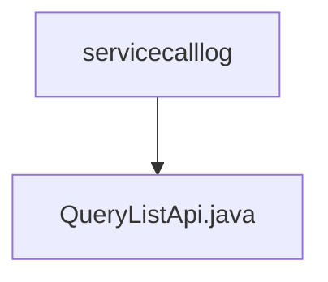

# 基础信息

|      |      |
|------|------|
| 名称 | servicecalllog |
| 编码语言 | .java |
| 代码路径 | WeFe/serving/serving-service/src/main/java/com/welab/wefe/serving/service/api/servicecalllog |
| 包名 | docs.serving.serving-service.src.main.java.com.welab.wefe.serving.service.api.servicecalllog |
| 概述说明 | 查询服务调用日志的API类，包含输入参数（服务ID、订单ID）和输出结果（调用方、请求/响应ID、数据、IP、时间等），使用分页处理。 |

# 说明

这是一个名为QueryListApi的API类，用于查询服务调用日志。它继承自AbstractApi，输入类型为Input，输出类型为PagingOutput<Output>。API路径为"servicecalllog/query-list"。内部使用ServiceCallLogService处理查询请求。Input类包含分页参数及两个可选查询条件：serviceId和orderId。Output类包含分页结果及多个日志字段：callByMe、requestId、responseId、requestData、responseData、requestIp和createdTime。该API通过handle方法调用serviceCallLogService.queryList处理请求并返回结果。

### 包内部结构视图

该流程图展示了一个简单的层级结构，根节点是servicecalllog目录，其下包含一个子节点QueryListApi.java文件。这表示在servicecalllog目录中有一个名为QueryListApi.java的Java文件，用于处理服务调用日志的查询列表功能。整个结构简洁明了，体现了典型的API文件存放方式。

# 文件列表

| 名称   | 类型  | 说明 |
|-------|------|-------------|
| [QueryListApi.java](QueryListApi.md) | file | 查询服务调用日志的API类，包含输入参数（服务ID、订单ID）和输出结果（调用方、请求/响应ID、数据、IP、时间等），使用分页处理。 |

