# 基础信息

|      |      |
|------|------|
| 名称 | DownloadApi |
| 编码语言 | .java |
| 代码路径 | WeFe/serving/serving-service/src/main/java/com/welab/wefe/serving/service/api/serviceorder/DownloadApi.java |
| 包名 | com.welab.wefe.serving.service.api.serviceorder |
| 依赖项 | ['com.welab.wefe.common.StatusCode', 'com.welab.wefe.common.exception.StatusCodeWithException', 'com.welab.wefe.common.fieldvalidate.annotation.Check', 'com.welab.wefe.common.web.api.base.AbstractApi', 'com.welab.wefe.common.web.api.base.Api', 'com.welab.wefe.common.web.dto.AbstractApiInput', 'com.welab.wefe.common.web.dto.ApiResult', 'com.welab.wefe.serving.service.dto.PagingInput', 'com.welab.wefe.serving.service.service.ServiceOrderService', 'org.springframework.beans.factory.annotation.Autowired', 'org.springframework.core.io.FileSystemResource', 'org.springframework.http.HttpHeaders', 'org.springframework.http.MediaType', 'org.springframework.http.ResponseEntity', 'java.io.File', 'java.util.Date'] |
| 概述说明 | DownloadApi类用于下载服务订单，接收订单ID、服务信息、时间范围等输入参数，返回CSV文件。处理文件不存在异常，设置HTTP响应头并返回文件资源。 |

# 说明

该代码定义了一个名为DownloadApi的类，用于处理服务订单下载请求。类继承自AbstractApi，输入类型为Input，输出为ResponseEntity。主要功能是通过serviceOrderService下载文件，并返回文件响应。Input类包含多个校验字段，如订单ID、服务ID、服务名称、订单类型、状态、请求方和响应方名称、时间范围等。file方法处理文件响应，设置HTTP头信息，包括缓存控制、内容处置、最后修改时间和ETag，并返回包含文件资源的响应实体。若文件不存在则抛出异常。

# 类列表 Class Summary

| 名称   | 类型  | 说明 |
|-------|------|-------------|
| DownloadApi | class | DownloadApi类提供下载服务订单功能，输入参数包括订单ID、服务信息、时间范围等，处理逻辑为调用serviceOrderService生成文件并返回CSV格式响应。 |


## 类 DownloadApi

|      |      |
|------|------|
| 访问范围 | @Api(path = "serviceorder/download", name = "download service orders");public |
| 类型 | class |
| 名称 | DownloadApi |
| 说明 | DownloadApi类提供下载服务订单功能，输入参数包括订单ID、服务信息、时间范围等，处理逻辑为调用serviceOrderService生成文件并返回CSV格式响应。 |


### UML类图

```mermaid
classDiagram
    class AbstractApi~T, R~ {
        <<abstract>>
        +handle(T input) ApiResult~R~
        #file(File file) ApiResult~R~
    }

    class DownloadApi {
        -ServiceOrderService serviceOrderService
        +handle(Input input) ApiResult~ResponseEntity~?~~
        #file(File file) ApiResult~ResponseEntity~?~~
    }

    class AbstractApiInput {
        <<abstract>>
    }

    class DownloadApi$Input {
        -String id
        -String serviceId
        -String serviceName
        -String serviceType
        -Integer orderType
        -String status
        -String requestPartnerName
        -String responsePartnerName
        -Date startTime
        -Date endTime
        +getter/setter methods
    }

    class ServiceOrderService {
        <<Interface>>
        +downloadFile(DownloadApi$Input input) File
    }

    AbstractApi <|-- DownloadApi
    AbstractApiInput <|-- DownloadApi$Input
    DownloadApi --> ServiceOrderService : 依赖
    DownloadApi --> DownloadApi$Input : 使用
```

类图描述：该图展示了下载服务订单API的类结构。DownloadApi继承自泛型抽象类AbstractApi，处理Input参数并返回ResponseEntity。Input是包含多个校验字段的内部类，继承自AbstractApiInput。DownloadApi通过依赖ServiceOrderService接口实现文件下载功能，并重写了文件处理方法。各实体间通过继承和依赖关系组织，形成清晰的层级结构。


### 内部方法调用关系图

```mermaid
graph TD
    A["类DownloadApi"]
    B["继承: AbstractApi<Input, ResponseEntity<?>>"]
    C["依赖: @Autowired ServiceOrderService"]
    D["方法: handle(Input input)"]
    E["方法: file(File file)"]
    F["嵌套类: Input"]
    G["属性: String id"]
    H["属性: String serviceId"]
    I["属性: String serviceName"]
    J["属性: String serviceType"]
    K["属性: Integer orderType"]
    L["属性: String status"]
    M["属性: String requestPartnerName"]
    N["属性: String responsePartnerName"]
    O["属性: Date startTime"]
    P["属性: Date endTime"]
    Q["Getter/Setter方法"]

    A --> B
    A --> C
    A --> D
    A --> E
    A --> F
    F --> G
    F --> H
    F --> I
    F --> J
    F --> K
    F --> L
    F --> M
    F --> N
    F --> O
    F --> P
    F --> Q
    D --> E
```



这段代码展示了一个文件下载API的实现，主要包含DownloadApi类及其嵌套的Input类。DownloadApi继承自AbstractApi，通过ServiceOrderService处理文件下载请求。核心流程是：handle方法接收Input参数，调用serviceOrderService.downloadFile获取文件，然后通过file方法构建包含HTTP头的响应实体。Input类定义了多个带校验注解的查询参数，包含订单和服务相关信息。file方法实现了文件存在性检查、HTTP响应头设置和文件资源封装等功能。

### 字段列表 Field List

| 名称  | 类型  | 说明 |
|-------|-------|------|
| serviceOrderService | ServiceOrderService | 自动注入ServiceOrderService实例。 |

### 方法列表

| 名称  | 类型  | 说明 |
|-------|-------|------|
| handle | ApiResult<ResponseEntity<?>> | 重写方法处理文件下载，调用服务并返回结果。 |
| file | ApiResult<ResponseEntity<?>> | 检查文件是否存在，不存在则报错。设置HTTP响应头（缓存、文件名、修改时间、ETag），返回文件内容作为响应体，类型为text/csv。 |


