# 基础信息

|      |      |
|------|------|
| 名称 | QueryListApi |
| 编码语言 | .java |
| 代码路径 | WeFe/serving/serving-service/src/main/java/com/welab/wefe/serving/service/api/serviceorder/QueryListApi.java |
| 包名 | com.welab.wefe.serving.service.api.serviceorder |
| 依赖项 | ['com.welab.wefe.common.fieldvalidate.annotation.Check', 'com.welab.wefe.common.web.api.base.AbstractApi', 'com.welab.wefe.common.web.api.base.Api', 'com.welab.wefe.common.web.dto.ApiResult', 'com.welab.wefe.serving.service.dto.PagingInput', 'com.welab.wefe.serving.service.dto.PagingOutput', 'com.welab.wefe.serving.service.service.ServiceOrderService', 'org.springframework.beans.factory.annotation.Autowired', 'java.util.Date'] |
| 概述说明 | QueryListApi类用于分页查询服务订单列表，包含输入参数如服务ID、名称、订单类型、状态等，输出结果包括订单ID、服务信息、合作方详情等。通过ServiceOrderService处理查询逻辑。 |

# 说明

这是一个名为QueryListApi的Java类，用于处理服务订单查询列表的API请求。该类继承自AbstractApi，接受Input类作为输入参数，返回PagingOutput<Output>类型的分页结果。Input类包含多个查询条件字段，如服务ID、服务名称、订单ID、服务类型、订单类型、订单状态、请求方名称、响应方名称以及时间范围等。Output类定义了返回结果中的字段，包括订单ID、服务ID、服务名称、服务类型、订单类型、状态、请求方和响应方的ID及名称等。该API通过调用serviceOrderService的queryList方法处理查询请求，并返回分页结果。

# 类列表 Class Summary

| 名称   | 类型  | 说明 |
|-------|------|-------------|
| QueryListApi | class | 服务订单查询API，支持分页查询订单列表，包含订单ID、服务名称、类型、状态及合作方信息等字段。输入参数包括服务ID、名称、订单类型、状态及时间范围等。 |


## 类 QueryListApi

|      |      |
|------|------|
| 访问范围 | @Api(path = "serviceorder/query-list", name = "search query list");public |
| 类型 | class |
| 名称 | QueryListApi |
| 说明 | 服务订单查询API，支持分页查询订单列表，包含订单ID、服务名称、类型、状态及合作方信息等字段。输入参数包括服务ID、名称、订单类型、状态及时间范围等。 |


### UML类图

```mermaid
classDiagram
    class QueryListApi {
        <<Api(path="serviceorder/query-list", name="search query list")>>
        -ServiceOrderService serviceOrderService
        +handle(Input input) ApiResult~PagingOutput~Output~~
    }
    
    class ServiceOrderService {
        <<Interface>>
        +queryList(Input input) PagingOutput~Output~
    }
    
    class PagingOutput~T~ {
        <<Generic>>
    }
    
    class PagingInput {
        <<BaseClass>>
    }
    
    class Output {
        -String id
        -String serviceId
        -String serviceName
        -Integer serviceType
        -Integer orderType
        -String status
        -String requestPartnerId
        -String requestPartnerName
        -String responsePartnerId
        -String responsePartnerName
        +getter/setter methods
    }
    
    class Input {
        -String serviceId
        -String serviceName
        -String id
        -String serviceType
        -Integer orderType
        -String status
        -String requestPartnerName
        -String responsePartnerName
        -Date startTime
        -Date endTime
        +getter/setter methods
    }
    
    QueryListApi --> ServiceOrderService : 依赖
    QueryListApi ..|> AbstractApi~Input, PagingOutput~Output~~ : 继承
    Output --|> PagingOutput
    Input --|> PagingInput
    ServiceOrderService ..> Output : 返回
    ServiceOrderService ..> Input : 使用
```

该类图展示了一个服务订单查询API的结构。QueryListApi继承自泛型抽象类AbstractApi，依赖ServiceOrderService接口处理业务逻辑。包含Input和Output两个嵌套类，分别继承自PagingInput和PagingOutput基类。Input类包含各种查询条件字段，Output类包含订单详情字段，两者都通过getter/setter方法暴露属性。ServiceOrderService接口定义了查询方法，返回分页包装的Output结果。


### 内部方法调用关系图

```mermaid
graph TD
    A["类QueryListApi"]
    B["继承: AbstractApi<Input, PagingOutput<Output>>"]
    C["依赖: @Autowired ServiceOrderService"]
    D["重写方法: handle(Input input)"]
    E["调用: serviceOrderService.queryList(input)"]
    F["返回: ApiResult<PagingOutput<Output>>"]
    G["嵌套类: Output"]
    H["嵌套类: Input"]
    I["属性: 11个String/Integer字段"]
    J["属性: 10个带@Check的查询参数"]

    A --> B
    A --> C
    A --> D
    D --> E
    E --> F
    A --> G
    G --> I
    A --> H
    H --> J
```



该流程图展示了QueryListApi的核心结构，这是一个用于服务订单查询的API类。它继承自抽象基类，通过ServiceOrderService处理分页查询请求，包含两个嵌套类：Output用于封装返回数据（含11个字段），Input用于接收带校验注解的查询参数（10个条件）。主要流程是handle方法接收输入参数后调用服务层并返回分页结果。

### 字段列表 Field List

| 名称  | 类型  | 说明 |
|-------|-------|------|
| serviceOrderService | ServiceOrderService | 自动注入ServiceOrderService服务实例。 |

### 方法列表

| 名称  | 类型  | 说明 |
|-------|-------|------|
| handle | ApiResult<PagingOutput<Output>> | 重写handle方法，调用serviceOrderService.queryList处理输入并返回分页结果。 |


