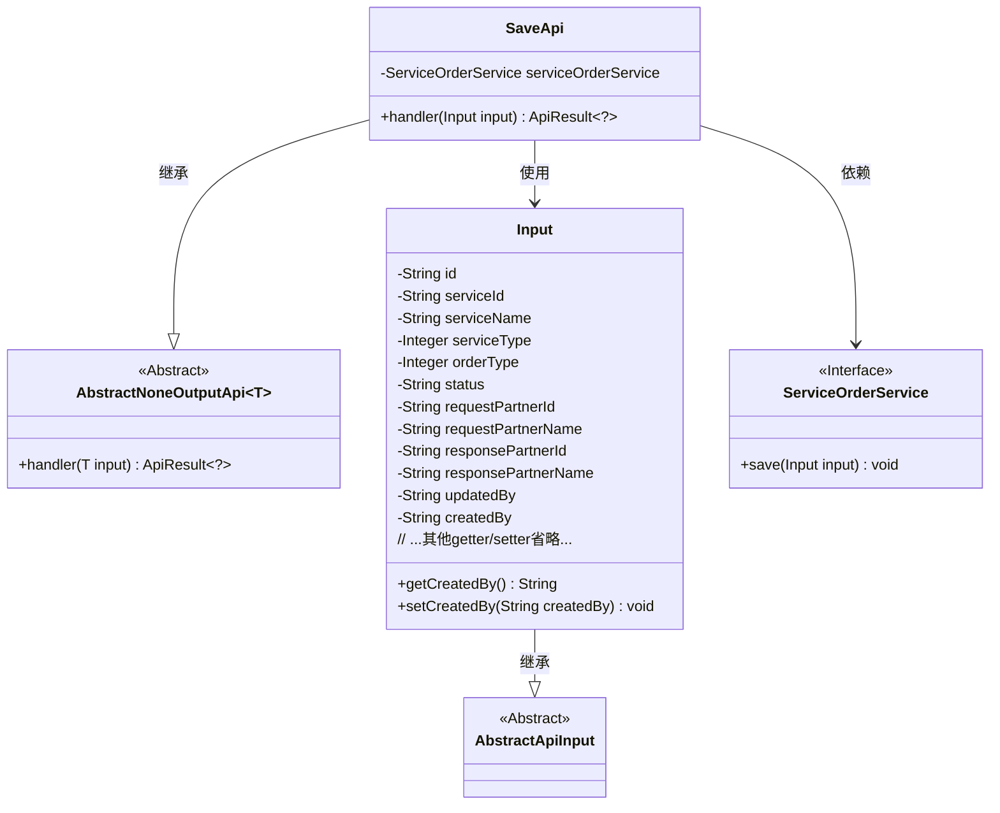
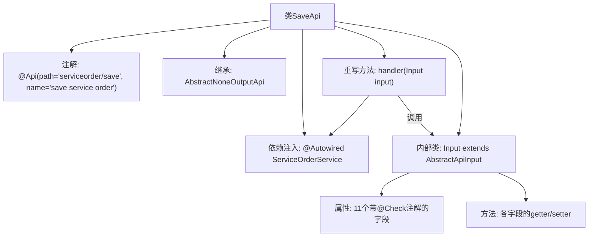

# 基础信息

|      |      |
|------|------|
| 名称 | SaveApi |
| 编码语言 | .java |
| 代码路径 | WeFe/serving/serving-service/src/main/java/com/welab/wefe/serving/service/api/serviceorder/SaveApi.java |
| 包名 | com.welab.wefe.serving.service.api.serviceorder |
| 依赖项 | ['com.welab.wefe.common.exception.StatusCodeWithException', 'com.welab.wefe.common.fieldvalidate.annotation.Check', 'com.welab.wefe.common.web.api.base.AbstractNoneOutputApi', 'com.welab.wefe.common.web.api.base.Api', 'com.welab.wefe.common.web.dto.AbstractApiInput', 'com.welab.wefe.common.web.dto.ApiResult', 'com.welab.wefe.serving.service.enums.ServiceOrderEnum', 'com.welab.wefe.serving.service.service.ServiceOrderService', 'org.springframework.beans.factory.annotation.Autowired', 'java.util.UUID'] |
| 概述说明 | SaveApi类用于保存服务订单，包含必填字段如服务ID、订单类型、请求方ID和响应方ID，自动生成订单ID，默认状态为ORDERING。 |

# 说明

该代码定义了一个名为SaveApi的API类，用于保存服务订单。API路径为serviceorder/save，继承自AbstractNoneOutputApi，输入类型为内部类Input。Input类包含多个字段，如订单ID、服务ID、服务名称、服务类型、订单类型、订单状态、请求方和响应方的ID及名称、更新人和创建人等。部分字段有校验注解，如必填项检查。handler方法调用serviceOrderService保存输入数据并返回成功结果。订单ID默认生成UUID并去除横线，订单状态默认为ORDERING。

# 类列表 Class Summary

| 名称   | 类型  | 说明 |
|-------|------|-------------|
| SaveApi | class | 保存服务订单的API，包含订单ID、服务ID、名称、类型、状态等必填和选填字段，调用ServiceOrderService保存数据。 |

## 类 SaveApi

|      |      |
|------|------|
| 访问范围 | @Api(path = "serviceorder/save", name = "save service order");public |
| 类型 | class |
| 名称 | SaveApi |
| 说明 | 保存服务订单的API，包含订单ID、服务ID、名称、类型、状态等必填和选填字段，调用ServiceOrderService保存数据。 |

### UML类图

类图描述：该图展示了订单保存API的类结构，核心类SaveApi继承自AbstractNoneOutputApi泛型类，处理Input参数并返回ApiResult。Input类继承自AbstractApiInput，包含订单相关字段及校验注解。SaveApi通过依赖ServiceOrderService接口实现订单保存功能，体现了清晰的层级关系和职责分离。

### 内部方法调用关系图

该流程图展示了SaveApi类的完整结构，包含API注解、父类继承、服务注入和输入参数处理逻辑。核心是handler方法通过ServiceOrderService保存输入数据，Input内部类定义了丰富的校验字段和访问方法。流程清晰呈现了类成员关系和方法调用链，特别是输入参数与业务处理的关联性。

### 字段列表 Field List

| 名称  | 类型  | 说明 |
|-------|-------|------|
| serviceOrderService | ServiceOrderService | 自动注入服务订单服务实例。 |

### 方法列表

| 名称  | 类型  | 说明 |
|-------|-------|------|
| handler | ApiResult<?> | 处理输入并保存服务订单，成功后返回结果。 |

