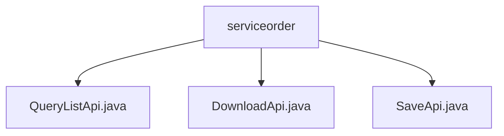

# 基础信息

|      |      |
|------|------|
| 名称 | serviceorder |
| 编码语言 | .java |
| 代码路径 | WeFe/serving/serving-service/src/main/java/com/welab/wefe/serving/service/api/serviceorder |
| 包名 | docs.serving.serving-service.src.main.java.com.welab.wefe.serving.service.api.serviceorder |
| 概述说明 | QueryListApi处理服务订单查询，返回分页结果。DownloadApi处理订单下载，返回文件响应。SaveApi保存订单数据，生成默认ID和状态。 |

# 说明

## 概述  
该模块核心职责是处理服务订单的全生命周期管理，包括查询列表、下载和保存操作。接口规范统一继承AbstractApi基类，采用分页响应(PagingOutput)或文件流(ResponseEntity)等标准返回格式。关键数据结构围绕Input/Output类，包含服务ID、订单类型、状态等20+字段。外部依赖仅serviceOrderService。例如QueryListApi实现分页查询，DownloadApi生成文件下载，SaveApi处理订单持久化。

## 主要业务场景  
模块支持服务订单的CRUD典型场景：查询列表通过组合条件过滤分页结果，下载导出符合条件的数据文件，保存操作实现订单创建/更新。交互模式类似RESTful风格，例如POST /save提交订单，GET /query获取分页数据。功能完整性体现在覆盖订单状态流转（如ORDERING默认状态）、双主体（请求方/响应方）管理和文件级操作。典型应用包括合作伙伴对账、服务监控看板等。

### 包内部结构视图

该流程图展示了serviceorder目录下的三个Java文件：QueryListApi.java、DownloadApi.java和SaveApi.java。这些文件都直接隶属于serviceorder目录，没有更深层次的嵌套结构。每个文件代表不同的API功能实现，包括查询列表、下载和保存操作。整个结构简洁明了，体现了服务订单模块的核心功能组成。

# 文件列表

| 名称   | 类型  | 说明 |
|-------|------|-------------|
| [QueryListApi.java](QueryListApi.md) | file | QueryListApi类用于分页查询服务订单列表，包含输入参数如服务ID、名称、订单类型、状态等，输出结果包括订单ID、服务信息、合作方详情等。通过ServiceOrderService处理查询逻辑。 |
| [DownloadApi.java](DownloadApi.md) | file | DownloadApi类用于下载服务订单，接收订单ID、服务信息、时间范围等输入参数，返回CSV文件。处理文件不存在异常，设置HTTP响应头并返回文件资源。 |
| [SaveApi.java](SaveApi.md) | file | SaveApi类用于保存服务订单，包含必填字段如服务ID、订单类型、请求方ID和响应方ID，自动生成订单ID，默认状态为ORDERING。 |

