# 基础信息

|      |      |
|------|------|
| 名称 | GlobalConfigDetailApi |
| 编码语言 | .java |
| 代码路径 | WeFe/serving/serving-service/src/main/java/com/welab/wefe/serving/service/api/system/GlobalConfigDetailApi.java |
| 包名 | com.welab.wefe.serving.service.api.system |
| 依赖项 | ['com.welab.wefe.common.exception.StatusCodeWithException', 'com.welab.wefe.common.fieldvalidate.annotation.Check', 'com.welab.wefe.common.web.api.base.AbstractApi', 'com.welab.wefe.common.web.api.base.Api', 'com.welab.wefe.common.web.dto.AbstractApiInput', 'com.welab.wefe.common.web.dto.ApiResult', 'com.welab.wefe.serving.service.dto.globalconfig.base.AbstractConfigModel', 'com.welab.wefe.serving.service.service.globalconfig.GlobalConfigService', 'org.springframework.beans.factory.annotation.Autowired', 'java.util.HashMap', 'java.util.List', 'java.util.Map'] |
| 概述说明 | GlobalConfigDetailApi类通过输入组名列表获取全局配置，返回配置模型映射。使用GlobalConfigService处理请求，校验输入组名必填。 |

# 说明

这是一个名为GlobalConfigDetailApi的Java类，用于获取全局配置详情。它继承自AbstractApi，输入类型为Input（包含一个必填的groups列表），输出为Map<String, AbstractConfigModel>。通过注入的GlobalConfigService，根据输入的组名列表获取对应的配置模型并返回。类上标注了Api注解，指定路径为global_config/detail，名称为get global settings。处理逻辑在handle方法中实现，遍历输入组名，调用服务获取配置模型，最后返回成功结果。

# 类列表 Class Summary

| 名称   | 类型  | 说明 |
|-------|------|-------------|
| GlobalConfigDetailApi | class | Java类GlobalConfigDetailApi定义了一个API接口，路径为global_config/detail，用于获取全局配置。通过GlobalConfigService获取指定组名的配置模型，返回Map格式结果。输入参数groups为必填的配置组名列表。 |


## 类 GlobalConfigDetailApi

|      |      |
|------|------|
| 访问范围 | @Api(path = "global_config/detail", name = "get global settings");public |
| 类型 | class |
| 名称 | GlobalConfigDetailApi |
| 说明 | Java类GlobalConfigDetailApi定义了一个API接口，路径为global_config/detail，用于获取全局配置。通过GlobalConfigService获取指定组名的配置模型，返回Map格式结果。输入参数groups为必填的配置组名列表。 |


### UML类图

```mermaid
classDiagram
    class AbstractApi~T, R~ {
        <<Abstract>>
        +handle(T input) R
    }
    class GlobalConfigDetailApi {
        -GlobalConfigService globalConfigService
        +handle(Input input) ApiResult~Map~String,AbstractConfigModel~~
    }
    class AbstractApiInput {
        <<Abstract>>
    }
    class GlobalConfigDetailApi$Input {
        +List~String~ groups
    }
    class GlobalConfigService {
        +getModel(String group) AbstractConfigModel
    }
    class AbstractConfigModel {
        <<Abstract>>
    }
    class ApiResult~T~ {
        +success(T data) ApiResult~T~
    }

    GlobalConfigDetailApi --> AbstractApi : 继承
    GlobalConfigDetailApi --> GlobalConfigService : 依赖
    GlobalConfigDetailApi$Input --> AbstractApiInput : 继承
    GlobalConfigService --> AbstractConfigModel : 返回
    GlobalConfigDetailApi ..> ApiResult : 使用
```

这段代码描述了一个全局配置详情API的实现，继承自抽象API基类`AbstractApi`，通过`GlobalConfigService`服务获取配置模型。输入参数`Input`是嵌套类，继承自`AbstractApiInput`，包含配置组名列表。处理逻辑遍历组名，调用服务获取对应配置模型并返回结果。类图展示了继承、依赖和关联关系，体现了API的核心结构和数据流动。


### 内部方法调用关系图

```mermaid
graph TD
    A["类GlobalConfigDetailApi"]
    B["注解: @Api(path='global_config/detail', name='get global settings')"]
    C["继承: AbstractApi<Input, Map<String, AbstractConfigModel>>"]
    D["依赖注入: @Autowired GlobalConfigService"]
    E["重写方法: handle(Input input)"]
    F["创建Map: output = new HashMap<>()"]
    G["循环处理: for (String group : input.groups)"]
    H["调用服务: globalConfigService.getModel(group)"]
    I["存入Map: output.put(group, model)"]
    J["返回结果: success(output)"]
    K["嵌套类Input"]
    L["继承: AbstractApiInput"]
    M["字段注解: @Check(name='配置项的组名', require=true)"]
    N["字段定义: List<String> groups"]

    A --> B
    A --> C
    A --> D
    A --> E
    E --> F
    E --> G
    G --> H
    G --> I
    E --> J
    A -.-> K
    K --> L
    K --> M
    K --> N
```



这段代码是一个基于Spring框架的API实现类，主要用于获取全局配置详情。流程图展示了从类定义到方法实现的完整结构：类通过继承AbstractApi并重写handle方法，使用GlobalConfigService获取配置数据，最终返回包含配置模型的Map。嵌套类Input定义了带校验注解的请求参数groups列表。整个流程体现了请求处理、服务调用和数据组装的标准API实现模式。

### 字段列表 Field List

| 名称  | 类型  | 说明 |
|-------|-------|------|
| globalConfigService | GlobalConfigService | 使用@Autowired自动注入GlobalConfigService实例。 |

### 方法列表

| 名称  | 类型  | 说明 |
|-------|-------|------|
| handle | ApiResult<Map<String, AbstractConfigModel>> | Java方法重写，处理输入组并返回配置模型映射。遍历输入组，从全局服务获取模型存入映射，最后返回成功结果。 |


