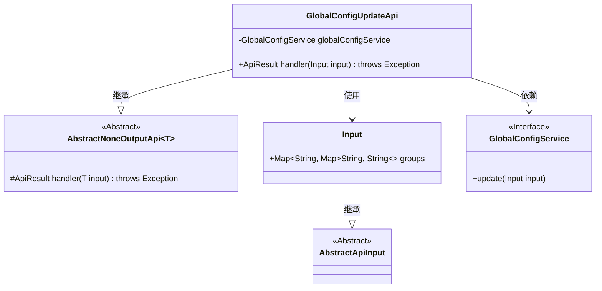

# 基础信息

|      |      |
|------|------|
| 名称 | GlobalConfigUpdateApi |
| 编码语言 | .java |
| 代码路径 | WeFe/serving/serving-service/src/main/java/com/welab/wefe/serving/service/api/system/GlobalConfigUpdateApi.java |
| 包名 | com.welab.wefe.serving.service.api.system |
| 依赖项 | ['com.welab.wefe.common.exception.StatusCodeWithException', 'com.welab.wefe.common.web.api.base.AbstractNoneOutputApi', 'com.welab.wefe.common.web.api.base.Api', 'com.welab.wefe.common.web.dto.AbstractApiInput', 'com.welab.wefe.common.web.dto.ApiResult', 'com.welab.wefe.serving.service.service.globalconfig.GlobalConfigService', 'org.springframework.beans.factory.annotation.Autowired', 'java.util.Map'] |
| 概述说明 | Java类GlobalConfigUpdateApi用于更新全局配置，通过GlobalConfigService处理输入参数groups（嵌套Map结构），无返回值。 |

# 说明

这是一个名为GlobalConfigUpdateApi的Java类，用于更新全局配置信息。该类继承自AbstractNoneOutputApi，泛型参数为内部类Input。通过@Api注解定义了API路径为"global_config/update"，名称为"更新配置信息"。类中注入了GlobalConfigService服务，重写了handler方法调用服务的update方法完成配置更新。Input内部类继承AbstractApiInput，包含一个groups字段，类型为嵌套的Map结构，用于接收分组的配置数据。该API执行成功时返回空结果。

# 类列表 Class Summary

| 名称   | 类型  | 说明 |
|-------|------|-------------|
| GlobalConfigUpdateApi | class | GlobalConfigUpdateApi用于更新配置信息，接收分组配置数据，调用GlobalConfigService完成更新操作。 |

## 类 GlobalConfigUpdateApi

|      |      |
|------|------|
| 访问范围 | @Api(path = "global_config/update", name = "更新配置信息");public |
| 类型 | class |
| 名称 | GlobalConfigUpdateApi |
| 说明 | GlobalConfigUpdateApi用于更新配置信息，接收分组配置数据，调用GlobalConfigService完成更新操作。 |

### UML类图

类图描述：该图展示了GlobalConfigUpdateApi类结构，它继承自泛型类AbstractNoneOutputApi<Input>，并实现了handler方法。包含一个静态嵌套类Input继承自AbstractApiInput，以及通过依赖注入的GlobalConfigService接口。整体设计用于处理配置更新请求，Input类使用嵌套Map结构存储分组配置数据，服务层通过接口实现解耦。

### 内部方法调用关系图

```mermaid
graph TD
    A["GlobalConfigUpdateApi类"]
    B["注解: @Api(path='global_config/update', name='更新配置信息')"]
    C["继承: AbstractNoneOutputApi<Input>"]
    D["依赖注入: @Autowired GlobalConfigService"]
    E["重写方法: handler(Input input)"]
    F["调用: globalConfigService.update(input)"]
    G["返回: ApiResult.success()"]
    H["嵌套类: Input"]
    I["继承: AbstractApiInput"]
    J["属性: Map<String, Map<String, String>> groups"]

    A --> B
    A --> C
    A --> D
    A --> E
    E --> F
    E --> G
    A --> H
    H --> I
    H --> J
```

该流程图展示了GlobalConfigUpdateApi类的完整结构，从类注解、继承关系、依赖注入到方法实现的调用链。核心流程是handler方法通过globalConfigService执行配置更新操作并返回成功结果，同时详细描述了嵌套Input类的继承结构和Map类型属性groups。所有箭头准确反映了类成员间的从属关系和方法调用顺序。

### 字段列表 Field List

| 名称  | 类型  | 说明 |
|-------|-------|------|
| globalConfigService | GlobalConfigService | 使用@Autowired自动注入GlobalConfigService实例。 |

### 方法列表

| 名称  | 类型  | 说明 |
|-------|-------|------|
| handler | ApiResult | Java方法重写，调用全局配置服务更新输入参数，成功后返回结果。 |

