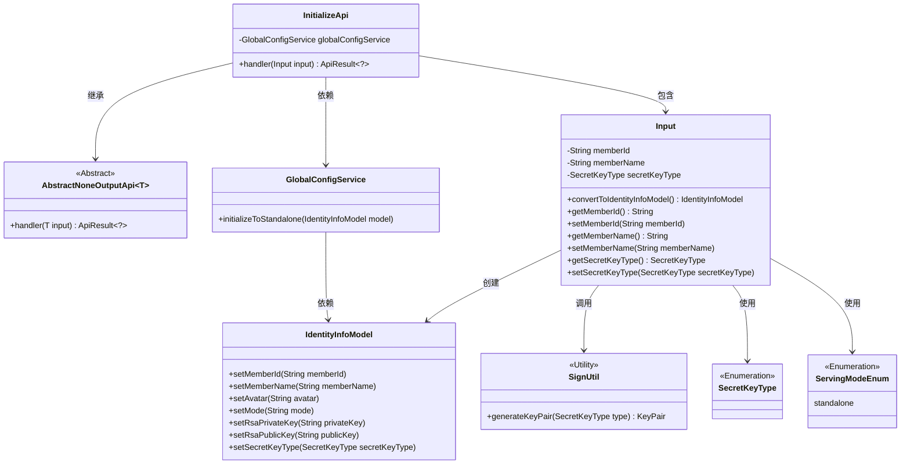
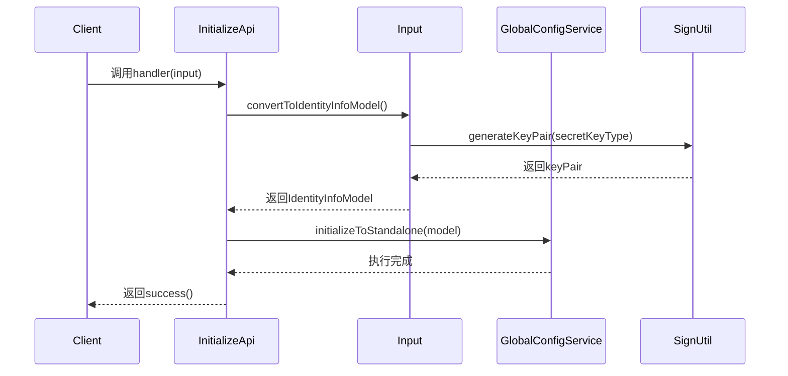

# 基础信息

|      |      |
|------|------|
| 名称 | InitializeApi |
| 编码语言 | .java |
| 代码路径 | WeFe/serving/serving-service/src/main/java/com/welab/wefe/serving/service/api/system/InitializeApi.java |
| 包名 | com.welab.wefe.serving.service.api.system |
| 依赖项 | ['com.welab.wefe.common.constant.SecretKeyType', 'com.welab.wefe.common.exception.StatusCodeWithException', 'com.welab.wefe.common.fieldvalidate.annotation.Check', 'com.welab.wefe.common.util.SignUtil', 'com.welab.wefe.common.web.api.base.AbstractNoneOutputApi', 'com.welab.wefe.common.web.api.base.Api', 'com.welab.wefe.common.web.dto.AbstractApiInput', 'com.welab.wefe.common.web.dto.ApiResult', 'com.welab.wefe.serving.service.dto.globalconfig.IdentityInfoModel', 'com.welab.wefe.serving.service.enums.ServingModeEnum', 'com.welab.wefe.serving.service.service.globalconfig.GlobalConfigService', 'org.springframework.beans.factory.annotation.Autowired', 'java.security.NoSuchAlgorithmException'] |
| 概述说明 | 初始化系统API，设置全局参数，包括成员ID、名称及密钥类型，并生成RSA密钥对。成员名称需符合中文、英文、数字组合，长度3-12。 |

# 说明

该代码定义了一个名为InitializeApi的系统初始化接口，用于设置全局参数。接口路径为global_config/initialize，继承自AbstractNoneOutputApi类，输入参数为Input内部类。Input类包含联邦成员ID、名称（需符合中文、英文、数字组合且长度3-12）和密钥类型等字段，并通过convertToIdentityInfoModel方法转换为IdentityInfoModel对象。初始化过程调用globalConfigService的initializeToStandalone方法，生成RSA密钥对并设置运行模式为standalone。

# 类列表 Class Summary

| 名称   | 类型  | 说明 |
|-------|------|-------------|
| InitializeApi | class | 初始化系统API，设置全局参数。输入包括成员ID、名称（3-12位中英文数字）和密钥类型，生成密钥对并转换为身份信息模型。 |

## 类 InitializeApi

|      |      |
|------|------|
| 访问范围 | @Api(path = "global_config/initialize", name = "Initialize system", desc = "Initialize the system and set global parameters.");public |
| 类型 | class |
| 名称 | InitializeApi |
| 说明 | 初始化系统API，设置全局参数。输入包括成员ID、名称（3-12位中英文数字）和密钥类型，生成密钥对并转换为身份信息模型。 |

### UML类图

这段代码展示了一个系统初始化API的实现结构。InitializeApi继承自AbstractNoneOutputApi，通过GlobalConfigService完成系统初始化操作。核心输入参数封装在Input内部类中，包含成员ID、名称和密钥类型等字段，通过convertToIdentityInfoModel方法转换为IdentityInfoModel对象。该设计采用分层架构，Input类负责数据验证和转换，服务类处理具体业务逻辑，符合单一职责原则。枚举类型SecretKeyType和ServingModeEnum为系统提供类型安全的常量值。

### 内部方法调用关系图

```mermaid
graph TD
    A["InitializeApi类"]
    B["继承: AbstractNoneOutputApi<Input>"]
    C["依赖注入: GlobalConfigService"]
    D["重写方法: handler(Input input)"]
    E["内部类: Input"]
    F["属性: memberId/memberName/secretKeyType"]
    G["方法: convertToIdentityInfoModel()"]
    H["调用: globalConfigService.initializeToStandalone()"]
    I["调用: SignUtil.generateKeyPair()"]
    J["返回: ApiResult.success()"]

    A --> B
    A --> C
    A --> D
    A --> E
    E --> F
    E --> G
    G --> I
    D --> G
    D --> H
    D --> J
```

流程图展示了InitializeApi类的结构，包含继承关系、依赖服务和核心方法调用链。时序图描述了系统初始化流程：客户端触发handler方法后，通过Input类转换数据并生成密钥对，最终调用全局配置服务完成初始化。整个过程包含数据验证、密钥生成和服务调用等关键步骤，最终返回成功状态。

### 字段列表 Field List

| 名称  | 类型  | 说明 |
|-------|-------|------|
| globalConfigService | GlobalConfigService | 使用@Autowired自动注入GlobalConfigService实例。 |

### 方法列表

| 名称  | 类型  | 说明 |
|-------|-------|------|
| handler | ApiResult<?> | 重写handler方法，将输入转为IdentityInfoModel并初始化独立配置，成功后返回结果。 |

