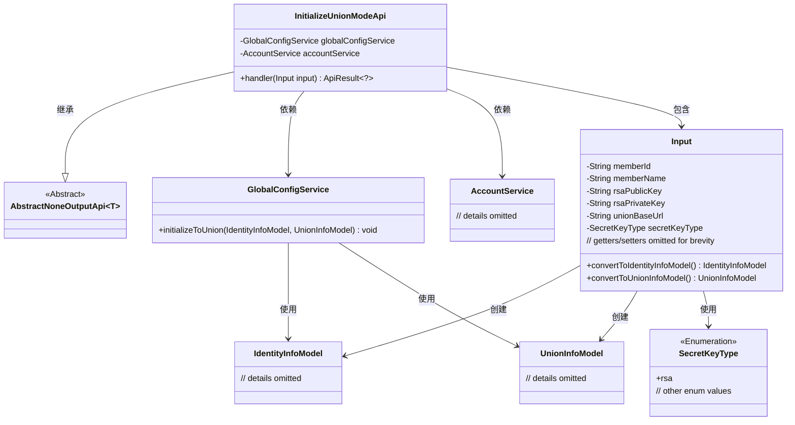

# 基础信息

|      |      |
|------|------|
| 名称 | InitializeUnionModeApi |
| 编码语言 | .java |
| 代码路径 | WeFe/serving/serving-service/src/main/java/com/welab/wefe/serving/service/api/system/InitializeUnionModeApi.java |
| 包名 | com.welab.wefe.serving.service.api.system |
| 依赖项 | ['com.welab.wefe.common.constant.SecretKeyType', 'com.welab.wefe.common.exception.StatusCodeWithException', 'com.welab.wefe.common.fieldvalidate.annotation.Check', 'com.welab.wefe.common.web.api.base.AbstractNoneOutputApi', 'com.welab.wefe.common.web.api.base.Api', 'com.welab.wefe.common.web.dto.AbstractApiInput', 'com.welab.wefe.common.web.dto.ApiResult', 'com.welab.wefe.serving.service.dto.globalconfig.IdentityInfoModel', 'com.welab.wefe.serving.service.dto.globalconfig.UnionInfoModel', 'com.welab.wefe.serving.service.enums.ServingModeEnum', 'com.welab.wefe.serving.service.service.AccountService', 'com.welab.wefe.serving.service.service.globalconfig.GlobalConfigService', 'org.springframework.beans.factory.annotation.Autowired'] |
| 概述说明 | 初始化系统API，路径为global_config/initialize/union，无需登录。输入参数包括成员ID、名称、公私钥、union地址等，校验名称格式为3-12位中英文数字。调用GlobalConfigService初始化系统并设置全局参数。 |

# 说明

该API类用于初始化系统并设置全局参数，路径为global_config/initialize/union，无需登录。主要功能是通过输入参数（包括联邦成员ID、名称、RSA公私钥、union地址和密钥类型）转换为IdentityInfoModel和UnionInfoModel，并调用globalConfigService进行初始化。输入参数有严格校验规则，如成员名称需为3-12位中英文或数字。

# 类列表 Class Summary

| 名称   | 类型  | 说明 |
|-------|------|-------------|
| InitializeUnionModeApi | class | 初始化系统API，路径为global_config/initialize/union，无需登录。输入参数包括成员ID、名称、公私钥、union地址和密钥类型，校验名称格式。调用服务初始化系统并设置全局参数。 |

## 类 InitializeUnionModeApi

|      |      |
|------|------|
| 访问范围 | @Api(;        path = "global_config/initialize/union",;        name = "Initialize system",;        desc = "Initialize the system and set global parameters.",;        login = false;);public |
| 类型 | class |
| 名称 | InitializeUnionModeApi |
| 说明 | 初始化系统API，路径为global_config/initialize/union，无需登录。输入参数包括成员ID、名称、公私钥、union地址和密钥类型，校验名称格式。调用服务初始化系统并设置全局参数。 |

### UML类图

这段类图展示了InitializeUnionModeApi及其相关类的结构关系。InitializeUnionModeApi继承自AbstractNoneOutputApi泛型类，包含Input内部类作为输入参数类型。该类通过GlobalConfigService和AccountService进行系统初始化操作，Input类负责将表单数据转换为IdentityInfoModel和UnionInfoModel两种领域模型。整个结构体现了清晰的职责划分：API类处理请求，Service类执行业务逻辑，Input类负责数据转换和校验，模型类承载业务数据。

### 内部方法调用关系图

```mermaid
graph TD
    A["类InitializeUnionModeApi"]
    B["继承: AbstractNoneOutputApi<Input>"]
    C["注解: @Api"]
    D["依赖注入: GlobalConfigService"]
    E["依赖注入: AccountService"]
    F["重写方法: handler(Input input)"]
    G["内部类Input"]
    H["继承: AbstractApiInput"]
    I["字段校验: @Check memberId"]
    J["字段校验: @Check memberName"]
    K["字段校验: @Check rsaPublicKey"]
    L["字段校验: @Check rsaPrivateKey"]
    M["字段校验: @Check unionBaseUrl"]
    N["字段校验: @Check secretKeyType"]
    O["方法: convertToIdentityInfoModel()"]
    P["方法: convertToUnionInfoModel()"]
    Q["getter/setter方法"]

    A --> B
    A --> C
    A --> D
    A --> E
    A --> F
    A --> G
    G --> H
    G --> I
    G --> J
    G --> K
    G --> L
    G --> M
    G --> N
    G --> O
    G --> P
    G --> Q
    F --> O
    F --> P
    F --> D
```

该流程图展示了InitializeUnionModeApi类的完整结构，包含继承关系、注解、依赖注入服务和内部类Input的详细组成。核心handler方法通过调用Input类的两个转换方法和globalConfigService完成初始化操作，Input类包含多个带校验注解的字段及其getter/setter方法。整个设计实现了联邦系统初始化功能，通过分层结构确保参数校验与业务逻辑分离。

### 字段列表 Field List

| 名称  | 类型  | 说明 |
|-------|-------|------|
| globalConfigService | GlobalConfigService | 使用@Autowired自动注入GlobalConfigService实例。 |
| accountService | AccountService | 使用@Autowired自动注入AccountService实例。 |

### 方法列表

| 名称  | 类型  | 说明 |
|-------|-------|------|
| handler | ApiResult<?> | 处理输入数据，转换为身份和联合信息模型，初始化全局配置后返回成功结果。 |

