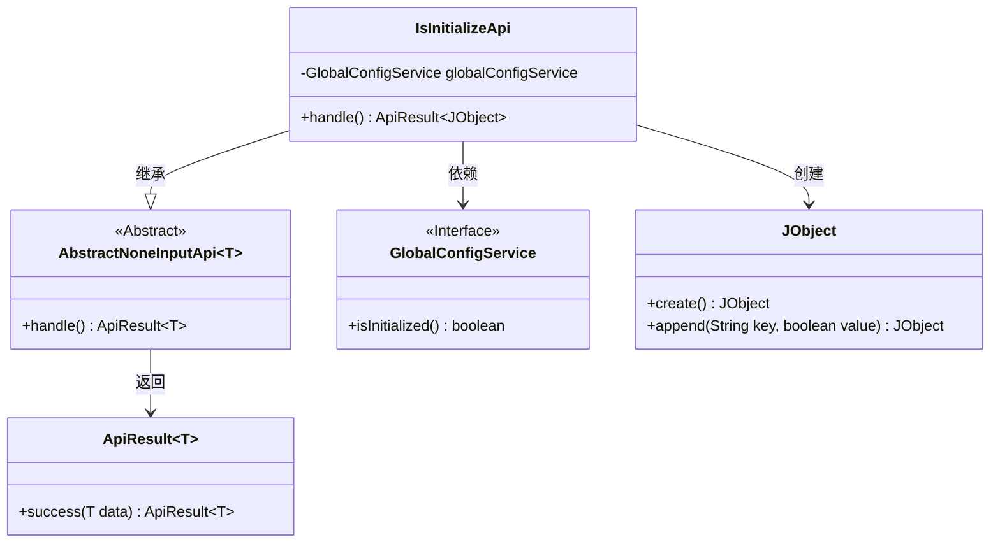
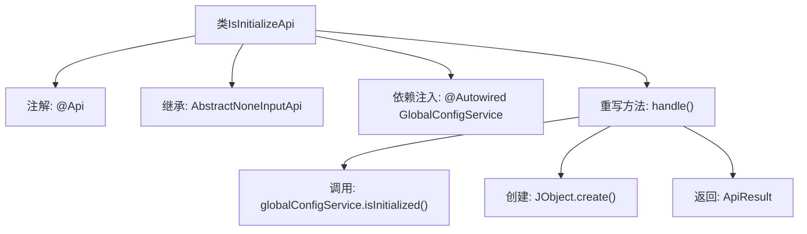

# 基础信息

|      |      |
|------|------|
| 名称 | IsInitializeApi |
| 编码语言 | .java |
| 代码路径 | WeFe/serving/serving-service/src/main/java/com/welab/wefe/serving/service/api/system/IsInitializeApi.java |
| 包名 | com.welab.wefe.serving.service.api.system |
| 依赖项 | ['com.welab.wefe.common.exception.StatusCodeWithException', 'com.welab.wefe.common.util.JObject', 'com.welab.wefe.common.web.api.base.AbstractNoneInputApi', 'com.welab.wefe.common.web.api.base.Api', 'com.welab.wefe.common.web.dto.ApiResult', 'com.welab.wefe.serving.service.service.globalconfig.GlobalConfigService', 'org.springframework.beans.factory.annotation.Autowired'] |
| 概述说明 | 这是一个检查系统是否初始化的API接口，无需登录，调用GlobalConfigService的isInitialized方法返回初始化状态。 |

# 说明

这是一个用于判断系统是否初始化的API接口类。该接口路径为"global_config/is_initialize"，不需要登录即可访问。类继承自AbstractNoneInputApi，返回类型为JObject。通过注入的GlobalConfigService服务调用isInitialized方法获取初始化状态，并将结果封装在JObject中返回，包含一个名为"initialized"的布尔值字段。该接口处理逻辑简单直接，仅返回系统初始化状态信息。

# 类列表 Class Summary

| 名称   | 类型  | 说明 |
|-------|------|-------------|
| IsInitializeApi | class | 这是一个检查系统是否初始化的API，无需登录，调用GlobalConfigService的isInitialized方法返回初始化状态。 |

## 类 IsInitializeApi

|      |      |
|------|------|
| 访问范围 | @Api(path = "global_config/is_initialize", name = "判断系统是否初始化", desc = "判断系统是否初始化", login = false);public |
| 类型 | class |
| 名称 | IsInitializeApi |
| 说明 | 这是一个检查系统是否初始化的API，无需登录，调用GlobalConfigService的isInitialized方法返回初始化状态。 |

### UML类图

这段代码展示了一个判断系统是否初始化的API实现。IsInitializeApi继承自AbstractNoneInputApi抽象类，通过依赖注入GlobalConfigService来获取初始化状态，并使用JObject构建返回结果。类图清晰地呈现了继承关系（IsInitializeApi→AbstractNoneInputApi）、接口依赖（GlobalConfigService）和工具类调用（JObject），同时体现了泛型在抽象基类和返回结果中的使用。整个设计符合单一职责原则，通过分层结构实现业务逻辑与数据封装的分离。

### 内部方法调用关系图

这段代码是一个Spring风格的API类，用于检查系统是否已完成初始化。流程图展示了类结构的关键部分：从类声明开始，经过注解和继承关系，到核心的handle()方法实现。handle()方法调用全局配置服务检查初始化状态，构建JSON响应对象并返回封装结果。整个过程体现了依赖注入和响应封装的典型Spring Boot控制器模式。

### 字段列表 Field List

| 名称  | 类型  | 说明 |
|-------|-------|------|
| globalConfigService | GlobalConfigService | 使用@Autowired自动注入GlobalConfigService实例。 |

### 方法列表

| 名称  | 类型  | 说明 |
|-------|-------|------|
| handle | ApiResult<JObject> | Java方法重写，返回包含globalConfigService初始化状态的ApiResult成功响应。 |

