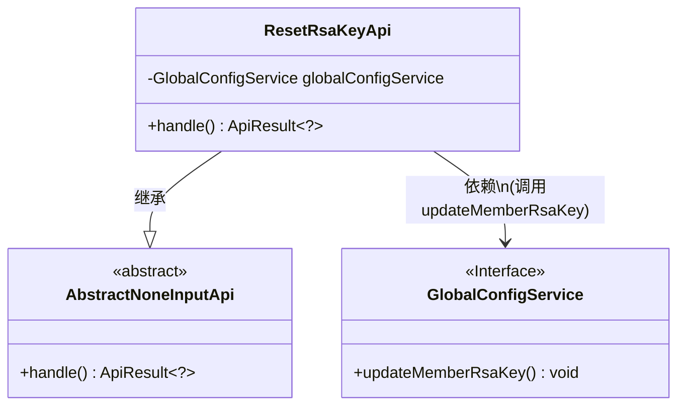
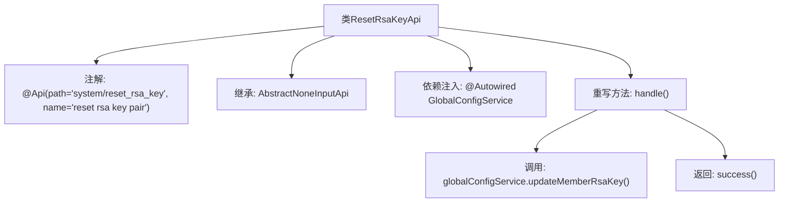

# 基础信息

|      |      |
|------|------|
| 名称 | ResetRsaKeyApi |
| 编码语言 | .java |
| 代码路径 | WeFe/serving/serving-service/src/main/java/com/welab/wefe/serving/service/api/system/ResetRsaKeyApi.java |
| 包名 | com.welab.wefe.serving.service.api.system |
| 依赖项 | ['com.welab.wefe.common.exception.StatusCodeWithException', 'com.welab.wefe.common.web.api.base.AbstractNoneInputApi', 'com.welab.wefe.common.web.api.base.Api', 'com.welab.wefe.common.web.dto.ApiResult', 'com.welab.wefe.serving.service.service.globalconfig.GlobalConfigService', 'org.springframework.beans.factory.annotation.Autowired'] |
| 概述说明 | 重置RSA密钥对的API类，调用全局配置服务更新密钥并返回成功结果。 |

# 说明

这是一个名为ResetRsaKeyApi的API类，用于重置RSA密钥对。它继承自AbstractNoneInputApi基类，表明该接口不需要输入参数。类上标注了路径为system/reset_rsa_key。通过自动注入的GlobalConfigService服务调用updateMemberRsaKey方法来更新成员RSA密钥。处理成功后返回空结果。整个类实现了无参请求处理和密钥重置功能。

# 类列表 Class Summary

| 名称   | 类型  | 说明 |
|-------|------|-------------|
| ResetRsaKeyApi | class | ResetRsaKeyApi类用于重置RSA密钥对，调用globalConfigService更新密钥并返回成功结果。 |

## 类 ResetRsaKeyApi

|      |      |
|------|------|
| 访问范围 | @Api(path = "system/reset_rsa_key", name = "reset rsa key pair");public |
| 类型 | class |
| 名称 | ResetRsaKeyApi |
| 说明 | ResetRsaKeyApi类用于重置RSA密钥对，调用globalConfigService更新密钥并返回成功结果。 |

### UML类图

类图描述：该代码实现了一个重置RSA密钥对的API接口，ResetRsaKeyApi继承自抽象类AbstractNoneInputApi，并通过依赖注入调用GlobalConfigService接口的updateMemberRsaKey方法完成密钥更新。类图清晰展示了继承关系和依赖调用，其中GlobalConfigService以接口形式存在，符合松耦合设计原则。

### 内部方法调用关系图

该流程图展示了ResetRsaKeyApi类的结构和工作流程。该类通过@Api注解定义API路径，继承AbstractNoneInputApi基类，并注入GlobalConfigService服务。核心逻辑在handle()方法中实现，先调用updateMemberRsaKey()更新密钥对，最后返回成功结果。整个过程体现了Spring Boot的依赖注入和API处理机制。

### 字段列表 Field List

| 名称  | 类型  | 说明 |
|-------|-------|------|
| globalConfigService | GlobalConfigService | 使用@Autowired自动注入GlobalConfigService实例。 |

### 方法列表

| 名称  | 类型  | 说明 |
|-------|-------|------|
| handle | ApiResult<?> | 该方法重写父类逻辑，调用服务更新成员RSA密钥，成功后返回成功结果。 |

