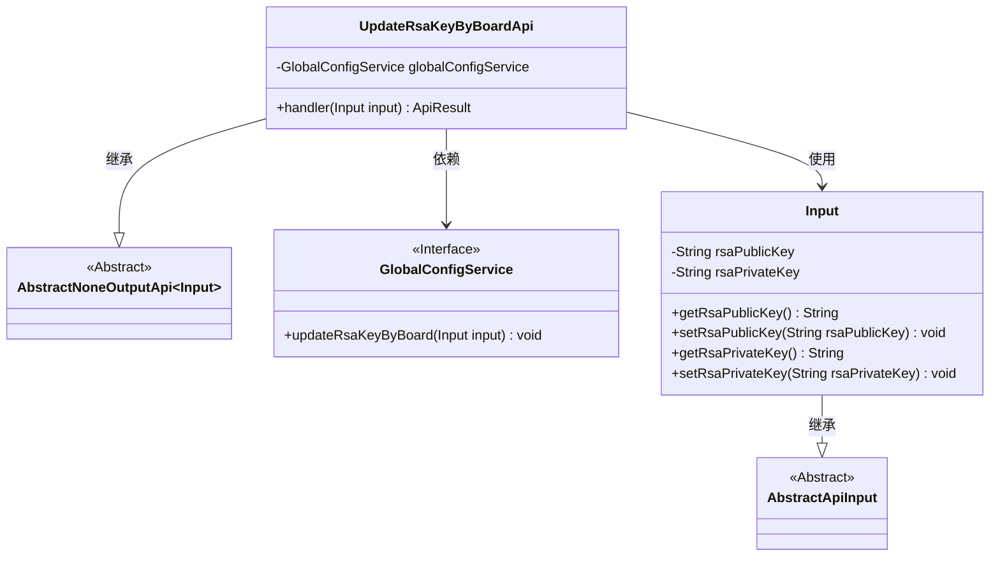
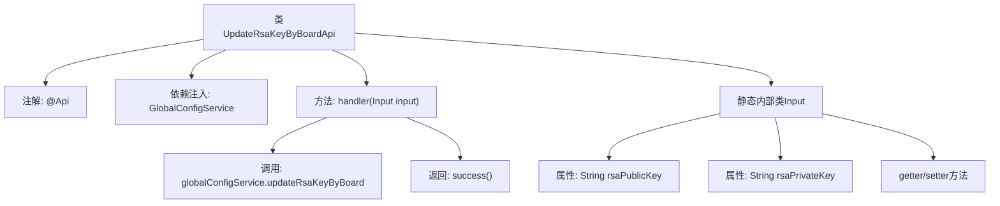

# 基础信息

|      |      |
|------|------|
| 名称 | UpdateRsaKeyByBoardApi |
| 编码语言 | .java |
| 代码路径 | WeFe/serving/serving-service/src/main/java/com/welab/wefe/serving/service/api/system/UpdateRsaKeyByBoardApi.java |
| 包名 | com.welab.wefe.serving.service.api.system |
| 依赖项 | ['com.welab.wefe.common.exception.StatusCodeWithException', 'com.welab.wefe.common.fieldvalidate.annotation.Check', 'com.welab.wefe.common.web.api.base.AbstractNoneOutputApi', 'com.welab.wefe.common.web.api.base.Api', 'com.welab.wefe.common.web.api.base.Caller', 'com.welab.wefe.common.web.dto.AbstractApiInput', 'com.welab.wefe.common.web.dto.ApiResult', 'com.welab.wefe.serving.service.service.globalconfig.GlobalConfigService', 'org.springframework.beans.factory.annotation.Autowired'] |
| 概述说明 | 这是一个用于同步board密钥的API，路径为system/update_rsa_key_by_board，允许带签名访问，调用者为Board。API接收公钥和私钥作为必填参数，并通过globalConfigService更新密钥。 |

# 说明

这是一个名为"同步board密钥"的API类，路径为"system/update_rsa_key_by_board"，允许带签名的访问，调用域为Board。它继承自AbstractNoneOutputApi，输入参数为内部类Input，包含必须的公钥和私钥字段。该API通过globalConfigService更新board的RSA密钥，处理成功后返回成功结果。Input类继承AbstractApiInput，包含rsaPublicKey和rsaPrivateKey两个必填字段及其getter/setter方法。

# 类列表 Class Summary

| 名称   | 类型  | 说明 |
|-------|------|-------------|
| UpdateRsaKeyByBoardApi | class | 这是一个用于同步board密钥的API，路径为system/update_rsa_key_by_board，需要提供公钥和私钥，调用GlobalConfigService更新密钥。 |

## 类 UpdateRsaKeyByBoardApi

|      |      |
|------|------|
| 访问范围 | @Api(path = "system/update_rsa_key_by_board",;        name = "同步board密钥",;        allowAccessWithSign = true,;        domain = Caller.Board;);public |
| 类型 | class |
| 名称 | UpdateRsaKeyByBoardApi |
| 说明 | 这是一个用于同步board密钥的API，路径为system/update_rsa_key_by_board，需要提供公钥和私钥，调用GlobalConfigService更新密钥。 |

### UML类图

类图描述：该代码实现了一个用于同步board密钥的API接口UpdateRsaKeyByBoardApi，继承自AbstractNoneOutputApi泛型类，其输入参数为内部类Input。Input类继承自AbstractApiInput，包含公钥和私钥两个属性及其getter/setter方法。UpdateRsaKeyByBoardApi通过依赖注入GlobalConfigService接口来更新密钥，handler方法处理输入并返回ApiResult结果。整体结构体现了清晰的层次关系和依赖调用。

### 内部方法调用关系图

这段代码定义了一个用于同步board密钥的API类UpdateRsaKeyByBoardApi，继承自AbstractNoneOutputApi。类通过@Api注解配置了接口路径和权限，使用GlobalConfigService来更新RSA密钥。handler方法处理输入参数Input，其中包含必须的公钥和私钥字段以及对应的getter/setter方法。流程图展示了类结构、依赖关系和方法调用链，清晰地呈现了从API接收到业务处理的完整流程。

### 字段列表 Field List

| 名称  | 类型  | 说明 |
|-------|-------|------|
| globalConfigService | GlobalConfigService | 使用@Autowired自动注入GlobalConfigService实例。 |

### 方法列表

| 名称  | 类型  | 说明 |
|-------|-------|------|
| handler | ApiResult | 更新全局配置的RSA密钥并返回成功结果。 |

