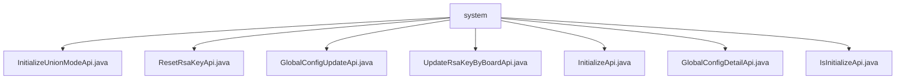

# 基础信息

|      |      |
|------|------|
| 名称 | system |
| 编码语言 | .java |
| 代码路径 | WeFe/serving/serving-service/src/main/java/com/welab/wefe/serving/service/api/system |
| 包名 | docs.serving.serving-service.src.main.java.com.welab.wefe.serving.service.api.system |
| 概述说明 | 初始化API类：设置全局参数，校验输入后调用服务初始化。重置RSA密钥API：无参请求更新密钥。全局配置更新API：接收分组配置数据并更新。同步board密钥API：更新board的RSA密钥。系统初始化接口：设置参数并生成密钥对。全局配置详情API：根据组名获取配置详情。系统初始化状态API：返回初始化状态布尔值。 |

# 说明

## 概述  
该模块核心职责是管理系统全局配置和初始化状态，类似配置中心的角色，提供联邦学习环境的基础参数设置与密钥管理。接口规范统一采用RESTful风格，路径以`global_config`和`system`为前缀，包含初始化、密钥重置、配置更新等操作。关键数据结构包括`IdentityInfoModel`（存储成员ID/名称）、`UnionInfoModel`（存储联邦地址/RSA密钥）和`AbstractConfigModel`（配置模型基类）。外部依赖仅为内部`GlobalConfigService`服务。例如`InitializeApi`将输入参数转换为模型对象，`ResetRsaKeyApi`实现无参密钥重置。

## 主要业务场景  
模块支持联邦学习系统的全生命周期管理：初始化阶段（例如`InitializeUnionModeApi`校验成员名称并生成密钥）、运行中配置更新（例如`GlobalConfigUpdateApi`处理分组配置的Map结构）、安全维护（例如`UpdateRsaKeyByBoardApi`同步Board密钥）。交互模式包含无参查询（如`IsInitializeApi`返回布尔状态）和结构化输入（如`GlobalConfigDetailApi`按组名列表获取配置）。典型应用包括独立部署初始化、密钥轮换和跨组件配置同步，API类型覆盖CRUD操作与状态检查。

### 包内部结构视图

该流程图展示了WeFe服务项目中system目录下的API文件结构。所有7个Java API文件都直接位于system目录下，包括系统初始化、RSA密钥重置、全局配置更新等功能接口。这些API文件共同构成了系统配置和管理功能模块的核心实现。

# 文件列表

| 名称   | 类型  | 说明 |
|-------|------|-------------|
| [InitializeUnionModeApi.java](InitializeUnionModeApi.md) | file | 初始化系统API，路径为global_config/initialize/union，无需登录。输入参数包括成员ID、名称、公私钥、union地址等，校验名称格式为3-12位中英文数字。调用GlobalConfigService初始化系统并设置全局参数。 |
| [ResetRsaKeyApi.java](ResetRsaKeyApi.md) | file | 重置RSA密钥对的API类，调用全局配置服务更新密钥并返回成功结果。 |
| [GlobalConfigUpdateApi.java](GlobalConfigUpdateApi.md) | file | Java类GlobalConfigUpdateApi用于更新全局配置，通过GlobalConfigService处理输入参数groups（嵌套Map结构），无返回值。 |
| [UpdateRsaKeyByBoardApi.java](UpdateRsaKeyByBoardApi.md) | file | 这是一个用于同步board密钥的API，路径为system/update_rsa_key_by_board，允许带签名访问，调用者为Board。API接收公钥和私钥作为必填参数，并通过globalConfigService更新密钥。 |
| [InitializeApi.java](InitializeApi.md) | file | 初始化系统API，设置全局参数，包括成员ID、名称及密钥类型，并生成RSA密钥对。成员名称需符合中文、英文、数字组合，长度3-12。 |
| [GlobalConfigDetailApi.java](GlobalConfigDetailApi.md) | file | GlobalConfigDetailApi类通过输入组名列表获取全局配置，返回配置模型映射。使用GlobalConfigService处理请求，校验输入组名必填。 |
| [IsInitializeApi.java](IsInitializeApi.md) | file | 这是一个检查系统是否初始化的API接口，无需登录，调用GlobalConfigService的isInitialized方法返回初始化状态。 |

