# 基础信息

|      |      |
|------|------|
| 名称 | Config |
| 编码语言 | .java |
| 代码路径 | WeFe/serving/serving-service/src/main/java/com/welab/wefe/serving/service/config/Config.java |
| 包名 | com.welab.wefe.serving.service.config |
| 依赖项 | ['com.welab.wefe.common.web.config.CommonConfig', 'org.springframework.beans.factory.annotation.Value', 'org.springframework.boot.context.properties.ConfigurationProperties', 'org.springframework.context.annotation.PropertySource', 'org.springframework.stereotype.Component'] |
| 概述说明 | Java配置类，包含文件路径、邮件主题内容、PSI批次大小及密钥类型等属性，支持外部配置注入和默认值设置。 |

# 说明

这是一个名为Config的Java配置类，继承自CommonConfig。它使用@Component注解标记为Spring组件，通过@PropertySource加载外部配置文件，并支持UTF-8编码。类中定义了多个配置属性：文件基础路径、忘记密码邮件主题和内容（含默认值）、PSI批量处理大小（默认40万）、系统初始化密钥类型（默认sm2）。每个属性都有对应的getter和setter方法，便于外部访问和修改。

# 类列表 Class Summary

| 名称   | 类型  | 说明 |
|-------|------|-------------|
| Config | class | 配置类Config继承CommonConfig，包含文件路径、邮件主题内容、PSI批量大小和密钥类型等属性，支持默认值和外部配置。 |


## 类 Config

|      |      |
|------|------|
| 访问范围 | @Component;@PropertySource(value = {"file:${config.path}"}, ignoreResourceNotFound=true, encoding = "utf-8");@ConfigurationProperties;public |
| 类型 | class |
| 名称 | Config |
| 说明 | 配置类Config继承CommonConfig，包含文件路径、邮件主题内容、PSI批量大小和密钥类型等属性，支持默认值和外部配置。 |


### UML类图

```mermaid
classDiagram
    class CommonConfig {
        <<abstract>>
    }
    
    class Config {
        -String fileBasePath
        -String emailAccountForgetPasswordSubject
        -String emailAccountForgetPasswordContent
        -int psiBatchSize
        -String initializeSecretKeyType
        +String getFileBasePath()
        +void setFileBasePath(String fileBasePath)
        +String getEmailAccountForgetPasswordSubject()
        +void setEmailAccountForgetPasswordSubject(String emailAccountForgetPasswordSubject)
        +String getEmailAccountForgetPasswordContent()
        +void setEmailAccountForgetPasswordContent(String emailAccountForgetPasswordContent)
        +int getPsiBatchSize()
        +void setPsiBatchSize(int psiBatchSize)
        +String getInitializeSecretKeyType()
        +void setInitializeSecretKeyType(String initializeSecretKeyType)
    }
    
    CommonConfig <|-- Config : 继承
    Config ..> "@Value" : 依赖
    Config ..> "@PropertySource" : 依赖
    Config ..> "@ConfigurationProperties" : 依赖
```

这段代码展示了一个Spring Boot配置类Config，继承自抽象类CommonConfig，通过注解加载外部属性文件并绑定字段值。类中包含文件路径、邮件主题/内容模板、PSI批处理大小和密钥类型等配置项，每个字段都有对应的getter/setter方法。通过@PropertySource指定配置文件路径，@Value注解注入属性值，@ConfigurationProperties支持类型安全的配置绑定，体现了Spring的配置管理机制。


### 内部方法调用关系图

```mermaid
graph TD
    A["类Config"]
    B["继承: CommonConfig"]
    C["注解: @Component"]
    D["注解: @PropertySource"]
    E["注解: @ConfigurationProperties"]
    F["属性: String fileBasePath"]
    G["属性: String emailAccountForgetPasswordSubject"]
    H["属性: String emailAccountForgetPasswordContent"]
    I["属性: int psiBatchSize"]
    J["属性: String initializeSecretKeyType"]
    K["方法: getFileBasePath()"]
    L["方法: setFileBasePath(String)"]
    M["方法: getEmailAccountForgetPasswordSubject()"]
    N["方法: setEmailAccountForgetPasswordSubject(String)"]
    O["方法: getEmailAccountForgetPasswordContent()"]
    P["方法: setEmailAccountForgetPasswordContent(String)"]
    Q["方法: getPsiBatchSize()"]
    R["方法: setPsiBatchSize(int)"]
    S["方法: getInitializeSecretKeyType()"]
    T["方法: setInitializeSecretKeyType(String)"]

    A --> B
    A --> C
    A --> D
    A --> E
    A --> F
    A --> G
    A --> H
    A --> I
    A --> J
    A --> K
    A --> L
    A --> M
    A --> N
    A --> O
    A --> P
    A --> Q
    A --> R
    A --> S
    A --> T
```



该流程图展示了Config类的完整结构，它是一个Spring组件类，继承自CommonConfig，通过注解加载外部配置。类包含5个主要属性及其对应的getter/setter方法，分别用于文件路径、邮件主题/内容配置、PSI批处理大小和密钥类型设置。所有属性都通过@Value注解注入，支持默认值和外部配置覆盖，体现了Spring配置类的典型设计模式。

### 字段列表 Field List

| 名称  | 类型  | 说明 |
|-------|-------|------|
| psiBatchSize | int | 配置项psiBatchSize默认值为400000，通过@Value注解从属性psi.batch.size注入。 |
| initializeSecretKeyType | String | 配置项：初始化密钥类型，默认值sm2，通过@Value注入到私有变量initializeSecretKeyType中。 |
| emailAccountForgetPasswordContent | String | 邮件内容模板：忘记密码操作验证码为#code#，2分钟内有效，请勿泄露。 |
| emailAccountForgetPasswordSubject | String | 代码定义了一个私有字符串变量，用于存储邮件主题"忘记密码"，默认值为"忘记密码"，可通过配置覆盖。 |
| fileBasePath | String | 配置文件注入文件路径变量fileBasePath。 |

### 方法列表

| 名称  | 类型  | 说明 |
|-------|-------|------|
| setEmailAccountForgetPasswordSubject | void | 设置忘记密码邮件主题的方法，将输入参数赋值给类变量emailAccountForgetPasswordSubject。 |
| getEmailAccountForgetPasswordSubject | String | 获取忘记密码邮件主题的方法，返回预设的邮件主题字符串。 |
| setFileBasePath | void | 设置文件基础路径的方法，将输入参数赋值给类成员变量fileBasePath。 |
| getFileBasePath | String | 获取文件基础路径的方法，返回fileBasePath变量值。 |
| getInitializeSecretKeyType | String | 获取初始化密钥类型的方法，返回字符串类型的密钥类型值。 |
| setPsiBatchSize | void | 设置PSI批处理大小的方法，将参数值赋给类变量psiBatchSize。 |
| setEmailAccountForgetPasswordContent | void | 设置忘记密码邮件内容的方法，参数为邮件内容字符串。 |
| getEmailAccountForgetPasswordContent | String | 方法返回忘记密码邮件内容字符串。 |
| getPsiBatchSize | int | 获取psiBatchSize值的公共方法，返回int类型。 |
| setInitializeSecretKeyType | void | 设置初始化密钥类型的方法，参数为字符串类型。 |


