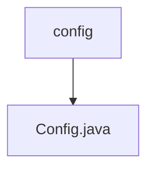

# 基础信息

|      |      |
|------|------|
| 名称 | config |
| 编码语言 | .java |
| 代码路径 | WeFe/serving/serving-service/src/main/java/com/welab/wefe/serving/service/config |
| 包名 | docs.serving.serving-service.src.main.java.com.welab.wefe.serving.service.config |
| 概述说明 | Java配置类，包含文件路径、邮件主题内容、PSI批次大小及密钥类型等属性，支持外部配置注入和默认值设置。 |

# 说明

这是一个名为Config的Java配置类，继承自CommonConfig。它使用@Component注解标记为Spring组件，通过@PropertySource加载外部配置文件，并支持UTF-8编码。类中定义了多个配置属性：文件基础路径、忘记密码邮件主题和内容（含默认值）、PSI批量处理大小（默认40万）、系统初始化密钥类型（默认sm2）。每个属性都有对应的getter和setter方法，便于外部访问和修改。

### 包内部结构视图

该流程图展示了WeFe项目中serving-service模块的配置目录结构。根节点为config文件夹，其下包含一个Config.java配置文件。这种简洁的层级关系体现了配置管理的核心结构，便于开发者快速定位配置文件位置。

# 文件列表

| 名称   | 类型  | 说明 |
|-------|------|-------------|
| [Config.java](Config.md) | file | Java配置类，包含文件路径、邮件主题内容、PSI批次大小及密钥类型等属性，支持外部配置注入和默认值设置。 |

