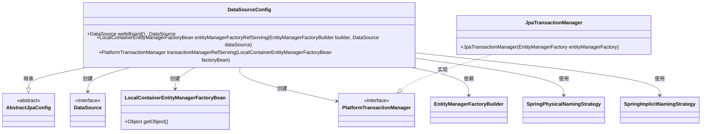
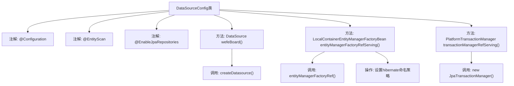

# 基础信息

|      |      |
|------|------|
| 名称 | DataSourceConfig |
| 编码语言 | .java |
| 代码路径 | WeFe/serving/serving-service/src/main/java/com/welab/wefe/serving/service/database/config/DataSourceConfig.java |
| 包名 | com.welab.wefe.serving.service.database.config |
| 依赖项 | ['com.welab.wefe.common.data.mysql.config.AbstractJpaConfig', 'com.welab.wefe.serving.service.ServingService', 'com.welab.wefe.serving.service.database.repository.base.BaseRepositoryFactoryBean', 'org.springframework.beans.factory.annotation.Qualifier', 'org.springframework.boot.autoconfigure.domain.EntityScan', 'org.springframework.boot.context.properties.ConfigurationProperties', 'org.springframework.boot.orm.jpa.EntityManagerFactoryBuilder', 'org.springframework.boot.orm.jpa.hibernate.SpringImplicitNamingStrategy', 'org.springframework.boot.orm.jpa.hibernate.SpringPhysicalNamingStrategy', 'org.springframework.context.annotation.Bean', 'org.springframework.context.annotation.Configuration', 'org.springframework.context.annotation.Primary', 'org.springframework.data.jpa.repository.config.EnableJpaRepositories', 'org.springframework.orm.jpa.JpaTransactionManager', 'org.springframework.orm.jpa.LocalContainerEntityManagerFactoryBean', 'org.springframework.transaction.PlatformTransactionManager', 'javax.sql.DataSource', 'java.util.Map'] |
| 概述说明 | 配置类DataSourceConfig继承AbstractJpaConfig，定义主数据源"serving"、实体管理器工厂和事务管理器，使用JPA并设置命名策略。 |

# 说明

这是一个Spring Boot的JPA数据源配置类，主要用于配置多数据源环境。类中定义了主数据源"serving"，使用MySQL数据库，通过@Primary注解标记为默认数据源。同时配置了实体管理器工厂bean和事务管理器，指定了实体扫描包路径和JPA仓库的基础类。实体管理器工厂设置了Hibernate的物理命名策略和隐式命名策略，确保表名和字段名符合Spring的命名规范。事务管理器基于JPA实现，用于管理数据库事务。整个配置扩展了AbstractJpaConfig基类，实现了完整的数据访问层基础设施。

# 类列表 Class Summary

| 名称   | 类型  | 说明 |
|-------|------|-------------|
| DataSourceConfig | class | 这是一个Spring Boot的JPA数据源配置类，定义了主数据源、实体管理器和事务管理器，包含自定义命名策略和MySQL配置。 |

## 类 DataSourceConfig

|      |      |
|------|------|
| 访问范围 | @Configuration;@EntityScan("com.welab.wefe.serving.service");@EnableJpaRepositories(basePackageClasses = ServingService.class,;        repositoryFactoryBeanClass = BaseRepositoryFactoryBean.class,;        entityManagerFactoryRef = "entityManagerFactoryRefServing",;        transactionManagerRef = "transactionManagerRefServing");public |
| 类型 | class |
| 名称 | DataSourceConfig |
| 说明 | 这是一个Spring Boot的JPA数据源配置类，定义了主数据源、实体管理器和事务管理器，包含自定义命名策略和MySQL配置。 |

### UML类图

这段代码展示了一个Spring Boot的JPA数据源配置类DataSourceConfig，它继承自AbstractJpaConfig。主要功能包括：1) 创建主数据源；2) 配置实体管理器工厂；3) 设置事务管理器。该类使用了多种策略类（如命名策略）和Spring JPA核心组件（如EntityManagerFactoryBuilder），通过@Bean注解将这些组件纳入Spring容器管理，为服务层提供完整的数据访问支持。

### 内部方法调用关系图

这段代码是一个Spring Boot的JPA数据源配置类，主要完成三个核心功能：1) 通过`wefeBoard()`方法创建主数据源；2) 通过`entityManagerFactoryRefServing()`配置实体管理器工厂，并设置Hibernate的物理/隐式命名策略；3) 通过`transactionManagerRefServing()`创建JPA事务管理器。类通过继承`AbstractJpaConfig`复用基础配置，并使用`@Primary`注解标记主Bean。

### 字段列表 Field List

| 名称  | 类型  | 说明 |
|-------|-------|------|

### 方法列表

| 名称  | 类型  | 说明 |
|-------|-------|------|
| entityManagerFactoryRefServing | LocalContainerEntityManagerFactoryBean | 主实体管理器工厂Bean配置，设置Hibernate命名策略，使用自定义数据源serving。 |
| transactionManagerRefServing | PlatformTransactionManager | 定义主事务管理器，使用指定实体管理器工厂创建JPA事务管理器。 |
| wefeBoard | DataSource | Spring配置类中定义主数据源"serving"，使用MySQL前缀配置，通过createDatasource方法创建。 |

