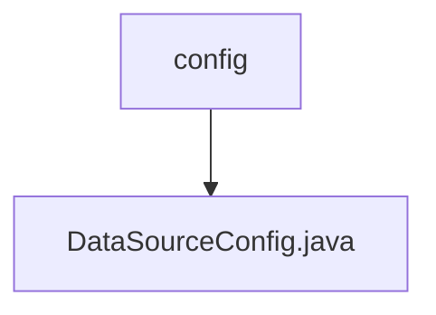

# 基础信息

|      |      |
|------|------|
| 名称 | config |
| 编码语言 | .java |
| 代码路径 | WeFe/serving/serving-service/src/main/java/com/welab/wefe/serving/service/database/config |
| 包名 | docs.serving.serving-service.src.main.java.com.welab.wefe.serving.service.database.config |
| 概述说明 | 配置类DataSourceConfig继承AbstractJpaConfig，定义主数据源"serving"、实体管理器工厂和事务管理器，使用JPA并设置命名策略。 |

# 说明

这是一个Spring Boot的JPA数据源配置类，主要用于配置多数据源环境。类中定义了主数据源"serving"，使用MySQL数据库，通过@Primary注解标记为默认数据源。同时配置了实体管理器工厂bean和事务管理器，指定了实体扫描包路径和JPA仓库的基础类。实体管理器工厂设置了Hibernate的物理命名策略和隐式命名策略，确保表名和字段名符合Spring的命名规范。事务管理器基于JPA实现，用于管理数据库事务。整个配置扩展了AbstractJpaConfig基类，实现了完整的数据访问层基础设施。

### 包内部结构视图

该流程图展示了WeFe项目中数据库配置的层级关系。顶层节点为config文件夹，其下包含一个具体的配置文件DataSourceConfig.java。这种结构是典型的Spring Boot项目配置目录组织方式，体现了单一职责原则，将数据源配置独立存放在专门的文件中。

# 文件列表

| 名称   | 类型  | 说明 |
|-------|------|-------------|
| [DataSourceConfig.java](DataSourceConfig.md) | file | 配置类DataSourceConfig继承AbstractJpaConfig，定义主数据源"serving"、实体管理器工厂和事务管理器，使用JPA并设置命名策略。 |

