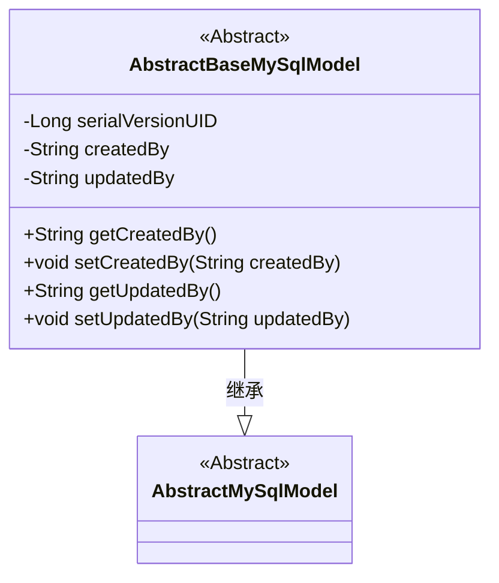
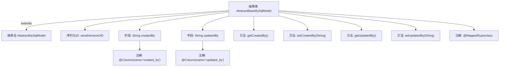

# 基础信息

|      |      |
|------|------|
| 名称 | AbstractBaseMySqlModel |
| 编码语言 | .java |
| 代码路径 | WeFe/serving/serving-service/src/main/java/com/welab/wefe/serving/service/database/entity/AbstractBaseMySqlModel.java |
| 包名 | com.welab.wefe.serving.service.database.entity |
| 依赖项 | ['javax.persistence.Column', 'javax.persistence.MappedSuperclass'] |
| 概述说明 | 抽象基类AbstractBaseMySqlModel继承AbstractMySqlModel，包含createdBy和updatedBy字段及其getter/setter方法。 |

# 说明

这是一个名为AbstractBaseMySqlModel的抽象Java类，继承自AbstractMySqlModel，并使用@MappedSuperclass注解标注。类中包含两个私有字符串字段createdBy和updatedBy，分别通过@Column注解映射到数据库表的created_by和updated_by列。提供了这两个字段的标准getter和setter方法。类实现了Serializable接口，并定义了serialVersionUID常量用于序列化。

# 类列表 Class Summary

| 名称   | 类型  | 说明 |
|-------|------|-------------|
| AbstractBaseMySqlModel | class | 抽象基类AbstractBaseMySqlModel继承AbstractMySqlModel，包含createdBy和updatedBy字段及getter/setter方法。 |

## 类 AbstractBaseMySqlModel

|      |      |
|------|------|
| 访问范围 | @MappedSuperclass;public abstract |
| 类型 | class |
| 名称 | AbstractBaseMySqlModel |
| 说明 | 抽象基类AbstractBaseMySqlModel继承AbstractMySqlModel，包含createdBy和updatedBy字段及getter/setter方法。 |

### UML类图

这段类图展示了一个MySQL基础模型类的继承结构。AbstractBaseMySqlModel作为抽象类继承自AbstractMySqlModel，包含createdBy和updatedBy两个私有字段及其对应的getter/setter方法，用于记录数据创建和更新的操作者信息。类中定义了serialVersionUID用于序列化控制，体现了JPA实体类的典型特征。该设计提供了可复用的基础模型结构，便于在MySQL数据库操作中统一管理审计字段。

### 内部方法调用关系图

这段代码定义了一个抽象基类`AbstractBaseMySqlModel`，它继承自`AbstractMySqlModel`并使用`@MappedSuperclass`注解标记。类中包含两个字段`createdBy`和`updatedBy`，分别用`@Column`注解映射到数据库表的列，并提供了对应的getter和setter方法。该类还定义了一个序列化版本ID`serialVersionUID`。这个基类主要用于为其他实体类提供公共字段和方法，体现了面向对象编程中的继承和复用思想。

### 字段列表 Field List

| 名称  | 类型  | 说明 |
|-------|-------|------|
| createdBy | String | 数据库字段created_by，类型为字符串，存储创建者信息。 |
| updatedBy | String | 数据库字段updatedBy，映射列名updated_by，类型为String。 |
| serialVersionUID = 3412866991205235454L | long | 定义了一个私有静态不可变的序列化版本ID，用于确保类在序列化时的版本兼容性。 |

### 方法列表

| 名称  | 类型  | 说明 |
|-------|-------|------|
| getCreatedBy | String | 获取创建者信息的方法，返回字符串类型变量createdBy。 |
| setCreatedBy | void | 这是一个Java方法，用于设置对象的创建者属性。方法名为setCreatedBy，接受一个字符串参数createdBy，并将其赋值给当前对象的同名成员变量。 |
| getUpdatedBy | String | 获取更新者信息的方法，返回updatedBy字段值。 |
| setUpdatedBy | void | 方法setUpdatedBy用于设置updatedBy属性的值，参数为String类型。 |

