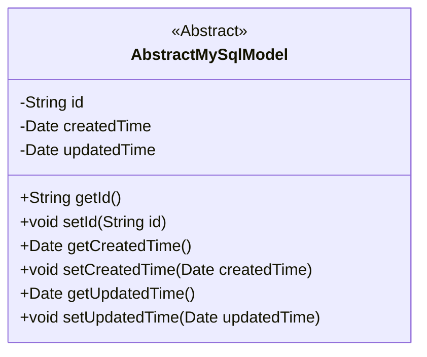
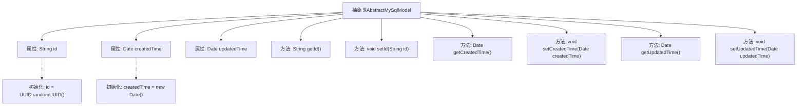

# 基础信息

|      |      |
|------|------|
| 名称 | AbstractMySqlModel |
| 编码语言 | .java |
| 代码路径 | WeFe/serving/serving-service/src/main/java/com/welab/wefe/serving/service/database/entity/AbstractMySqlModel.java |
| 包名 | com.welab.wefe.serving.service.database.entity |
| 依赖项 | ['javax.persistence.Column', 'javax.persistence.Id', 'javax.persistence.MappedSuperclass', 'java.io.Serializable', 'java.util.Date', 'java.util.UUID'] |
| 概述说明 | 抽象类AbstractMySqlModel定义MySQL模型基类，包含ID、创建时间和更新时间字段，ID自动生成不可更新，提供getter/setter方法。 |

# 说明

这是一个名为AbstractMySqlModel的抽象类，使用@MappedSuperclass注解标注，实现了Serializable接口。类中包含三个核心字段：id作为全局唯一标识符，使用UUID生成并去除横线，设置为不可更新；createdTime记录创建时间，默认值为当前时间；updatedTime记录更新时间。类提供了这三个字段的标准getter和setter方法，用于访问和修改字段值。该抽象类可作为其他实体类的基类，提供通用的字段和方法。

# 类列表 Class Summary

| 名称   | 类型  | 说明 |
|-------|------|-------------|
| AbstractMySqlModel | class | 抽象类AbstractMySqlModel定义MySQL模型基类，包含ID、创建时间和更新时间字段及getter/setter方法。ID自动生成无横线UUID，创建时间默认当前时间。 |

## 类 AbstractMySqlModel

|      |      |
|------|------|
| 访问范围 | @MappedSuperclass;public abstract |
| 类型 | class |
| 名称 | AbstractMySqlModel |
| 说明 | 抽象类AbstractMySqlModel定义MySQL模型基类，包含ID、创建时间和更新时间字段及getter/setter方法。ID自动生成无横线UUID，创建时间默认当前时间。 |

### UML类图

这段代码定义了一个名为`AbstractMySqlModel`的抽象类，用于作为MySQL数据库模型的基类。该类实现了`Serializable`接口，表明其实例可以被序列化。类中包含三个私有字段：`id`（使用UUID生成并去除连字符）、`createdTime`（创建时间，默认为当前时间）和`updatedTime`（更新时间）。提供了这些字段的getter和setter方法，允许外部访问和修改这些属性。这个抽象类通常会被其他具体实体类继承，以复用这些公共字段和方法。

### 内部方法调用关系图

这段代码展示了一个抽象类AbstractMySqlModel，它作为MySQL数据模型的基类，实现了Serializable接口以确保可序列化。类中包含三个核心属性：id（使用UUID生成并去除横线）、createdTime（自动初始化为当前时间）和updatedTime，以及对应的getter和setter方法。该设计提供了基础字段的通用实现，便于其他具体模型类继承使用，体现了JPA实体类的典型结构。

### 字段列表 Field List

| 名称  | 类型  | 说明 |
|-------|-------|------|
| id = UUID.randomUUID().toString().replaceAll("-", "") | String | 实体ID字段，使用UUID生成并去除横杠，数据库列名id且不可更新。 |
| createdTime = new Date() | Date | 数据库字段映射：created_time对应Date类型，默认值为当前时间。 |
| updatedTime | Date | 数据库字段updated_time映射为Date类型的updatedTime。 |

### 方法列表

| 名称  | 类型  | 说明 |
|-------|-------|------|
| setId | void | 设置对象ID的方法，将参数id赋值给对象的id属性。 |
| getUpdatedTime | Date | 方法getUpdatedTime返回updatedTime日期对象。 |
| getCreatedTime | Date | 获取创建时间的公共方法，返回Date类型变量createdTime。 |
| setUpdatedTime | void | 设置更新时间的方法，将参数updatedTime赋值给类的成员变量updatedTime。 |
| getId | String | 获取对象ID的方法，返回字符串类型的id值。 |
| setCreatedTime | void | 这是一个Java方法，用于设置对象的创建时间属性，接受一个Date类型参数。 |

