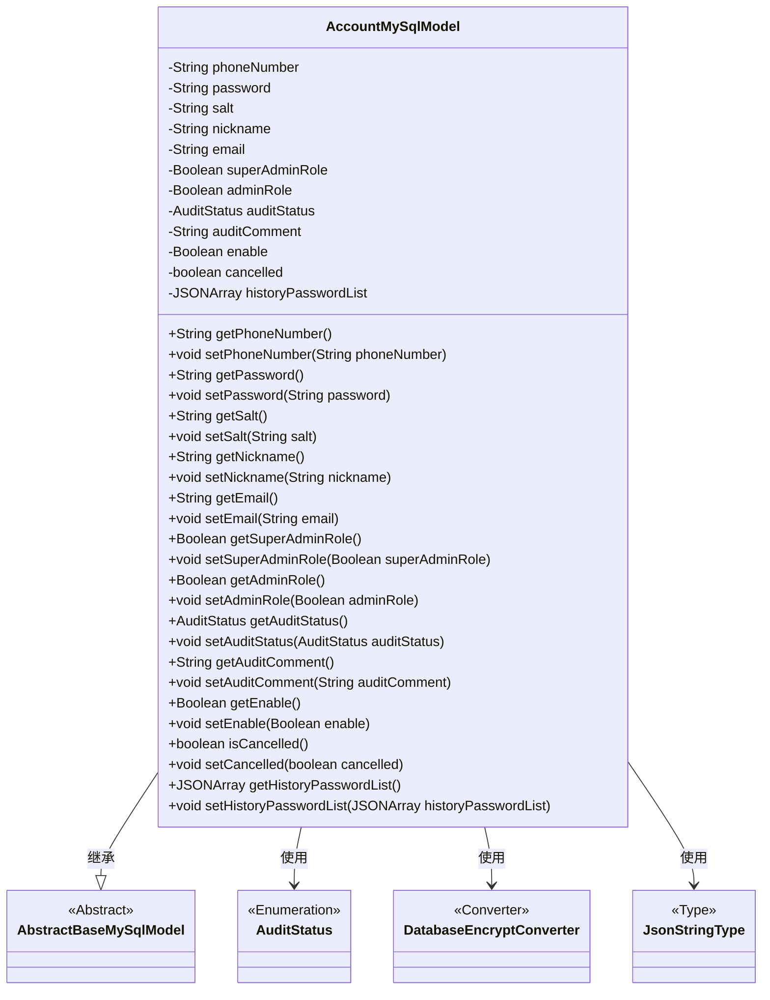

# 基础信息

|      |      |
|------|------|
| 名称 | AccountMySqlModel |
| 编码语言 | .java |
| 代码路径 | WeFe/serving/serving-service/src/main/java/com/welab/wefe/serving/service/database/entity/AccountMySqlModel.java |
| 包名 | com.welab.wefe.serving.service.database.entity |
| 依赖项 | ['com.alibaba.fastjson.JSONArray', 'com.vladmihalcea.hibernate.type.json.JsonStringType', 'com.welab.wefe.common.web.util.DatabaseEncryptConverter', 'com.welab.wefe.common.wefe.enums.AuditStatus', 'org.hibernate.annotations.Type', 'org.hibernate.annotations.TypeDef', 'javax.persistence'] |
| 概述说明 | 账户实体类，包含电话、密码、昵称、邮箱等字段，支持加密存储，区分超级管理员和普通管理员，记录审核状态、历史密码等信息。 |

# 说明

这是一个名为AccountMySqlModel的Java实体类，映射到数据库中的account表。该类继承自AbstractBaseMySqlModel，包含用户账户的基本信息和管理属性。主要字段包括加密存储的手机号、密码、盐值、昵称、邮箱，以及超级管理员和普通管理员标识。此外还包含审核状态、审核意见、账户启用状态、注销状态等管理属性，以及以JSON格式存储的历史密码列表。所有字段都提供了对应的getter和setter方法。

# 类列表 Class Summary

| 名称   | 类型  | 说明 |
|-------|------|-------------|
| AccountMySqlModel | class | AccountMySqlModel是账户实体类，包含电话、密码、昵称、邮箱等字段，支持加密存储，区分超级管理员和普通管理员，记录审核状态、历史密码等信息。 |

## 类 AccountMySqlModel

|      |      |
|------|------|
| 访问范围 | @Entity(name = "account");@TypeDef(name = "json", typeClass = JsonStringType.class);public |
| 类型 | class |
| 名称 | AccountMySqlModel |
| 说明 | AccountMySqlModel是账户实体类，包含电话、密码、昵称、邮箱等字段，支持加密存储，区分超级管理员和普通管理员，记录审核状态、历史密码等信息。 |

### UML类图

这段代码定义了一个名为`AccountMySqlModel`的实体类，用于表示账户信息，继承自`AbstractBaseMySqlModel`。该类包含多个私有字段，如电话号码、密码、昵称等，并提供了相应的getter和setter方法。使用了JPA注解进行数据库映射，包括字段加密转换(`DatabaseEncryptConverter`)和JSON类型处理(`JsonStringType`)。审计状态(`AuditStatus`)是一个枚举类型，用于表示账户的审核状态。类图清晰地展示了类之间的继承关系和依赖关系。

### 内部方法调用关系图

```mermaid
graph TD
    A["类AccountMySqlModel"]
    B["继承: AbstractBaseMySqlModel"]
    C["注解: @Entity('account')"]
    D["注解: @TypeDef(name='json', typeClass=JsonStringType.class)"]
    E["属性: String phoneNumber"]
    F["属性: String password"]
    G["属性: String salt"]
    H["属性: String nickname"]
    I["属性: String email"]
    J["属性: Boolean superAdminRole"]
    K["属性: Boolean adminRole"]
    L["属性: AuditStatus auditStatus"]
    M["属性: String auditComment"]
    N["属性: Boolean enable"]
    O["属性: boolean cancelled"]
    P["属性: JSONArray historyPasswordList"]
    Q["方法: getter/setter"]

    A --> B
    A --> C
    A --> D
    A --> E
    A --> F
    A --> G
    A --> H
    A --> I
    A --> J
    A --> K
    A --> L
    A --> M
    A --> N
    A --> O
    A --> P
    A --> Q
```

这段代码定义了一个名为AccountMySqlModel的实体类，继承自AbstractBaseMySqlModel，用于表示账户信息。类中包含多个属性，如电话号码、密码、昵称、邮箱等，并使用了JPA注解进行数据库映射配置。每个属性都有对应的getter和setter方法，用于访问和修改属性值。类中还定义了一些特殊属性，如超级管理员角色、审核状态、历史密码列表等，用于实现账户管理的各种功能需求。

### 字段列表 Field List

| 名称  | 类型  | 说明 |
|-------|-------|------|
| historyPasswordList | JSONArray | 实体类字段historyPasswordList使用JSON类型存储历史密码列表，数据库列定义为json格式。 |
| auditComment | String | 数据库字段audit_comment映射为私有字符串auditComment。 |
| cancelled = false | boolean | 变量cancelled初始值为false，表示未取消状态。 |
| enable | Boolean | 私有布尔类型变量enable，用于控制功能开关状态。 |
| nickname | String | 声明一个私有字符串变量nickname。 |
| auditStatus | AuditStatus | 实体类字段auditStatus，使用枚举类型AuditStatus，数据库列名audit_status，存储枚举字符串值。 |
| email | String | 私有字符串类型变量email |
| phoneNumber | String | 数据库字段phone_number使用加密转换器存储。 |
| salt | String | 私有字符串变量salt，用于存储加密盐值。 |
| password | String | 私有字符串类型变量password。 |
| serialVersionUID = -6835962000573567824L | long | 声明一个私有静态不可变的长整型序列化版本ID，值为-6835962000573567824。 |
| superAdminRole | Boolean | 数据库字段super_admin_role映射为布尔类型变量superAdminRole。 |
| adminRole | Boolean | 实体类中定义布尔类型字段adminRole，对应数据库列名admin_role。 |

### 方法列表

| 名称  | 类型  | 说明 |
|-------|-------|------|
| setAuditStatus | void | 方法setAuditStatus用于设置auditStatus属性值。 |
| getPhoneNumber | String | 获取电话号码的方法，返回字符串类型变量phoneNumber。 |
| setNickname | void | 设置用户昵称的方法，将输入参数赋值给对象的nickname属性。 |
| setAuditComment | void | 设置审核评语的方法，将参数auditComment赋值给类的auditComment属性。 |
| setSuperAdminRole | void | 设置超级管理员角色的方法，参数为布尔值。 |
| getAdminRole | Boolean | 获取管理员角色状态的方法，返回布尔值表示是否为管理员。 |
| getNickname | String | 获取昵称的方法，返回字符串类型的nickname。 |
| setSalt | void | 这是一个Java方法，用于设置类中的salt字符串属性。方法接受一个String参数salt，并将其赋值给类的成员变量this.salt。 |
| getSalt | String | 获取salt值的公开方法。 |
| getAuditComment | String | 获取审计评语的方法，返回auditComment字符串。 |
| setCancelled | void | 设置取消状态的布尔值方法，将参数cancelled赋值给成员变量cancelled。 |
| getEnable | Boolean | 获取enable布尔值的公共方法。 |
| setAdminRole | void | 设置管理员角色的方法，参数为布尔值。 |
| getEmail | String | 获取邮箱地址的方法。 |
| isCancelled | boolean | 检查任务是否已取消，返回布尔值cancelled的状态。 |
| setEmail | void | 这是一个Java方法，用于设置对象的email属性，接受一个字符串参数email并将其赋值给对象的email字段。 |
| setPhoneNumber | void | Java方法：设置电话号码属性值。 |
| getSuperAdminRole | Boolean | 获取超级管理员角色状态的方法，返回布尔值。 |
| setEnable | void | 这是一个Java方法，用于设置布尔类型的enable属性值。方法接受一个Boolean参数，并将其赋值给类的成员变量enable。 |
| getPassword | String | 获取密码方法，返回字符串类型密码值。 |
| getHistoryPasswordList | JSONArray | 获取历史密码列表的方法，返回JSONArray类型的历史密码数据。 |
| setHistoryPasswordList | void | 设置历史密码列表方法，接收JSON数组参数并赋值给成员变量。 |
| setPassword | void | 这是一个Java方法，用于设置密码。方法名为setPassword，接受一个字符串参数password，并将其赋值给类的成员变量password。 |
| getAuditStatus | AuditStatus | 获取审核状态的方法，返回auditStatus字段值。 |

