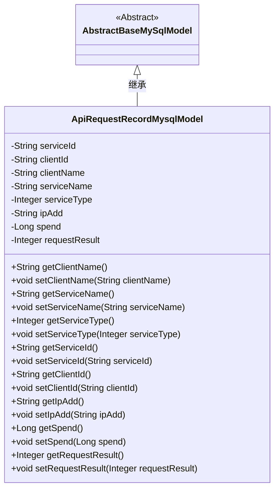

# 基础信息

|      |      |
|------|------|
| 名称 | ApiRequestRecordMysqlModel |
| 编码语言 | .java |
| 代码路径 | WeFe/serving/serving-service/src/main/java/com/welab/wefe/serving/service/database/entity/ApiRequestRecordMysqlModel.java |
| 包名 | com.welab.wefe.serving.service.database.entity |
| 依赖项 | ['javax.persistence.Column', 'javax.persistence.Entity'] |
| 概述说明 | 这是一个API请求记录的MySQL实体类，包含服务ID、客户ID、名称、类型、IP地址、耗时和请求结果等字段。 |

# 说明

这是一个名为ApiRequestRecordMysqlModel的Java实体类，映射到数据库表api_request_record。它继承自AbstractBaseMySqlModel，包含多个字段用于记录API请求信息：服务ID、客户端ID、客户名称、服务名称、服务类型、IP地址、请求耗时和请求结果。每个字段都有对应的getter和setter方法，部分字段通过@Column注解指定了数据库列名。该实体类主要用于存储和管理API调用的相关数据。

# 类列表 Class Summary

| 名称   | 类型  | 说明 |
|-------|------|-------------|
| ApiRequestRecordMysqlModel | class | Java实体类ApiRequestRecordMysqlModel，记录API请求信息，包含服务ID、客户ID、名称、类型、IP地址、耗时和请求结果等字段。 |

## 类 ApiRequestRecordMysqlModel

|      |      |
|------|------|
| 访问范围 | @Entity(name = "api_request_record");public |
| 类型 | class |
| 名称 | ApiRequestRecordMysqlModel |
| 说明 | Java实体类ApiRequestRecordMysqlModel，记录API请求信息，包含服务ID、客户ID、名称、类型、IP地址、耗时和请求结果等字段。 |

### UML类图

这段代码定义了一个名为`ApiRequestRecordMysqlModel`的实体类，用于记录API请求的相关信息，包括服务ID、客户端ID、客户名称、服务名称、服务类型、IP地址、耗时和请求结果等字段。该类继承自`AbstractBaseMySqlModel`抽象类，表明它是一个基于MySQL的数据库模型。类中提供了各个字段的getter和setter方法，用于访问和修改这些属性。通过JPA注解`@Entity`和`@Column`，该类与数据库中的`api_request_record`表及其字段建立了映射关系。

### 内部方法调用关系图

```mermaid
graph TD
    A["类ApiRequestRecordMysqlModel"]
    B["继承: AbstractBaseMySqlModel"]
    C["注解: @Entity(name='api_request_record')"]
    D["属性: String serviceId"]
    E["属性: String clientId"]
    F["属性: String clientName"]
    G["属性: String serviceName"]
    H["属性: Integer serviceType"]
    I["属性: String ipAdd"]
    J["属性: Long spend"]
    K["属性: Integer requestResult"]
    L["方法: getClientName/setClientName"]
    M["方法: getServiceName/setServiceName"]
    N["方法: getServiceType/setServiceType"]
    O["方法: getServiceId/setServiceId"]
    P["方法: getClientId/setClientId"]
    Q["方法: getIpAdd/setIpAdd"]
    R["方法: getSpend/setSpend"]
    S["方法: getRequestResult/setRequestResult"]

    A --> B
    A --> C
    A --> D
    A --> E
    A --> F
    A --> G
    A --> H
    A --> I
    A --> J
    A --> K
    A --> L
    A --> M
    A --> N
    A --> O
    A --> P
    A --> Q
    A --> R
    A --> S
```

该流程图展示了ApiRequestRecordMysqlModel类的完整结构，包括继承关系、实体注解、8个私有属性及其对应的getter/setter方法。作为数据库实体类，它通过JPA注解映射到api_request_record表，记录了API请求的服务信息、客户端信息、IP地址、耗时和结果等核心字段，所有属性均通过标准访问器方法进行封装。

### 字段列表 Field List

| 名称  | 类型  | 说明 |
|-------|-------|------|
| spend | Long | 私有长整型变量spend，用于存储数值。 |
| requestResult | Integer | 数据库字段映射：requestResult对应表列request_result，类型为Integer。 |
| ipAdd | String | 数据库字段映射：私有字符串类型变量ipAdd对应表列ip_add。 |
| clientId | String | 数据库字段映射：clientId对应表列client_id。 |
| serviceType | Integer | 数据库字段映射：service_type对应Integer类型的serviceType。 |
| clientName | String | 数据库字段映射：client_name对应clientName字符串类型。 |
| serviceName | String | 数据库字段映射：serviceName对应表列service_name。 |
| serviceId | String | 数据库字段映射：serviceId对应表列service_id。 |

### 方法列表

| 名称  | 类型  | 说明 |
|-------|-------|------|
| setIpAdd | void | 这是一个Java方法，用于设置类的ipAdd属性值。方法接收一个字符串参数ipAdd，并将其赋值给类的同名成员变量。 |
| getIpAdd | String | 获取IP地址的方法，返回字符串类型变量ipAdd。 |
| getServiceId | String | 这是一个Java方法，返回字符串类型的serviceId属性值。 |
| setClientId | void | 设置客户端ID的方法，将参数clientId赋值给当前对象的clientId属性。 |
| setServiceName | void | 这是一个Java方法，用于设置类的serviceName属性。方法接收一个字符串参数serviceName，并将其赋值给类的同名成员变量。 |
| setServiceId | void | 设置服务ID的方法，将输入参数赋值给类的serviceId成员变量。 |
| getServiceType | Integer | 获取服务类型的方法，返回整型值serviceType。 |
| getServiceName | String | 获取服务名称的方法，直接返回serviceName变量值。 |
| setServiceType | void | 这是一个Java方法，用于设置类的serviceType属性，接收一个Integer类型参数。 |
| getClientName | String | 获取客户端名称的方法，返回字符串clientName。 |
| getClientId | String | 这是一个Java方法，返回字符串类型的clientId成员变量值。 |
| setClientName | void | 设置客户端名称的方法，将输入参数赋值给类成员变量clientName。 |
| setSpend | void | 这是一个Java方法，用于设置类成员变量spend的值。方法接受一个Long类型参数，并将其赋值给当前对象的spend属性。 |
| getRequestResult | Integer | 获取请求结果的整数值。 |
| setRequestResult | void | 定义方法setRequestResult，用于设置请求结果requestResult的整数值。 |
| getSpend | Long | 方法getSpend返回一个Long类型的spend值。 |

