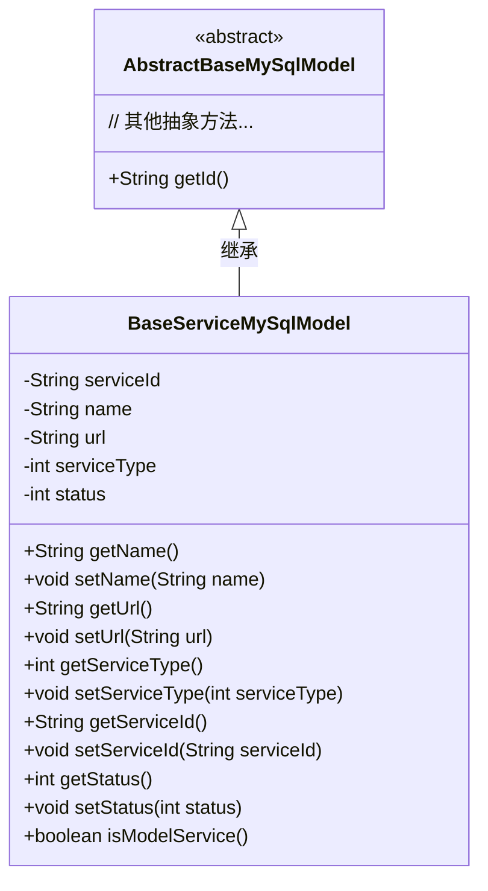

# 基础信息

|      |      |
|------|------|
| 名称 | BaseServiceMySqlModel |
| 编码语言 | .java |
| 代码路径 | WeFe/serving/serving-service/src/main/java/com/welab/wefe/serving/service/database/entity/BaseServiceMySqlModel.java |
| 包名 | com.welab.wefe.serving.service.database.entity |
| 依赖项 | ['javax.persistence.Column', 'javax.persistence.Entity', 'javax.persistence.Inheritance', 'javax.persistence.InheritanceType', 'javax.persistence.Table', 'org.hibernate.annotations.TypeDef', 'com.vladmihalcea.hibernate.type.json.JsonStringType'] |
| 概述说明 | BaseServiceMySqlModel是继承AbstractBaseMySqlModel的实体类，映射数据库表base_service，包含服务ID、名称、URL、类型和状态等字段，提供getter/setter方法及判断是否为模型服务的方法。 |

# 说明

该代码定义了一个名为BaseServiceMySqlModel的Java实体类，映射到数据库表base_service。它继承自AbstractBaseMySqlModel，采用JOINED继承策略。类中包含服务ID、名称、URL地址、服务类型和状态等字段，其中服务ID默认使用父类的ID。状态字段默认为0表示离线，1表示在线。提供了各字段的getter和setter方法，以及一个判断服务类型是否大于6的辅助方法isModelService。实体使用了json类型定义，表明可能包含JSON格式数据。

# 类列表 Class Summary

| 名称   | 类型  | 说明 |
|-------|------|-------------|
| BaseServiceMySqlModel | class | BaseServiceMySqlModel是继承AbstractBaseMySqlModel的JPA实体类，映射数据库表base_service，包含服务ID、名称、URL、类型和状态字段，支持JSON类型，提供状态判断方法。 |

## 类 BaseServiceMySqlModel

|      |      |
|------|------|
| 访问范围 | @Entity(name = "base_service");@Table(name = "base_service");@Inheritance(strategy = InheritanceType.JOINED);@TypeDef(name = "json", typeClass = JsonStringType.class);public |
| 类型 | class |
| 名称 | BaseServiceMySqlModel |
| 说明 | BaseServiceMySqlModel是继承AbstractBaseMySqlModel的JPA实体类，映射数据库表base_service，包含服务ID、名称、URL、类型和状态字段，支持JSON类型，提供状态判断方法。 |

### UML类图

该代码定义了一个名为`BaseServiceMySqlModel`的实体类，继承自抽象类`AbstractBaseMySqlModel`。类中包含服务ID、名称、URL、类型和状态等私有属性，并提供了相应的getter和setter方法。其中`serviceId`属性通过调用父类的`getId()`方法初始化，`isModelService()`方法用于判断服务类型是否大于6。该类使用JPA注解进行ORM映射，表明它是一个数据库实体，并采用JOINED继承策略。

### 内部方法调用关系图

```mermaid
graph TD
    A["类BaseServiceMySqlModel"]
    B["继承: AbstractBaseMySqlModel"]
    C["注解: @Entity/Table/Inheritance/TypeDef"]
    D["属性: String serviceId = super.getId()"]
    E["属性: String name"]
    F["属性: String url"]
    G["属性: int serviceType"]
    H["属性: int status = 0"]
    I["方法: getName/setName"]
    J["方法: getUrl/setUrl"]
    K["方法: getServiceType/setServiceType"]
    L["方法: getServiceId/setServiceId"]
    M["方法: getStatus/setStatus"]
    N["方法: isModelService"]

    A --> B
    A --> C
    A --> D
    A --> E
    A --> F
    A --> G
    A --> H
    A --> I
    A --> J
    A --> K
    A --> L
    A --> M
    A --> N
```

这段代码定义了一个名为BaseServiceMySqlModel的JPA实体类，继承自AbstractBaseMySqlModel，用于表示基础服务数据模型。类中包含服务ID、名称、URL、类型和状态等属性，通过注解配置了数据库映射关系（表名、继承策略和JSON类型支持）。提供了标准的getter/setter方法以及isModelService业务方法，用于判断服务类型是否大于6。该实体主要用于ORM框架进行数据库操作，体现了服务模型的核心属性与行为。

### 字段列表 Field List

| 名称  | 类型  | 说明 |
|-------|-------|------|
| serviceType | int | 数据库字段映射：service_type对应整型变量serviceType。 |
| url | String | 私有字符串变量url |
| status = 0 | int | 代码定义了一个私有整型变量status，默认值为0，对应数据库列名"status"。 |
| serviceId = super.getId() | String | 数据库字段映射：service_id对应父类ID字符串。 |
| serialVersionUID = 6086376958829410311L | long | 定义了一个私有静态常量serialVersionUID，值为6086376958829410311L，用于序列化版本控制。 |
| name | String | 私有字符串类型变量name。 |

### 方法列表

| 名称  | 类型  | 说明 |
|-------|-------|------|
| setServiceType | void | 设置服务类型的方法，接收整型参数并赋值给类变量serviceType。 |
| getServiceType | int | 获取服务类型的方法，返回整型变量serviceType的值。 |
| setUrl | void | 设置URL地址的方法，将输入参数url赋值给类的成员变量url。 |
| getServiceId | String | 这是一个Java方法，返回字符串类型的serviceId成员变量值。 |
| getName | String | 获取名称的方法，返回变量name的值。 |
| setServiceId | void | 设置服务ID的方法，将输入参数赋值给类的serviceId成员变量。 |
| getStatus | int | 方法返回整型状态值status。 |
| setStatus | void | 设置状态值的方法，将输入参数status赋值给类成员变量status。 |
| isModelService | boolean | 方法isModelService检查serviceType是否大于6，返回布尔值。 |
| getUrl | String | 这是一个Java方法，返回字符串类型的url变量值。 |
| setName | void | 设置对象名称的方法，将参数name赋值给对象的name属性。 |

