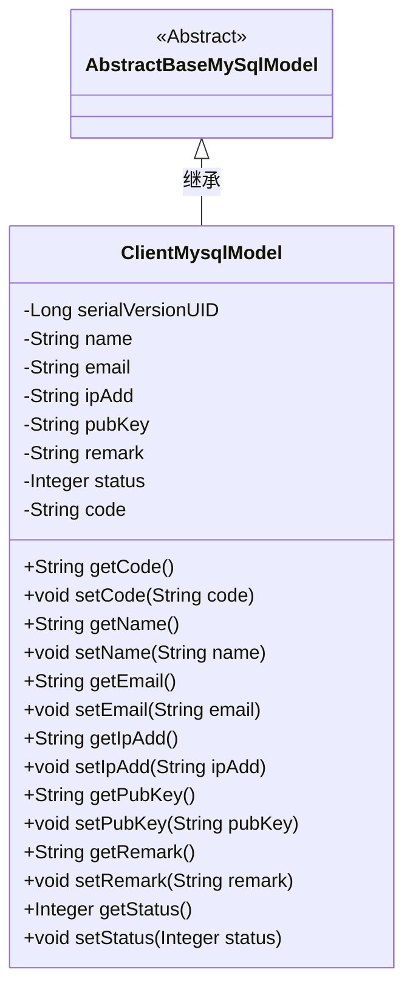

# 基础信息

|      |      |
|------|------|
| 名称 | ClientMysqlModel |
| 编码语言 | .java |
| 代码路径 | WeFe/serving/serving-service/src/main/java/com/welab/wefe/serving/service/database/entity/ClientMysqlModel.java |
| 包名 | com.welab.wefe.serving.service.database.entity |
| 依赖项 | ['com.welab.wefe.serving.service.enums.ClientStatusEnum', 'javax.persistence.Column', 'javax.persistence.Entity'] |
| 概述说明 | ClientMysqlModel类表示客户端实体，包含名称、邮箱、IP地址、公钥、备注、状态和代码字段，状态默认为正常。 |

# 说明

这是一个名为ClientMysqlModel的Java实体类，映射数据库表client。它继承自AbstractBaseMySqlModel，包含name、email、ip_add、pub_key、remark、status和code字段。其中ip_add和pub_key通过@Column注解指定了数据库列名。status字段默认值为ClientStatusEnum.NORMAL的值，表示正常状态。类中为每个字段提供了getter和setter方法，实现了对字段的访问和修改。

# 类列表 Class Summary

| 名称   | 类型  | 说明 |
|-------|------|-------------|
| ClientMysqlModel | class | ClientMysqlModel类表示客户端实体，包含名称、邮箱、IP地址、公钥、备注、状态和代码字段，状态默认为正常。 |

## 类 ClientMysqlModel

|      |      |
|------|------|
| 访问范围 | @Entity(name = "client");public |
| 类型 | class |
| 名称 | ClientMysqlModel |
| 说明 | ClientMysqlModel类表示客户端实体，包含名称、邮箱、IP地址、公钥、备注、状态和代码字段，状态默认为正常。 |

### UML类图

这段类图展示了ClientMysqlModel继承自AbstractBaseMySqlModel的层级关系。ClientMysqlModel是一个实体类，包含客户相关的多个属性（如name、email、ipAdd等）及其对应的getter和setter方法。其中status属性默认值为ClientStatusEnum.NORMAL的值，表明客户状态默认为正常。类通过@Entity注解标记为JPA实体，与数据库表"client"映射。该设计实现了数据模型的封装和基础功能的复用。

### 内部方法调用关系图

```mermaid
graph TD
    A["类ClientMysqlModel"]
    B["继承: AbstractBaseMySqlModel"]
    C["注解: @Entity(name='client')"]
    D["属性: String name"]
    E["属性: String email"]
    F["属性: @Column String ipAdd"]
    G["属性: @Column String pubKey"]
    H["属性: String remark"]
    I["属性: Integer status"]
    J["属性: String code"]
    K["方法: getCode/setCode"]
    L["方法: getName/setName"]
    M["方法: getEmail/setEmail"]
    N["方法: getIpAdd/setIpAdd"]
    O["方法: getPubKey/setPubKey"]
    P["方法: getRemark/setRemark"]
    Q["方法: getStatus/setStatus"]

    A --> B
    A --> C
    A --> D
    A --> E
    A --> F
    A --> G
    A --> H
    A --> I
    A --> J
    A --> K
    A --> L
    A --> M
    A --> N
    A --> O
    A --> P
    A --> Q
```

这段代码定义了一个名为ClientMysqlModel的JPA实体类，继承自AbstractBaseMySqlModel。类中包含多个属性（name、email、ipAdd等）及其对应的getter和setter方法，其中ipAdd和pubKey属性通过@Column注解与数据库列名映射。status属性默认值为ClientStatusEnum.NORMAL的枚举值。该实体类用于表示客户端数据在MySQL中的存储模型，通过注解配置与数据库表的映射关系。

### 字段列表 Field List

| 名称  | 类型  | 说明 |
|-------|-------|------|
| ipAdd | String | 数据库字段映射：ipAdd对应表列ip_add，类型为字符串。 |
| status = ClientStatusEnum.NORMAL.getValue() | Integer | 私有整型变量status初始化为ClientStatusEnum.NORMAL的值。 |
| email | String | 声明一个私有字符串变量email。 |
| serialVersionUID = -3524660109499676484L | long | 定义了一个私有静态不可变的序列化版本ID，用于确保类的序列化兼容性。 |
| code | String | 私有字符串类型变量code。 |
| name | String | 私有字符串变量name |
| remark | String | 私有字符串类型变量，用于存储备注信息。 |
| pubKey | String | 数据库字段映射：pub_key对应String类型变量pubKey。 |

### 方法列表

| 名称  | 类型  | 说明 |
|-------|-------|------|
| setCode | void | 设置字符串类型的code变量值。 |
| getPubKey | String | 获取公钥的方法，返回pubKey变量值。 |
| getCode | String | 获取并返回code字符串值的方法。 |
| getEmail | String | 获取email的字符串值方法。 |
| getName | String | 获取名称的方法，返回变量name的值。 |
| getIpAdd | String | 获取IP地址的方法，返回字符串类型变量ipAdd。 |
| setRemark | void | 这是一个Java方法，用于设置对象的remark属性值。方法接收一个字符串参数，并将其赋值给对象的remark字段。 |
| getRemark | String | 获取备注信息的字符串方法。 |
| setEmail | void | 这是一个Java方法，用于设置类中的email属性值。方法接收一个字符串参数email，并将其赋值给类的成员变量this.email。 |
| setPubKey | void | 设置公钥的Java方法，将输入字符串赋值给类的pubKey成员变量。 |
| setIpAdd | void | 这是一个Java方法，用于设置类的ipAdd属性值。方法接收一个字符串参数ipAdd，并将其赋值给类的同名成员变量。 |
| setName | void | 这是一个Java方法，用于设置对象的名称属性。方法接受一个字符串参数name，并将其赋值给当前对象的name字段。 |
| getStatus | Integer | 获取状态值的方法，返回整数类型的状态值。 |
| setStatus | void | 设置状态值的方法，将输入参数status赋值给类的status属性。 |

