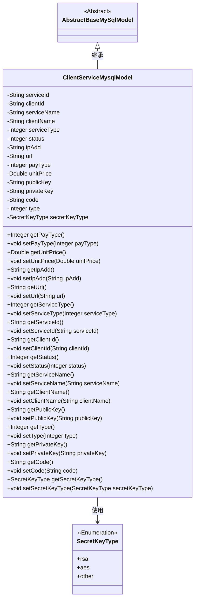

# 基础信息

|      |      |
|------|------|
| 名称 | ClientServiceMysqlModel |
| 编码语言 | .java |
| 代码路径 | WeFe/serving/serving-service/src/main/java/com/welab/wefe/serving/service/database/entity/ClientServiceMysqlModel.java |
| 包名 | com.welab.wefe.serving.service.database.entity |
| 依赖项 | ['javax.persistence.Column', 'javax.persistence.Entity', 'javax.persistence.EnumType', 'javax.persistence.Enumerated', 'com.welab.wefe.common.constant.SecretKeyType', 'com.welab.wefe.common.fieldvalidate.annotation.Check', 'com.welab.wefe.serving.service.enums.ServiceClientTypeEnum', 'com.welab.wefe.serving.service.enums.ServiceStatusEnum'] |
| 概述说明 | ClientServiceMysqlModel类映射client_service表，包含服务ID、客户ID、名称、类型、状态、IP、URL、价格、密钥等字段，默认状态未使用，密钥类型为rsa。 |

# 说明

该内容定义了一个名为ClientServiceMysqlModel的Java实体类，映射到数据库表client_service。类继承自AbstractBaseMySqlModel，包含服务与客户关联信息。主要字段包括服务ID、客户ID、服务名称、客户名称、服务类型（1-8表示开通，-1表示激活）、状态（默认未使用）、IP地址、URL、支付类型、单价、公钥、私钥、代码、类型（默认开通）及密钥类型（默认RSA）。每个字段均有对应的getter和setter方法，部分字段有注释说明其用途和取值范围。

# 类列表 Class Summary

| 名称   | 类型  | 说明 |
|-------|------|-------------|
| ClientServiceMysqlModel | class | 客户端服务MySQL实体类，包含服务ID、客户端ID、名称、类型、状态、IP、URL、密钥、价格等字段，默认状态未使用，密钥类型RSA。 |

## 类 ClientServiceMysqlModel

|      |      |
|------|------|
| 访问范围 | @Entity(name = "client_service");public |
| 类型 | class |
| 名称 | ClientServiceMysqlModel |
| 说明 | 客户端服务MySQL实体类，包含服务ID、客户端ID、名称、类型、状态、IP、URL、密钥、价格等字段，默认状态未使用，密钥类型RSA。 |

### UML类图

这段代码定义了一个名为`ClientServiceMysqlModel`的实体类，继承自抽象基类`AbstractBaseMySqlModel`，用于表示客户端服务信息。该类包含多个字段，如服务ID、客户端ID、服务名称、客户端名称、服务类型、状态、IP地址、URL、支付类型、单价、公钥、私钥、代码、类型和密钥类型等，并提供了相应的getter和setter方法。其中，密钥类型`secretKeyType`是一个枚举类型`SecretKeyType`的实例，默认为rsa。该类主要用于数据库映射，存储和管理客户端服务的相关信息。

### 内部方法调用关系图

该流程图展示了ClientServiceMysqlModel类的完整结构，包括其继承关系、实体注解、15个属性字段（涉及字符串、数值和枚举类型）以及对应的getter/setter方法。特别值得注意的是url字段的getter/setter方法中包含空值检查和trim处理逻辑，status和type字段带有默认值初始化，secretKeyType字段使用枚举类型并通过@Enumerated注解指定存储策略。类整体设计为数据库实体模型，包含服务与客户端的关联信息、支付相关属性和密钥管理功能。

### 字段列表 Field List

| 名称  | 类型  | 说明 |
|-------|-------|------|
| clientName | String | 数据库字段映射：client_name对应clientName字符串类型。 |
| secretKeyType = SecretKeyType.rsa | SecretKeyType | 数据库字段secret_key_type存储密钥类型，默认值为rsa，使用枚举字符串映射。 |
| status = ServiceStatusEnum.UNUSED.getCode() | Integer | 私有整型变量status初始化为服务状态枚举类中未使用状态对应的代码值。 |
| clientId | String | 数据库字段映射：client_id对应String类型的clientId。 |
| payType | Integer | 数据库字段pay_type映射为私有整型变量payType。 |
| code | String | 数据库字段映射：code列对应字符串类型变量code。 |
| serialVersionUID = -2660433592111729597L | long | 私有静态常量序列化ID，值为-2660433592111729597L。 |
| serviceType | Integer | 数据库字段映射：service_type对应Integer类型serviceType。 |
| type = ServiceClientTypeEnum.OPEN.getValue() | Integer | 数据库字段映射：type对应ServiceClientTypeEnum.OPEN的整型值。 |
| ipAdd | String | 数据库字段映射：ipAdd对应表列ip_add，类型为字符串。 |
| serviceId | String | 数据库字段映射：service_id对应私有字符串变量serviceId。 |
| unitPrice | Double | 数据库字段unit_price映射为Double类型的unitPrice。 |
| privateKey | String | 数据库字段private_key映射为Java类的privateKey字符串属性。 |
| publicKey | String | 数据库字段映射：publicKey对应表列public_key，类型为String。 |
| url | String | 声明一个私有字符串变量url。 |
| serviceName | String | 数据库字段映射：serviceName对应表列service_name。 |

### 方法列表

| 名称  | 类型  | 说明 |
|-------|-------|------|
| setUrl | void | 设置URL方法：若参数非空则去除首尾空格后赋值给成员变量url。 |
| setPayType | void | 这是一个Java方法，用于设置支付类型属性。方法接收一个Integer参数payType，并将其赋值给类的同名成员变量。 |
| setType | void | 设置类型属性的方法，参数为整型。 |
| getServiceId | String | 获取serviceId的公共方法。 |
| getClientName | String | 获取客户端名称的方法，返回字符串clientName。 |
| getServiceName | String | 这是一个Java方法，返回字符串类型的serviceName属性值。 |
| setUnitPrice | void | 设置单价方法，接收Double参数并赋值给类成员变量unitPrice。 |
| getPrivateKey | String | 获取私有密钥的方法，返回privateKey变量值。 |
| setServiceName | void | 设置服务名称的方法，将输入参数赋值给类的成员变量serviceName。 |
| setStatus | void | 定义公共方法setStatus，接收整型参数status并赋值给当前对象的status属性。 |
| getSecretKeyType | SecretKeyType | 获取密钥类型的方法，返回secretKeyType。 |
| setSecretKeyType | void | 设置密钥类型的方法，将参数secretKeyType赋值给当前对象的secretKeyType属性。 |
| getStatus | Integer | 获取状态值的方法，返回整数类型的status变量。 |
| setPrivateKey | void | 设置私有密钥的方法，将输入字符串赋值给类的privateKey成员变量。 |
| getType | Integer | 获取类型值的方法，返回整数类型的type变量。 |
| setIpAdd | void | 定义了一个公共方法setIpAdd，用于设置类成员变量ipAdd的值。参数为字符串类型ipAdd。 |
| setServiceType | void | 定义了一个公共方法setServiceType，用于设置类中的serviceType整型属性。 |
| getUrl | String | 该方法检查URL是否为null，若非null则返回去除首尾空格的URL，否则返回null。 |
| setServiceId | void | 设置服务ID的方法，将输入参数赋值给类的serviceId成员变量。 |
| getPayType | Integer | 方法getPayType返回payType的整数值。 |
| setCode | void | 设置字符串类型的code变量值。 |
| getPublicKey | String | 获取公钥的方法，返回publicKey变量值。 |
| getServiceType | Integer | 获取serviceType的整数值。 |
| getUnitPrice | Double | 获取商品单价的方法，返回Double类型数值。 |
| getCode | String | 这是一个Java方法，返回字符串类型的code变量值。 |
| setClientName | void | 设置客户端名称的方法，将参数clientName赋值给当前对象的clientName属性。 |
| getClientId | String | 这是一个Java方法，返回字符串类型的clientId成员变量值。 |
| getIpAdd | String | 获取IP地址的方法，返回字符串类型的ipAdd。 |
| setClientId | void | 设置客户端ID的方法，将参数clientId赋值给当前对象的clientId属性。 |
| setPublicKey | void | 设置公钥的方法，将输入字符串赋值给类的publicKey成员变量。 |

