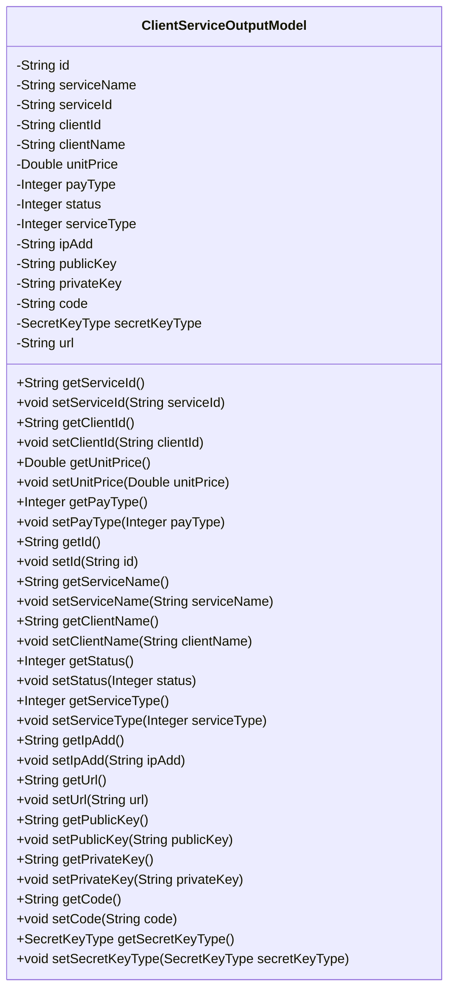

# 基础信息

|      |      |
|------|------|
| 名称 | ClientServiceOutputModel |
| 编码语言 | .java |
| 代码路径 | WeFe/serving/serving-service/src/main/java/com/welab/wefe/serving/service/database/entity/ClientServiceOutputModel.java |
| 包名 | com.welab.wefe.serving.service.database.entity |
| 依赖项 | ['com.welab.wefe.common.constant.SecretKeyType', 'javax.persistence', 'java.util.UUID'] |
| 概述说明 | ClientServiceOutputModel类包含服务与客户信息，如ID、名称、价格、状态、密钥类型及请求地址等字段，用于管理服务输出数据。 |

# 说明

ClientServiceOutputModel是一个实体类，用于表示客户服务输出模型。该类包含多个属性，包括自动生成的ID、服务名称、服务ID、客户ID、客户名称、单价、付费类型、启用状态、服务类型、IP地址、公钥、私钥、代码、密钥类型（默认为rsa）和请求地址。每个属性都有对应的getter和setter方法，用于访问和修改属性值。密钥类型使用枚举类型SecretKeyType表示。该实体类主要用于存储和管理客户服务的相关信息。

# 类列表 Class Summary

| 名称   | 类型  | 说明 |
|-------|------|-------------|
| ClientServiceOutputModel | class | ClientServiceOutputModel类包含客户服务相关属性，如ID、服务名称、客户信息、价格、状态、密钥及请求地址等。 |

## 类 ClientServiceOutputModel

|      |      |
|------|------|
| 访问范围 | @Entity;public |
| 类型 | class |
| 名称 | ClientServiceOutputModel |
| 说明 | ClientServiceOutputModel类包含客户服务相关属性，如ID、服务名称、客户信息、价格、状态、密钥及请求地址等。 |

### UML类图

这段代码定义了一个名为`ClientServiceOutputModel`的实体类，用于表示客户端服务输出模型。该类包含多个私有字段，如服务名称、服务ID、客户端ID、单价、付费类型等，并提供了对应的getter和setter方法。其中`secretKeyType`字段使用了枚举类型`SecretKeyType`，默认值为`rsa`。该类主要用于存储和操作客户端服务的相关信息，包括服务的基本属性、密钥信息以及状态等。通过JPA注解`@Entity`和`@Id`标记，表明这是一个可持久化的实体类。

### 内部方法调用关系图

```mermaid
graph TD
    A["类ClientServiceOutputModel"]
    B["属性: String id"]
    C["属性: String serviceName"]
    D["属性: String serviceId"]
    E["属性: String clientId"]
    F["属性: String clientName"]
    G["属性: Double unitPrice"]
    H["属性: Integer payType"]
    I["属性: Integer status"]
    J["属性: Integer serviceType"]
    K["属性: String ipAdd"]
    L["属性: String publicKey"]
    M["属性: String privateKey"]
    N["属性: String code"]
    O["属性: SecretKeyType secretKeyType"]
    P["属性: String url"]
    Q["方法: getServiceId/setServiceId"]
    R["方法: getClientId/setClientId"]
    S["方法: getUnitPrice/setUnitPrice"]
    T["方法: getPayType/setPayType"]
    U["方法: getId/setId"]
    V["方法: getServiceName/setServiceName"]
    W["方法: getClientName/setClientName"]
    X["方法: getStatus/setStatus"]
    Y["方法: getServiceType/setServiceType"]
    Z["方法: getIpAdd/setIpAdd"]
    AA["方法: getUrl/setUrl"]
    AB["方法: getPublicKey/setPublicKey"]
    AC["方法: getPrivateKey/setPrivateKey"]
    AD["方法: getCode/setCode"]
    AE["方法: getSecretKeyType/setSecretKeyType"]

    A --> B
    A --> C
    A --> D
    A --> E
    A --> F
    A --> G
    A --> H
    A --> I
    A --> J
    A --> K
    A --> L
    A --> M
    A --> N
    A --> O
    A --> P
    A --> Q
    A --> R
    A --> S
    A --> T
    A --> U
    A --> V
    A --> W
    A --> X
    A --> Y
    A --> Z
    A --> AA
    A --> AB
    A --> AC
    A --> AD
    A --> AE
```

该流程图展示了ClientServiceOutputModel类的结构和功能。该类是一个实体类，包含多个属性如id、serviceName、serviceId等，以及对应的getter和setter方法。类的主要作用是存储和操作客户端服务输出的相关数据，包括服务信息、客户信息、价格、状态等。通过getter和setter方法，可以对这些属性进行读取和修改操作。

### 字段列表 Field List

| 名称  | 类型  | 说明 |
|-------|-------|------|
| payType | Integer | 支付类型，整型私有变量。 |
| status | Integer | 私有整型状态变量。 |
| id = UUID.randomUUID().toString().replaceAll("-", "") | String | 自动生成无连字符的UUID作为ID字段。 |
| clientName | String | 声明一个私有字符串变量clientName。 |
| clientId | String | 声明一个私有字符串变量clientId。 |
| ipAdd | String | 声明一个私有字符串变量ipAdd。 |
| serviceName | String | 私有字符串变量serviceName，用于存储服务名称。 |
| unitPrice | Double | 私有双精度浮点型变量unitPrice。 |
| serviceType | Integer | 私有整型变量，表示服务类型。 |
| url | String | 声明一个私有字符串变量url。 |
| secretKeyType = SecretKeyType.rsa | SecretKeyType | 数据库字段secret_key_type存储为字符串枚举，默认值为rsa。 |
| privateKey | String | 私有字符串变量privateKey |
| code | String | 私有字符串变量code。 |
| serviceId | String | 私有字符串类型变量serviceId。 |
| publicKey | String | 私有字符串变量publicKey，用于存储公钥。 |

### 方法列表

| 名称  | 类型  | 说明 |
|-------|-------|------|
| getId | String | 方法getId返回字符串类型的id值。 |
| getPublicKey | String | 方法返回公钥字符串。 |
| setStatus | void | 这是一个Java方法，用于设置对象的status属性值。方法接收一个Integer类型参数，并将其赋值给对象的status字段。 |
| setUnitPrice | void | 设置单价方法，接收Double参数unitPrice并赋值给类成员变量unitPrice。 |
| getServiceId | String | 获取serviceId的方法，返回字符串类型的serviceId。 |
| getStatus | Integer | 这是一个Java方法，返回名为status的整型变量值。 |
| getPrivateKey | String | 获取私有密钥的方法，返回privateKey变量值。 |
| setId | void | 设置对象ID的方法，将传入的字符串参数赋值给对象的id属性。 |
| getPayType | Integer | 获取支付类型的方法，返回整数类型的支付类型值。 |
| setClientName | void | 设置客户端名称的方法，将输入参数赋值给类的成员变量clientName。 |
| setCode | void | 这是一个Java方法，用于设置类中的code属性值。方法接收一个字符串参数code，并将其赋值给当前对象的code成员变量。 |
| setPublicKey | void | 设置公钥的方法，将输入字符串赋值给类的publicKey成员变量。 |
| getSecretKeyType | SecretKeyType | 方法返回secretKeyType的值，类型为SecretKeyType。 |
| setServiceId | void | 设置服务ID的方法，将输入参数赋值给类的serviceId成员变量。 |
| setIpAdd | void | 这是一个Java方法，用于设置类的ipAdd属性值。方法接收一个字符串参数ipAdd，并将其赋值给类的同名成员变量。 |
| setServiceName | void | 这是一个Java方法，用于设置类成员变量serviceName的值。方法接收一个字符串参数serviceName，并将其赋值给当前对象的同名属性。 |
| getCode | String | 获取code值的公共方法。 |
| getUrl | String | 这是一个Java方法，返回字符串类型的url变量值。 |
| getServiceType | Integer | 获取服务类型的方法，返回整型数值serviceType。 |
| getServiceName | String | 获取服务名称的方法，返回字符串serviceName。 |
| getUnitPrice | Double | 这是一个Java方法，返回Double类型的unitPrice值。 |
| setServiceType | void | 这是一个Java方法，用于设置类的serviceType属性，接收一个Integer类型参数。 |
| getClientName | String | 获取客户端名称的方法，返回字符串类型变量clientName。 |
| setPayType | void | 设置支付类型的方法，参数为整型payType，赋值给类成员变量payType。 |
| setClientId | void | 设置客户端ID的方法，将输入参数赋值给类的clientId成员变量。 |
| getClientId | String | 获取客户端ID的方法，直接返回clientId字段值。 |
| setUrl | void | 设置URL字符串的方法，将输入参数url赋值给类的url成员变量。 |
| setPrivateKey | void | 设置私有密钥的方法，将输入参数privateKey赋值给类的私有成员变量privateKey。 |
| getIpAdd | String | 获取IP地址的方法，返回字符串类型的ipAdd值。 |
| setSecretKeyType | void | 设置密钥类型的方法，将传入的secretKeyType赋值给当前对象的secretKeyType属性。 |

