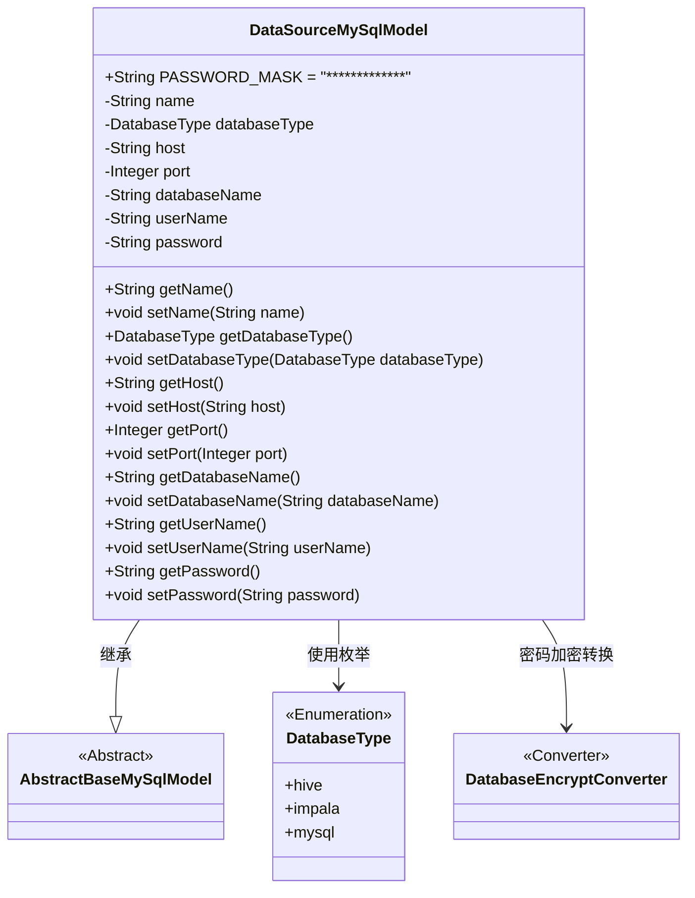

# 基础信息

|      |      |
|------|------|
| 名称 | DataSourceMySqlModel |
| 编码语言 | .java |
| 代码路径 | WeFe/serving/serving-service/src/main/java/com/welab/wefe/serving/service/database/entity/DataSourceMySqlModel.java |
| 包名 | com.welab.wefe.serving.service.database.entity |
| 依赖项 | ['com.welab.wefe.common.jdbc.base.DatabaseType', 'com.welab.wefe.common.web.util.DatabaseEncryptConverter', 'javax.persistence'] |
| 概述说明 | DataSourceMySqlModel类定义了数据源实体，包含名称、数据库类型、主机、端口、数据库名、用户名和加密密码等属性，并提供了相应的getter和setter方法。 |

# 说明

这是一个名为DataSourceMySqlModel的Java持久化实体类，用于表示数据源信息。该类继承自AbstractBaseMySqlModel基类，包含数据源名称、数据库类型（枚举值包括hive、impala、mysql）、主机地址、端口号、数据库名称、用户名和密码等字段。密码字段使用了DatabaseEncryptConverter进行加密转换，并定义了PASSWORD_MASK常量用于密码掩码显示。所有字段都提供了对应的getter和setter方法，支持对这些属性的访问和修改。

# 类列表 Class Summary

| 名称   | 类型  | 说明 |
|-------|------|-------------|
| DataSourceMySqlModel | class | MySQL数据源实体类，包含名称、类型、主机、端口、数据库名、用户名和加密密码等字段及getter/setter方法。 |

## 类 DataSourceMySqlModel

|      |      |
|------|------|
| 访问范围 | @Entity(name = "data_source");public |
| 类型 | class |
| 名称 | DataSourceMySqlModel |
| 说明 | MySQL数据源实体类，包含名称、类型、主机、端口、数据库名、用户名和加密密码等字段及getter/setter方法。 |

### UML类图

这段代码定义了一个名为DataSourceMySqlModel的实体类，用于表示MySQL数据源的配置信息。该类继承自AbstractBaseMySqlModel抽象基类，包含数据源名称、数据库类型（枚举值）、主机地址、端口号、数据库名称、用户名和密码等属性。其中密码字段使用了DatabaseEncryptConverter进行加密转换，数据库类型通过DatabaseType枚举定义。该类提供了完整的getter和setter方法，并定义了一个密码掩码常量PASSWORD_MASK。

### 内部方法调用关系图

```mermaid
graph TD
    A["类DataSourceMySqlModel"]
    B["继承关系: extends AbstractBaseMySqlModel"]
    C["常量: PASSWORD_MASK = '*************'"]
    D["属性: String name"]
    E["属性: DatabaseType databaseType"]
    F["属性: String host"]
    G["属性: Integer port"]
    H["属性: String databaseName"]
    I["属性: String userName"]
    J["属性: String password"]
    K["方法: getName()"]
    L["方法: setName(String name)"]
    M["方法: getDatabaseType()"]
    N["方法: setDatabaseType(DatabaseType databaseType)"]
    O["方法: getHost()"]
    P["方法: setHost(String host)"]
    Q["方法: getPort()"]
    R["方法: setPort(Integer port)"]
    S["方法: getDatabaseName()"]
    T["方法: setDatabaseName(String databaseName)"]
    U["方法: getUserName()"]
    V["方法: setUserName(String userName)"]
    W["方法: getPassword()"]
    X["方法: setPassword(String password)"]

    A --> B
    A --> C
    A --> D
    A --> E
    A --> F
    A --> G
    A --> H
    A --> I
    A --> J
    A --> K
    A --> L
    A --> M
    A --> N
    A --> O
    A --> P
    A --> Q
    A --> R
    A --> S
    A --> T
    A --> U
    A --> V
    A --> W
    A --> X
```

这段代码定义了一个名为DataSourceMySqlModel的实体类，继承自AbstractBaseMySqlModel，用于表示数据库连接源的模型。类中包含多个属性如name、databaseType、host、port等，分别对应数据库连接的不同参数，每个属性都有对应的getter和setter方法。特别地，password属性使用了DatabaseEncryptConverter进行加密转换，且定义了常量PASSWORD_MASK用于密码掩码显示。该类通过JPA注解标注为实体，映射到数据库中的data_source表。

### 字段列表 Field List

| 名称  | 类型  | 说明 |
|-------|-------|------|
| password | String | 数据库密码字段，使用DatabaseEncryptConverter类进行加密转换。 |
| name | String | 私有字符串变量name |
| serialVersionUID = 4348703828245457696L | long | 定义了一个私有静态不可变长整型序列化版本号4348703828245457696L。 |
| databaseType | DatabaseType | Java实体类字段注解：使用字符串枚举值映射数据库列"database_type"，类型为DatabaseType。 |
| host | String | 私有字符串变量host。 |
| PASSWORD_MASK = "*************" | String | 静态常量PASSWORD_MASK定义为星号掩码字符串，用于密码隐藏显示。 |
| port | Integer | 私有整型端口变量。 |
| userName | String | 数据库字段映射：userName对应表列user_name。 |
| databaseName | String | 数据库字段映射：私有字符串变量databaseName对应数据库列名database_name。 |

### 方法列表

| 名称  | 类型  | 说明 |
|-------|-------|------|
| setDatabaseName | void | 设置数据库名称的方法，将输入参数赋值给类的成员变量databaseName。 |
| setPort | void | 设置端口号的方法，将输入参数port赋值给类的port属性。 |
| getDatabaseName | String | 方法返回数据库名称字符串。 |
| getDatabaseType | DatabaseType | 获取当前数据库类型的方法，返回值为DatabaseType对象。 |
| setName | void | 设置对象名称的方法，将输入参数name赋值给对象的name属性。 |
| getUserName | String | 获取用户名的公共方法，返回字符串userName。 |
| setDatabaseType | void | 设置数据库类型的方法，将参数databaseType赋值给类的同名属性。 |
| getName | String | 获取名称的方法，返回字符串类型的name变量值。 |
| getHost | String | 方法返回主机地址字符串。 |
| setHost | void | 设置主机地址的方法，将输入字符串赋值给类的host变量。 |
| getPort | Integer | 获取端口号的方法，返回整型数值port。 |
| setUserName | void | 设置用户名的公共方法，将输入参数赋值给成员变量userName。 |
| getPassword | String | 获取密码的方法，返回字符串类型密码。 |
| setPassword | void | 这是一个Java方法，用于设置密码字段的值。方法接受一个字符串参数password，并将其赋值给类的成员变量password。 |

