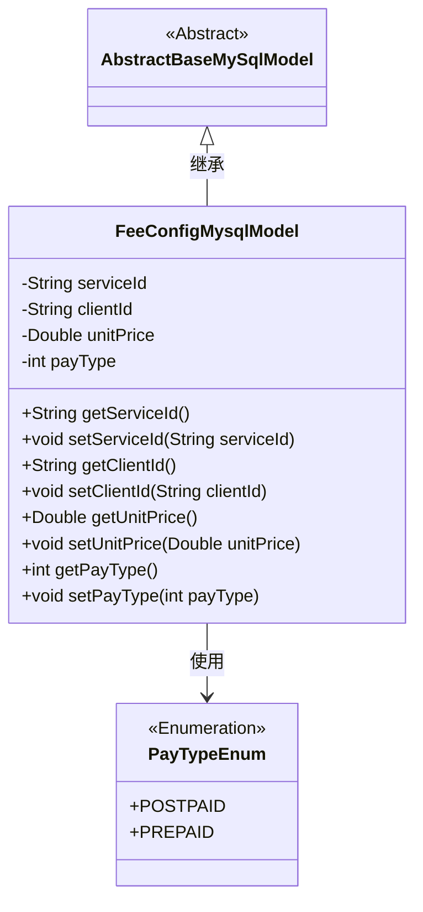
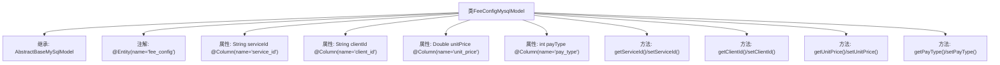

# 基础信息

|      |      |
|------|------|
| 名称 | FeeConfigMysqlModel |
| 编码语言 | .java |
| 代码路径 | WeFe/serving/serving-service/src/main/java/com/welab/wefe/serving/service/database/entity/FeeConfigMysqlModel.java |
| 包名 | com.welab.wefe.serving.service.database.entity |
| 依赖项 | ['com.welab.wefe.serving.service.enums.PayTypeEnum', 'javax.persistence.Column', 'javax.persistence.Entity'] |
| 概述说明 | FeeConfigMysqlModel是数据库实体类，包含serviceId、clientId、unitPrice和payType字段，分别表示服务ID、客户ID、单价和付费类型（1预付费/0后付费）。 |

# 说明

该代码定义了一个名为FeeConfigMysqlModel的JPA实体类，映射到数据库表fee_config。类继承自AbstractBaseMySqlModel，包含四个字段：serviceId（服务ID）、clientId（客户端ID）、unitPrice（单价）和payType（支付类型，默认为后付费）。每个字段都有对应的getter和setter方法，并通过@Column注解指定了数据库列名。payType字段使用枚举PayTypeEnum，1表示预付费，0表示后付费。

# 类列表 Class Summary

| 名称   | 类型  | 说明 |
|-------|------|-------------|
| FeeConfigMysqlModel | class | FeeConfigMysqlModel是数据库实体类，包含serviceId、clientId、unitPrice和payType字段，分别表示服务ID、客户ID、单价和付费类型。 |

## 类 FeeConfigMysqlModel

|      |      |
|------|------|
| 访问范围 | @Entity(name = "fee_config");public |
| 类型 | class |
| 名称 | FeeConfigMysqlModel |
| 说明 | FeeConfigMysqlModel是数据库实体类，包含serviceId、clientId、unitPrice和payType字段，分别表示服务ID、客户ID、单价和付费类型。 |

### UML类图

类图描述：FeeConfigMysqlModel类继承自AbstractBaseMySqlModel抽象类，包含serviceId、clientId、unitPrice和payType四个私有属性及对应的getter/setter方法。其中payType属性使用PayTypeEnum枚举类型来定义支付类型（预付费/后付费）。该模型通过JPA注解标记为数据库实体，映射到fee_config表。

### 内部方法调用关系图

这段代码定义了一个名为FeeConfigMysqlModel的实体类，继承自AbstractBaseMySqlModel，用于映射数据库中的fee_config表。类中包含四个属性：serviceId、clientId、unitPrice和payType，分别对应表中的字段，并通过注解进行映射。每个属性都有对应的getter和setter方法，用于访问和修改属性值。其中payType属性有默认值，表示支付类型，1为预付费，0为后付费。这个类主要用于ORM框架与数据库表之间的映射，方便进行数据操作。

### 字段列表 Field List

| 名称  | 类型  | 说明 |
|-------|-------|------|
| unitPrice | Double | 数据库字段unit_price映射为Double类型的unitPrice。 |
| clientId | String | 数据库字段映射：clientId对应表列client_id。 |
| serviceId | String | 数据库字段映射：serviceId对应表列service_id。 |
| payType = PayTypeEnum.POSTPAID.getCode() | int | 数据库字段pay_type映射为整型payType，默认值为后付费枚举代码。 |

### 方法列表

| 名称  | 类型  | 说明 |
|-------|-------|------|
| setClientId | void | 设置客户端ID的方法，将传入的clientId赋值给当前对象的clientId属性。 |
| getClientId | String | 这是一个Java方法，返回字符串类型的clientId变量值。 |
| setServiceId | void | 这是一个Java方法，用于设置类的serviceId属性值。方法接收一个字符串参数serviceId，并将其赋值给类的同名成员变量。 |
| getServiceId | String | 获取serviceId的公共方法。 |
| getUnitPrice | Double | 这是一个Java方法，返回Double类型的unitPrice值。 |
| setUnitPrice | void | 设置单价方法，接受双精度参数并赋值给成员变量unitPrice。 |
| getPayType | int | 获取支付类型的方法，返回payType值。 |
| setPayType | void | 设置支付类型的方法，参数为payType，赋值给当前对象的payType属性。 |

