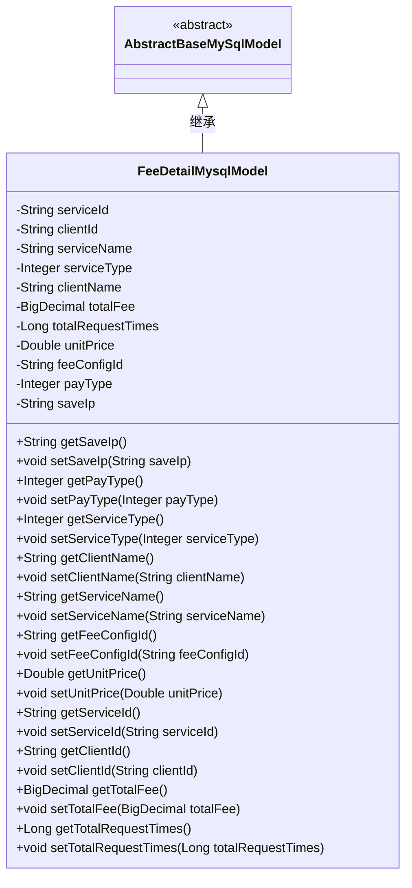

# 基础信息

|      |      |
|------|------|
| 名称 | FeeDetailMysqlModel |
| 编码语言 | .java |
| 代码路径 | WeFe/serving/serving-service/src/main/java/com/welab/wefe/serving/service/database/entity/FeeDetailMysqlModel.java |
| 包名 | com.welab.wefe.serving.service.database.entity |
| 依赖项 | ['javax.persistence.Column', 'javax.persistence.Entity', 'java.math.BigDecimal'] |
| 概述说明 | FeeDetailMysqlModel类映射fee_detail表，包含服务ID、客户ID、名称、类型、总费用、请求次数、单价、付费类型、配置ID和IP等字段及getter/setter方法。 |

# 说明

FeeDetailMysqlModel是一个映射到数据库表fee_detail的实体类，继承自AbstractBaseMySqlModel。它包含服务ID、客户ID、服务名称、服务类型、客户名称、总费用、总请求次数、单价、费用配置ID、支付类型和保存IP等字段。每个字段都有对应的getter和setter方法，用于访问和修改属性值。该模型主要用于存储和管理费用相关的详细信息。

# 类列表 Class Summary

| 名称   | 类型  | 说明 |
|-------|------|-------------|
| FeeDetailMysqlModel | class | FeeDetailMysqlModel是存储费用详情的实体类，包含服务ID、客户ID、服务名称、服务类型、总费用、总请求次数、单价、费用配置ID、支付类型和保存IP等字段。 |

## 类 FeeDetailMysqlModel

|      |      |
|------|------|
| 访问范围 | @Entity(name = "fee_detail");public |
| 类型 | class |
| 名称 | FeeDetailMysqlModel |
| 说明 | FeeDetailMysqlModel是存储费用详情的实体类，包含服务ID、客户ID、服务名称、服务类型、总费用、总请求次数、单价、费用配置ID、支付类型和保存IP等字段。 |

### UML类图

类图描述：FeeDetailMysqlModel类继承自抽象基类AbstractBaseMySqlModel，是一个实体类，映射数据库表"fee_detail"。该类包含多个私有字段，如serviceId、clientId、totalFee等，每个字段都有对应的getter和setter方法。这些字段通过@Column注解与数据库表的列进行映射，用于存储服务费用相关的详细信息，包括服务ID、客户ID、服务名称、总费用、请求次数等业务数据。

### 内部方法调用关系图

```mermaid
graph TD
    A["类FeeDetailMysqlModel"]
    B["继承: AbstractBaseMySqlModel"]
    C["注解: @Entity(name='fee_detail')"]
    D["属性: String serviceId"]
    E["属性: String clientId"]
    F["属性: String serviceName"]
    G["属性: Integer serviceType"]
    H["属性: String clientName"]
    I["属性: BigDecimal totalFee"]
    J["属性: Long totalRequestTimes"]
    K["属性: Double unitPrice"]
    L["属性: String feeConfigId"]
    M["属性: Integer payType"]
    N["属性: String saveIp"]
    O["方法: get/setSaveIp"]
    P["方法: get/setPayType"]
    Q["方法: get/setServiceType"]
    R["方法: get/setClientName"]
    S["方法: get/setServiceName"]
    T["方法: get/setFeeConfigId"]
    U["方法: get/setUnitPrice"]
    V["方法: get/setServiceId"]
    W["方法: get/setClientId"]
    X["方法: get/setTotalFee"]
    Y["方法: get/setTotalRequestTimes"]

    A --> B
    A --> C
    A --> D
    A --> E
    A --> F
    A --> G
    A --> H
    A --> I
    A --> J
    A --> K
    A --> L
    A --> M
    A --> N
    A --> O
    A --> P
    A --> Q
    A --> R
    A --> S
    A --> T
    A --> U
    A --> V
    A --> W
    A --> X
    A --> Y
```

这段代码定义了一个名为FeeDetailMysqlModel的JPA实体类，继承自AbstractBaseMySqlModel，用于映射数据库表fee_detail。类中包含12个私有属性，每个属性都有对应的getter和setter方法，用于操作这些属性值。属性通过@Column注解与数据库表的列名进行映射，其中包含服务ID、客户ID、服务名称、服务类型、客户名称、总费用、总请求次数、单价、费用配置ID、支付类型和保存IP等信息。该实体类主要用于在Java应用程序和数据库之间进行数据持久化操作。

### 字段列表 Field List

| 名称  | 类型  | 说明 |
|-------|-------|------|
| feeConfigId | String | 数据库字段fee_config_id映射为feeConfigId字符串类型变量。 |
| saveIp | String | 数据库字段映射：私有字符串类型变量saveIp对应表列save_ip。 |
| clientId | String | 数据库字段映射：client_id对应私有变量clientId。 |
| payType | Integer | 数据库字段pay_type映射为私有整型变量payType。 |
| totalRequestTimes | Long | 数据库字段映射：total_request_times对应Long类型totalRequestTimes。 |
| serviceType | Integer | 数据库字段映射：service_type对应Integer类型的serviceType。 |
| totalFee | BigDecimal | 数据库字段映射：total_fee对应BigDecimal类型的totalFee。 |
| serviceId | String | 数据库字段映射：serviceId对应表列service_id。 |
| clientName | String | 数据库字段映射：client_name对应clientName字符串类型。 |
| unitPrice | Double | 数据库字段映射：unitPrice对应表中的unit_price列，类型为Double。 |
| serviceName | String | 数据库字段映射：service_name对应String类型的serviceName。 |

### 方法列表

| 名称  | 类型  | 说明 |
|-------|-------|------|
| setClientName | void | 设置客户端名称的方法，将输入参数赋值给类的成员变量clientName。 |
| getClientName | String | 获取客户端名称的方法，返回字符串类型变量clientName。 |
| getSaveIp | String | 获取保存的IP地址字符串。 |
| getServiceId | String | 获取serviceId的方法，返回字符串类型的serviceId。 |
| setUnitPrice | void | 设置单价方法，接收Double参数unitPrice并赋值给类成员变量unitPrice。 |
| setServiceType | void | 定义了一个公共方法setServiceType，用于设置类中的serviceType属性，参数为Integer类型。 |
| setServiceName | void | 设置服务名称的方法，将输入参数赋值给类的成员变量serviceName。 |
| getServiceType | Integer | 获取服务类型的方法，返回整型值serviceType。 |
| getClientId | String | 该方法返回一个字符串类型的clientId值。 |
| setClientId | void | 设置客户端ID的方法，将参数clientId赋值给当前对象的clientId属性。 |
| getTotalFee | BigDecimal | 获取总费用的方法，返回BigDecimal类型的totalFee值。 |
| setTotalFee | void | Java方法：设置总费用，参数为BigDecimal类型。 |
| getTotalRequestTimes | Long | 获取请求总数的方法，返回值为长整型。 |
| setTotalRequestTimes | void | Java方法：设置总请求次数变量。 |
| setServiceId | void | 设置服务ID的方法，将输入参数赋值给类的serviceId成员变量。 |
| setFeeConfigId | void | 设置费用配置ID的方法，将参数feeConfigId赋值给当前对象的同名属性。 |
| getPayType | Integer | 获取支付类型的方法，返回整数类型的支付类型值。 |
| setPayType | void | 设置支付类型的方法，参数为整型payType，赋值给类成员变量payType。 |
| getServiceName | String | 这是一个Java方法，返回字符串类型的serviceName变量值。 |
| getUnitPrice | Double | 这是一个Java方法，返回Double类型的unitPrice值。 |
| getFeeConfigId | String | 获取费用配置ID的方法，返回feeConfigId字符串。 |
| setSaveIp | void | 这是一个Java方法，用于设置saveIp属性的值。方法接收一个字符串参数saveIp，并将其赋值给当前对象的saveIp成员变量。 |

