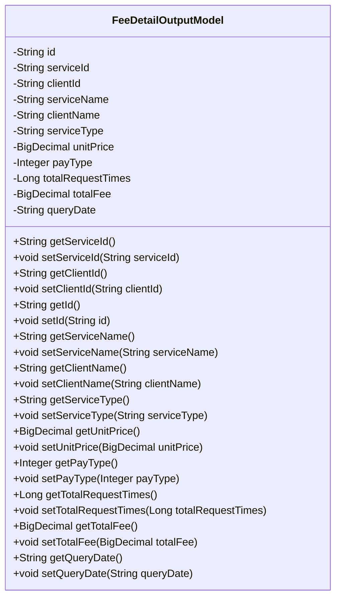

# 基础信息

|      |      |
|------|------|
| 名称 | FeeDetailOutputModel |
| 编码语言 | .java |
| 代码路径 | WeFe/serving/serving-service/src/main/java/com/welab/wefe/serving/service/database/entity/FeeDetailOutputModel.java |
| 包名 | com.welab.wefe.serving.service.database.entity |
| 依赖项 | ['javax.persistence.Column', 'javax.persistence.Entity', 'javax.persistence.Id', 'java.math.BigDecimal'] |
| 概述说明 | FeeDetailOutputModel是JPA实体类，包含服务与客户信息、单价、付费类型、调用次数、总费用及统计日期等字段。 |

# 说明

FeeDetailOutputModel是一个JPA实体类，用于表示费用明细数据。包含主键id、服务ID、客户ID、服务名称、客户名称、服务类型、单价、付费类型、总调用次数、总费用和统计日期等字段。每个字段都有对应的getter和setter方法，部分字段通过Column注解与数据库列名映射。该类主要用于存储和操作与费用相关的详细信息。

# 类列表 Class Summary

| 名称   | 类型  | 说明 |
|-------|------|-------------|
| FeeDetailOutputModel | class | FeeDetailOutputModel是JPA实体类，包含服务费用明细字段如ID、服务客户信息、单价、付费类型、调用次数、总费用和统计日期。 |

## 类 FeeDetailOutputModel

|      |      |
|------|------|
| 访问范围 | @Entity;public |
| 类型 | class |
| 名称 | FeeDetailOutputModel |
| 说明 | FeeDetailOutputModel是JPA实体类，包含服务费用明细字段如ID、服务客户信息、单价、付费类型、调用次数、总费用和统计日期。 |

### UML类图

该代码定义了一个名为FeeDetailOutputModel的实体类，用于表示费用明细输出模型。类中包含多个私有字段，如id、serviceId、clientId等，每个字段都有对应的getter和setter方法。这些字段通过JPA注解与数据库表进行映射，例如@Entity表示这是一个JPA实体，@Id标注主键字段，@Column用于指定数据库列名。该类主要用于存储和操作与费用明细相关的数据，包括服务信息、客户信息、价格、请求次数和统计日期等。

### 内部方法调用关系图

```mermaid
graph TD
    A["类FeeDetailOutputModel"]
    B["主键属性: @Id String id"]
    C["属性: @Column serviceId"]
    D["属性: @Column clientId"]
    E["属性: @Column serviceName"]
    F["属性: @Column clientName"]
    G["属性: @Column serviceType"]
    H["属性: @Column unitPrice"]
    I["属性: @Column payType"]
    J["属性: @Column totalRequestTimes"]
    K["属性: @Column totalFee"]
    L["属性: @Column queryDate"]
    M["Getter/Setter: serviceId"]
    N["Getter/Setter: clientId"]
    O["Getter/Setter: id"]
    P["Getter/Setter: serviceName"]
    Q["Getter/Setter: clientName"]
    R["Getter/Setter: serviceType"]
    S["Getter/Setter: unitPrice"]
    T["Getter/Setter: payType"]
    U["Getter/Setter: totalRequestTimes"]
    V["Getter/Setter: totalFee"]
    W["Getter/Setter: queryDate"]

    A --> B
    A --> C
    A --> D
    A --> E
    A --> F
    A --> G
    A --> H
    A --> I
    A --> J
    A --> K
    A --> L
    A --> M
    A --> N
    A --> O
    A --> P
    A --> Q
    A --> R
    A --> S
    A --> T
    A --> U
    A --> V
    A --> W
```

这段代码定义了一个名为FeeDetailOutputModel的JPA实体类，用于表示费用明细的输出模型。该类包含12个属性，分别对应不同的费用相关字段，如服务ID、客户ID、服务名称、单价、付费类型等，每个属性都有对应的getter和setter方法。所有属性都通过JPA注解进行映射，其中id属性被标记为主键(@Id)，其他属性通过@Column注解与数据库表的列进行关联。这个类主要用于在应用程序和数据库之间传输费用明细数据。

### 字段列表 Field List

| 名称  | 类型  | 说明 |
|-------|-------|------|
| totalRequestTimes | Long | 数据库字段映射：total_request_times对应Long类型totalRequestTimes。 |
| payType | Integer | 数据库字段映射：payType对应pay_type，类型为Integer。 |
| totalFee | BigDecimal | 数据库字段映射：total_fee对应BigDecimal类型变量totalFee。 |
| id | String | 实体ID字段，用于唯一标识对象。 |
| clientName | String | 数据库字段映射：client_name对应实体类属性clientName。 |
| queryDate | String | 数据库字段query_date映射为字符串类型变量queryDate。 |
| serviceName | String | 数据库字段映射：serviceName对应表列service_name，类型为字符串。 |
| unitPrice | BigDecimal | 数据库字段unit_price映射为BigDecimal类型的unitPrice变量。 |
| serviceId | String | 数据库字段映射：serviceId对应表列service_id，类型为字符串。 |
| serviceType | String | 数据库字段映射：service_type对应字符串类型变量serviceType。 |
| clientId | String | 数据库字段映射：client_id对应String类型的clientId。 |

### 方法列表

| 名称  | 类型  | 说明 |
|-------|-------|------|
| getServiceType | String | 获取服务类型的方法，返回字符串serviceType。 |
| getUnitPrice | BigDecimal | 这是一个Java方法，返回BigDecimal类型的unitPrice值。 |
| setServiceType | void | 设置服务类型的方法，将输入参数赋值给类的serviceType成员变量。 |
| getPayType | Integer | 获取支付类型的方法，返回payType整数值。 |
| setUnitPrice | void | 设置单价的方法，将参数unitPrice赋值给类的成员变量unitPrice。 |
| getId | String | 获取ID的公共方法，返回字符串类型的id。 |
| setClientName | void | 设置客户端名称的方法，将输入参数赋值给成员变量clientName。 |
| setServiceId | void | 设置服务ID的方法，将输入参数赋值给类的serviceId成员变量。 |
| getServiceId | String | 获取serviceId的公共方法，返回字符串类型的serviceId值。 |
| setClientId | void | 设置客户端ID的方法，将输入参数clientId赋值给类的成员变量this.clientId。 |
| setServiceName | void | 这是一个Java方法，用于设置类中的serviceName属性值。方法接收一个字符串参数serviceName，并将其赋值给类的同名成员变量。 |
| setTotalRequestTimes | void | 这是一个Java方法，用于设置totalRequestTimes属性的值。方法接收一个Long类型参数，并将其赋值给类的成员变量totalRequestTimes。 |
| getTotalFee | BigDecimal | 获取总费用的方法，返回BigDecimal类型的totalFee值。 |
| setTotalFee | void | 这是一个Java方法，用于设置totalFee属性的值，参数类型为BigDecimal。 |
| getQueryDate | String | 方法getQueryDate返回queryDate的值。 |
| setQueryDate | void | 设置查询日期的方法，将输入参数赋值给类成员变量queryDate。 |
| setId | void | 设置对象ID的方法，将参数id赋值给对象的id属性。 |
| getServiceName | String | 这是一个Java方法，返回字符串类型的serviceName成员变量值。 |
| getClientId | String | 获取客户端ID的方法，直接返回成员变量clientId的值。 |
| getClientName | String | 获取客户端名称的方法，返回clientName变量值。 |
| setPayType | void | 设置支付类型的方法，参数为整型payType，赋值给类成员变量payType。 |
| getTotalRequestTimes | Long | 这是一个Java方法，返回名为totalRequestTimes的Long类型变量值。 |

