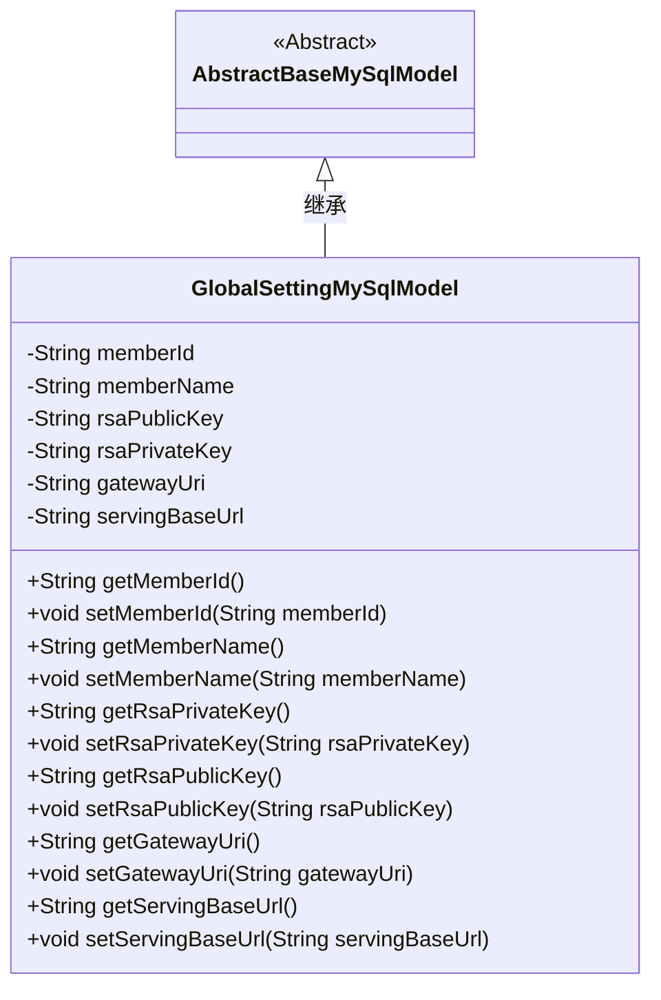

# 基础信息

|      |      |
|------|------|
| 名称 | GlobalSettingMySqlModel |
| 编码语言 | .java |
| 代码路径 | WeFe/serving/serving-service/src/main/java/com/welab/wefe/serving/service/database/entity/GlobalSettingMySqlModel.java |
| 包名 | com.welab.wefe.serving.service.database.entity |
| 依赖项 | ['javax.persistence.Column', 'javax.persistence.Entity'] |
| 概述说明 | GlobalSettingMySqlModel是MySQL实体类，包含成员ID、名称、RSA密钥、网关URI和服务基础URL字段及其getter/setter方法。 |

# 说明

该内容描述了一个名为global_setting的JPA实体类GlobalSettingMySqlModel，继承自AbstractBaseMySqlModel。类中包含七个字段：memberId（会员ID）、memberName（会员名称）、rsaPublicKey（RSA公钥）、rsaPrivateKey（RSA私钥）、gatewayUri（网关URI）和servingBaseUrl（服务基础URL）。每个字段都有对应的getter和setter方法，用于访问和修改字段值。该实体类用于映射数据库中的表结构，存储全局配置信息。

# 类列表 Class Summary

| 名称   | 类型  | 说明 |
|-------|------|-------------|
| GlobalSettingMySqlModel | class | GlobalSettingMySqlModel是存储全局设置的MySQL实体类，包含成员ID、名称、RSA密钥、网关URI和服务基础URL等字段及其getter/setter方法。 |

## 类 GlobalSettingMySqlModel

|      |      |
|------|------|
| 访问范围 | @Entity(name = "global_setting");public |
| 类型 | class |
| 名称 | GlobalSettingMySqlModel |
| 说明 | GlobalSettingMySqlModel是存储全局设置的MySQL实体类，包含成员ID、名称、RSA密钥、网关URI和服务基础URL等字段及其getter/setter方法。 |

### UML类图

该类图展示了GlobalSettingMySqlModel继承自抽象类AbstractBaseMySqlModel的关系。GlobalSettingMySqlModel作为数据库实体类，包含6个私有字段（memberId、memberName等）及其对应的getter/setter方法，用于存储全局配置信息。通过@Entity注解表明这是一个JPA实体类，@Column注解指定字段与数据库列的映射关系。类图清晰地反映了实体类的属性和继承结构，适用于ORM框架的数据持久化操作。

### 内部方法调用关系图

```mermaid
graph TD
    A["类GlobalSettingMySqlModel"]
    B["继承: AbstractBaseMySqlModel"]
    C["注解: @Entity(name='global_setting')"]
    D["属性: String memberId"]
    E["注解: @Column(name='member_id')"]
    F["属性: String memberName"]
    G["注解: @Column(name='member_name')"]
    H["属性: String rsaPublicKey"]
    I["注解: @Column(name='rsa_public_key')"]
    J["属性: String rsaPrivateKey"]
    K["注解: @Column(name='rsa_private_key')"]
    L["属性: String gatewayUri"]
    M["注解: @Column(name='gateway_uri')"]
    N["属性: String servingBaseUrl"]
    O["注解: @Column(name='serving_base_url')"]
    P["方法: getMemberId()/setMemberId()"]
    Q["方法: getMemberName()/setMemberName()"]
    R["方法: getRsaPublicKey()/setRsaPublicKey()"]
    S["方法: getRsaPrivateKey()/setRsaPrivateKey()"]
    T["方法: getGatewayUri()/setGatewayUri()"]
    U["方法: getServingBaseUrl()/setServingBaseUrl()"]

    A --> B
    A --> C
    A --> D
    D --> E
    A --> F
    F --> G
    A --> H
    H --> I
    A --> J
    J --> K
    A --> L
    L --> M
    A --> N
    N --> O
    A --> P
    A --> Q
    A --> R
    A --> S
    A --> T
    A --> U
```

这段代码定义了一个名为GlobalSettingMySqlModel的实体类，继承自AbstractBaseMySqlModel，用于存储全局设置信息。类中包含多个属性，如memberId、memberName、rsaPublicKey等，每个属性都有对应的getter和setter方法，并且通过@Column注解与数据库表的列进行映射。该类主要用于数据库操作，提供了对全局设置数据的封装和访问方法。

### 字段列表 Field List

| 名称  | 类型  | 说明 |
|-------|-------|------|
| gatewayUri | String | 数据库字段映射：gatewayUri对应表列gateway_uri，类型为字符串。 |
| memberName | String | 数据库字段映射：成员名称对应表列member_name，类型为字符串。 |
| serialVersionUID = -8671971928261399816L | long | 声明一个私有静态不可变的长整型序列化版本号。 |
| rsaPrivateKey | String | 数据库字段映射：rsa_private_key存储RSA私钥字符串。 |
| rsaPublicKey | String | 实体类字段rsaPublicKey，映射数据库列名rsa_public_key，存储RSA公钥字符串。 |
| servingBaseUrl | String | 数据库字段映射：servingBaseUrl对应表列serving_base_url。 |
| memberId | String | 数据库字段member_id映射为成员ID字符串类型变量。 |

### 方法列表

| 名称  | 类型  | 说明 |
|-------|-------|------|
| getMemberId | String | 这是一个Java方法，返回成员ID字符串memberId。 |
| setMemberName | void | 设置成员变量memberName的方法，参数为字符串memberName。 |
| getMemberName | String | 获取成员名称的方法，返回成员变量memberName的值。 |
| setRsaPrivateKey | void | 设置RSA私钥的方法，将传入的字符串参数赋值给类的私有成员变量rsaPrivateKey。 |
| getRsaPrivateKey | String | 获取RSA私钥的方法，返回字符串类型的私钥值。 |
| setMemberId | void | 设置成员ID的方法，将输入字符串赋值给类的成员变量memberId。 |
| getRsaPublicKey | String | 获取RSA公钥的方法，返回字符串类型的rsaPublicKey。 |
| setRsaPublicKey | void | 设置RSA公钥的方法，将传入的字符串赋值给类的rsaPublicKey成员变量。 |
| setGatewayUri | void | 设置网关URI的方法，将输入参数gatewayUri赋值给类的同名成员变量。 |
| getServingBaseUrl | String | 这是一个Java方法，返回字符串类型的servingBaseUrl成员变量值。 |
| setServingBaseUrl | void | 设置服务基础URL的方法，将输入参数赋值给类成员变量servingBaseUrl。 |
| getGatewayUri | String | 获取网关URI的公共方法，返回字符串类型变量gatewayUri。 |

