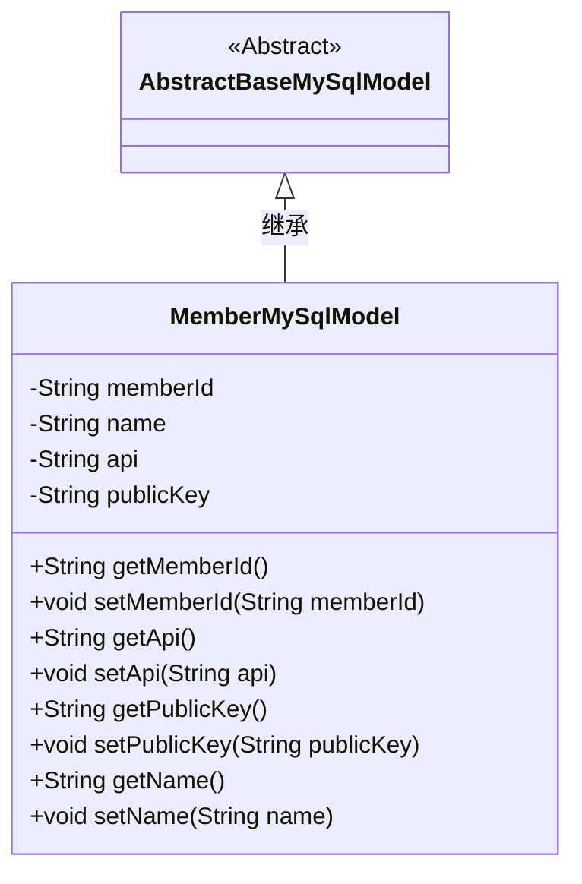
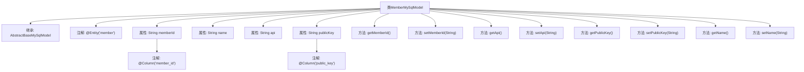

# 基础信息

|      |      |
|------|------|
| 名称 | MemberMySqlModel |
| 编码语言 | .java |
| 代码路径 | WeFe/serving/serving-service/src/main/java/com/welab/wefe/serving/service/database/entity/MemberMySqlModel.java |
| 包名 | com.welab.wefe.serving.service.database.entity |
| 依赖项 | ['javax.persistence.Column', 'javax.persistence.Entity'] |
| 概述说明 | 定义MySQL成员实体类，包含成员ID、名称、API地址和公钥字段，提供对应getter和setter方法。 |

# 说明

这是一个名为MemberMySqlModel的JPA实体类，映射到数据库表"member"。它继承自AbstractBaseMySqlModel，包含四个主要属性：memberId（会员ID，映射到列member_id）、name（会员名称）、api（API URL）和publicKey（公钥，映射到列public_key）。类中为每个属性提供了对应的getter和setter方法，用于访问和修改这些字段的值。

# 类列表 Class Summary

| 名称   | 类型  | 说明 |
|-------|------|-------------|
| MemberMySqlModel | class | MemberMySqlModel类映射数据库表member，包含memberId、name、api和publicKey字段及其getter/setter方法。 |

## 类 MemberMySqlModel

|      |      |
|------|------|
| 访问范围 | @Entity(name = "member");public |
| 类型 | class |
| 名称 | MemberMySqlModel |
| 说明 | MemberMySqlModel类映射数据库表member，包含memberId、name、api和publicKey字段及其getter/setter方法。 |

### UML类图

这段代码展示了一个名为`MemberMySqlModel`的实体类，它继承自抽象基类`AbstractBaseMySqlModel`。该类映射到数据库中的"member"表，包含四个私有字段：`memberId`、`name`、`api`和`publicKey`，每个字段都有对应的getter和setter方法。`@Column`注解用于指定数据库列名，而`@Entity`注解则标识该类是一个JPA实体。这个类主要用于在Java应用程序和MySQL数据库之间进行数据映射和操作。

### 内部方法调用关系图

这段代码定义了一个名为MemberMySqlModel的JPA实体类，继承自AbstractBaseMySqlModel，用于映射数据库中的member表。类中包含四个属性：带有@Column注解的memberId和publicKey，以及普通字段name和api，每个属性都有对应的getter和setter方法。该实体类通过@Entity注解指定了对应的数据库表名为'member'，并通过@Column注解实现了部分字段名与数据库列的映射。

### 字段列表 Field List

| 名称  | 类型  | 说明 |
|-------|-------|------|
| publicKey | String | 数据库字段映射：publicKey对应表列public_key。 |
| name | String | 私有字符串变量name。 |
| memberId | String | 数据库字段member_id映射为成员ID字符串类型。 |
| api | String | 私有字符串变量api |

### 方法列表

| 名称  | 类型  | 说明 |
|-------|-------|------|
| getPublicKey | String | 获取公钥的方法，返回publicKey变量。 |
| setMemberId | void | 设置成员ID的方法，将输入参数赋值给类的成员变量memberId。 |
| getMemberId | String | 方法getMemberId返回成员ID字符串memberId。 |
| getApi | String | 方法返回字符串类型的api变量值。 |
| setPublicKey | void | 设置公钥的方法，将输入字符串赋值给类的publicKey成员变量。 |
| getName | String | 获取名称的方法，返回字符串类型的name变量值。 |
| setName | void | 设置对象名称的方法，将参数name赋值给对象的name属性。 |
| setApi | void | 设置API字符串的方法。 |

