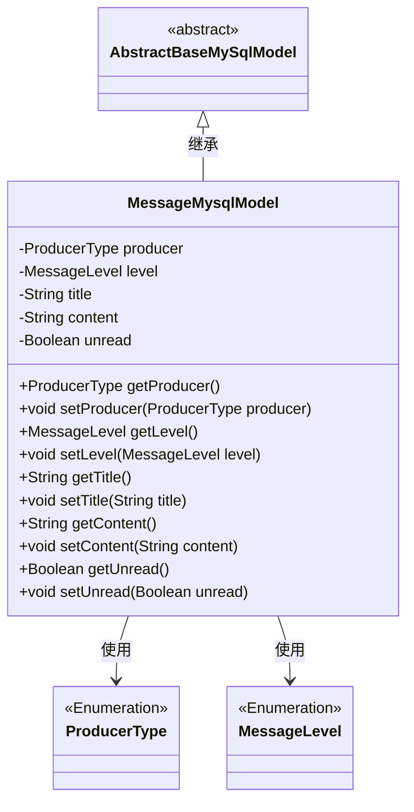
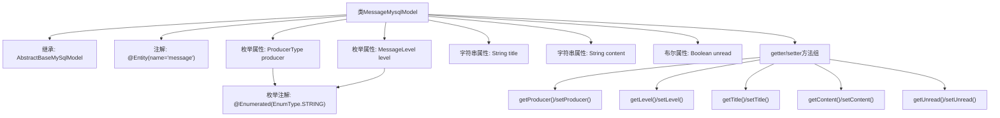

# 基础信息

|      |      |
|------|------|
| 名称 | MessageMysqlModel |
| 编码语言 | .java |
| 代码路径 | WeFe/serving/serving-service/src/main/java/com/welab/wefe/serving/service/database/entity/MessageMysqlModel.java |
| 包名 | com.welab.wefe.serving.service.database.entity |
| 依赖项 | ['javax.persistence.Entity', 'javax.persistence.EnumType', 'javax.persistence.Enumerated', 'com.welab.wefe.common.wefe.enums.MessageLevel', 'com.welab.wefe.common.wefe.enums.ProducerType'] |
| 概述说明 | 消息实体类，包含生产者类型、消息级别、标题、内容和未读状态字段及其getter/setter方法。 |

# 说明

这是一个名为MessageMysqlModel的JPA实体类，映射到数据库中的message表。该类继承自AbstractBaseMySqlModel，包含五个主要属性：producer表示消息生产者类型（枚举值为board/gateway），level表示消息级别（枚举值为info/success/error/warning），title存储消息标题，content存储消息内容，unread表示消息是否未读状态。每个属性都有对应的getter和setter方法。

# 类列表 Class Summary

| 名称   | 类型  | 说明 |
|-------|------|-------------|
| MessageMysqlModel | class | 消息实体类，包含生产者类型、消息级别、标题、内容及未读状态字段，提供getter/setter方法。 |

## 类 MessageMysqlModel

|      |      |
|------|------|
| 访问范围 | @Entity(name = "message");public |
| 类型 | class |
| 名称 | MessageMysqlModel |
| 说明 | 消息实体类，包含生产者类型、消息级别、标题、内容及未读状态字段，提供getter/setter方法。 |

### UML类图

这段代码定义了一个名为MessageMysqlModel的实体类，继承自AbstractBaseMySqlModel抽象类。该类包含五个主要属性：producer（生产者类型枚举）、level（消息级别枚举）、title（标题字符串）、content（内容字符串）和unread（未读状态布尔值），并为每个属性提供了getter和setter方法。该类通过JPA注解标记为数据库实体，用于持久化消息数据。两个枚举类型ProducerType和MessageLevel分别表示消息来源和消息级别。

### 内部方法调用关系图

这段代码定义了一个名为MessageMysqlModel的JPA实体类，继承自AbstractBaseMySqlModel，用于表示消息数据在MySQL中的存储结构。类中包含五个核心属性：两个枚举类型字段（producer和level）分别表示消息来源和级别，两个字符串字段（title和content）存储消息标题和内容，一个布尔字段（unread）标记消息是否未读。所有属性都配有对应的getter和setter方法，枚举字段使用@Enumerated注解指定字符串存储方式。该实体类通过@Entity注解映射到名为"message"的数据库表。

### 字段列表 Field List

| 名称  | 类型  | 说明 |
|-------|-------|------|
| title | String | 声明一个私有字符串变量title。 |
| producer | ProducerType | 该代码定义了一个枚举类型字段producer，使用字符串形式存储枚举值。 |
| unread | Boolean | 私有布尔类型变量，表示未读状态。 |
| content | String | 私有字符串变量content。 |
| level | MessageLevel | 定义枚举类型字段level，使用字符串形式存储枚举值。 |

### 方法列表

| 名称  | 类型  | 说明 |
|-------|-------|------|
| setUnread | void | 设置未读状态的方法，参数为布尔值unread，用于更新对象的未读状态。 |
| getContent | String | 获取content字符串的方法。 |
| setContent | void | 这是一个Java方法，用于设置类成员变量content的值。方法接受一个字符串参数content，并将其赋值给当前对象的content属性。 |
| setLevel | void | 设置消息等级的方法，将输入参数level赋值给当前对象的level属性。 |
| setTitle | void | 方法setTitle用于设置对象的title属性，参数为字符串title。 |
| getUnread | Boolean | 获取未读状态的布尔值方法。 |
| setProducer | void | 方法`setProducer`用于设置生产者对象，参数为`ProducerType`类型，赋值给当前实例的`producer`字段。 |
| getProducer | ProducerType | 获取生产者类型的方法，返回producer变量值。 |
| getTitle | String | 获取标题字符串的方法。 |
| getLevel | MessageLevel | 获取消息级别的方法，返回当前消息的级别值。 |

