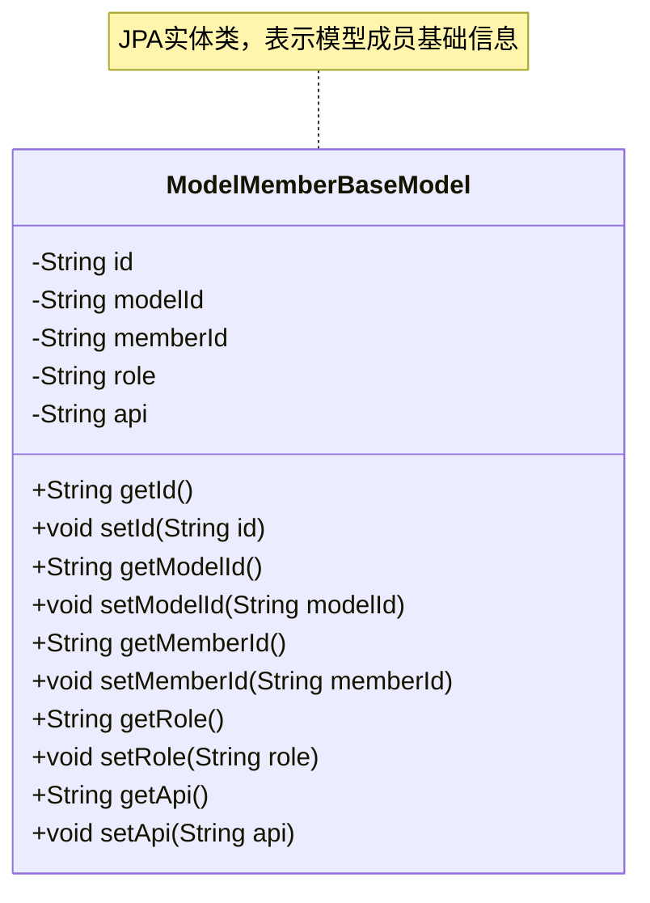

# 基础信息

|      |      |
|------|------|
| 名称 | ModelMemberBaseModel |
| 编码语言 | .java |
| 代码路径 | WeFe/serving/serving-service/src/main/java/com/welab/wefe/serving/service/database/entity/ModelMemberBaseModel.java |
| 包名 | com.welab.wefe.serving.service.database.entity |
| 依赖项 | ['javax.persistence.Column', 'javax.persistence.Entity', 'javax.persistence.Id', 'java.util.UUID'] |
| 概述说明 | 定义了一个名为ModelMemberBaseModel的实体类，包含id、modelId、memberId、role和api字段，并提供了对应的getter和setter方法。 |

# 说明

该内容定义了一个名为ModelMemberBaseModel的实体类，映射到数据库表model_member_base。实体包含五个字段：id作为主键，使用UUID生成并去除横线；modelId和memberId分别映射到表字段model_id和member_id；role和api为普通字段。类中为每个字段提供了getter和setter方法，用于访问和修改字段值。

# 类列表 Class Summary

| 名称   | 类型  | 说明 |
|-------|------|-------------|
| ModelMemberBaseModel | class | 这是一个名为model_member_base的JPA实体类，包含id、modelId、memberId、role和api字段，用于存储成员模型基础信息。 |

## 类 ModelMemberBaseModel

|      |      |
|------|------|
| 访问范围 | @Entity(name = "model_member_base");public |
| 类型 | class |
| 名称 | ModelMemberBaseModel |
| 说明 | 这是一个名为model_member_base的JPA实体类，包含id、modelId、memberId、role和api字段，用于存储成员模型基础信息。 |

### UML类图

该代码定义了一个JPA实体类ModelMemberBaseModel，用于存储模型成员的基础信息。类中包含五个私有字段：id(主键)、modelId(模型ID)、memberId(成员ID)、role(角色)和api(API)，每个字段都有对应的getter和setter方法。id字段在初始化时会自动生成32位的UUID字符串。该类映射到数据库表"model_member_base"，其中model_id和member_id字段有特定的列名映射。这是一个典型的数据持久化实体类，用于在ORM框架中表示数据库表结构。

### 内部方法调用关系图

```mermaid
graph TD
    A["类ModelMemberBaseModel"]
    B["注解: @Entity(name='model_member_base')"]
    C["属性: @Id String id"]
    D["初始化: UUID.randomUUID().toString().replaceAll('-','')"]
    E["属性: @Column(name='model_id') String modelId"]
    F["属性: @Column(name='member_id') String memberId"]
    G["属性: String role"]
    H["属性: String api"]
    I["方法: String getId()"]
    J["方法: void setId(String id)"]
    K["方法: String getModelId()"]
    L["方法: void setModelId(String modelId)"]
    M["方法: String getMemberId()"]
    N["方法: void setMemberId(String memberId)"]
    O["方法: String getRole()"]
    P["方法: void setRole(String role)"]
    Q["方法: String getApi()"]
    R["方法: void setApi(String api)"]

    A --> B
    A --> C
    C --> D
    A --> E
    A --> F
    A --> G
    A --> H
    A --> I
    A --> J
    A --> K
    A --> L
    A --> M
    A --> N
    A --> O
    A --> P
    A --> Q
    A --> R
```

这段代码定义了一个名为ModelMemberBaseModel的JPA实体类，用于映射数据库表model_member_base。类包含5个属性：自动生成的UUID主键id、带列注解的modelId和memberId、以及普通字段role和api。每个属性都有对应的getter和setter方法，其中id属性在初始化时通过UUID生成并移除连字符。该实体类完整描述了数据表结构，支持ORM框架进行持久化操作，适用于成员模型基础数据的存储和访问。

### 字段列表 Field List

| 名称  | 类型  | 说明 |
|-------|-------|------|
| memberId | String | 数据库字段映射：成员ID对应表列member_id，类型为字符串。 |
| id = UUID.randomUUID().toString().replaceAll("-", "") | String | 自动生成无连字符的UUID作为ID字段。 |
| role | String | 私有字符串变量role，用于存储角色信息。 |
| modelId | String | 数据库字段映射：modelId对应表列model_id。 |
| api | String | 私有字符串类型变量api |

### 方法列表

| 名称  | 类型  | 说明 |
|-------|-------|------|
| setId | void | 设置对象ID的方法，将参数id赋值给当前对象的id属性。 |
| getModelId | String | 获取模型ID的方法，返回字符串类型的modelId。 |
| getMemberId | String | 这是一个Java方法，返回成员ID字符串。 |
| setModelId | void | 定义了一个公共方法setModelId，用于设置modelId属性的值。 |
| getApi | String | 方法返回字符串类型变量api的值。 |
| setRole | void | 方法setRole用于设置角色属性，参数为字符串类型。 |
| setMemberId | void | 设置成员ID的方法，将传入的字符串参数赋值给类的成员变量memberId。 |
| getId | String | 获取ID的公共方法，返回字符串类型的id值。 |
| getRole | String | 获取角色属性的方法，返回字符串类型的role值。 |
| setApi | void | 这是一个Java方法，用于设置类的api属性值。方法接收一个字符串参数api，并将其赋值给当前对象的api成员变量。 |

