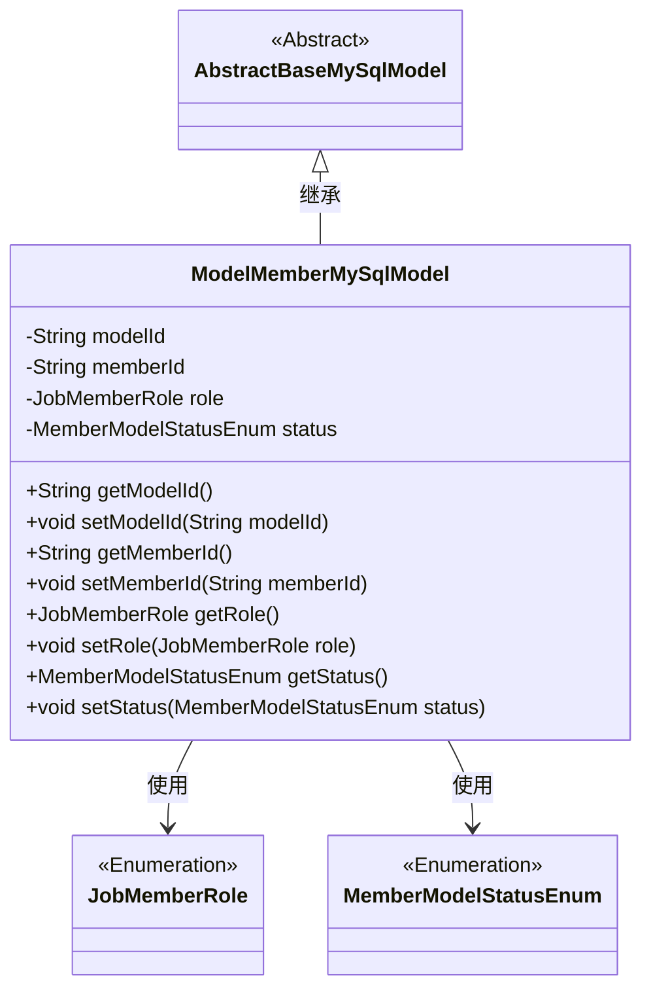

# 基础信息

|      |      |
|------|------|
| 名称 | ModelMemberMySqlModel |
| 编码语言 | .java |
| 代码路径 | WeFe/serving/serving-service/src/main/java/com/welab/wefe/serving/service/database/entity/ModelMemberMySqlModel.java |
| 包名 | com.welab.wefe.serving.service.database.entity |
| 依赖项 | ['com.welab.wefe.common.wefe.enums.JobMemberRole', 'com.welab.wefe.serving.service.enums.MemberModelStatusEnum', 'javax.persistence.Column', 'javax.persistence.Entity', 'javax.persistence.EnumType', 'javax.persistence.Enumerated'] |
| 概述说明 | 这是一个名为model_member的MySQL实体类，包含modelId、memberId、role和status字段，分别表示模型ID、成员ID、角色和状态，其中状态默认为offline。 |

# 说明

这是一个名为ModelMemberMySqlModel的Java实体类，映射到数据库表model_member。它继承自AbstractBaseMySqlModel，包含四个主要字段：modelId和memberId分别存储模型和成员ID，role表示成员角色，status记录成员状态，默认值为offline。所有字段都有对应的getter和setter方法。role和status使用枚举类型存储，并以字符串形式存入数据库。

# 类列表 Class Summary

| 名称   | 类型  | 说明 |
|-------|------|-------------|
| ModelMemberMySqlModel | class | ModelMemberMySqlModel类定义了模型成员实体，包含模型ID、成员ID、角色和状态字段，状态默认为离线。 |

## 类 ModelMemberMySqlModel

|      |      |
|------|------|
| 访问范围 | @Entity(name = "model_member");public |
| 类型 | class |
| 名称 | ModelMemberMySqlModel |
| 说明 | ModelMemberMySqlModel类定义了模型成员实体，包含模型ID、成员ID、角色和状态字段，状态默认为离线。 |

### UML类图

这段代码定义了一个名为`ModelMemberMySqlModel`的实体类，继承自抽象基类`AbstractBaseMySqlModel`，用于表示模型成员在MySQL数据库中的映射。该类包含四个主要字段：`modelId`、`memberId`、`role`和`status`，其中后两个字段是枚举类型。通过注解`@Entity`和`@Column`实现了与数据库表的映射关系，提供了标准的getter和setter方法用于字段访问和修改。该类主要用于管理模型成员的基本信息及其状态，体现了JPA实体类与数据库表之间的映射关系。

### 内部方法调用关系图

```mermaid
graph TD
    A["类ModelMemberMySqlModel"]
    B["继承: AbstractBaseMySqlModel"]
    C["注解: @Entity(name='model_member')"]
    D["属性: String modelId @Column(name='model_id')"]
    E["属性: String memberId @Column(name='member_id')"]
    F["属性: JobMemberRole role @Enumerated(EnumType.STRING)"]
    G["属性: MemberModelStatusEnum status @Enumerated(EnumType.STRING)"]
    H["方法: String getModelId()"]
    I["方法: void setModelId(String modelId)"]
    J["方法: String getMemberId()"]
    K["方法: void setMemberId(String memberId)"]
    L["方法: JobMemberRole getRole()"]
    M["方法: void setRole(JobMemberRole role)"]
    N["方法: MemberModelStatusEnum getStatus()"]
    O["方法: void setStatus(MemberModelStatusEnum status)"]

    A --> B
    A --> C
    A --> D
    A --> E
    A --> F
    A --> G
    A --> H
    A --> I
    A --> J
    A --> K
    A --> L
    A --> M
    A --> N
    A --> O
```

该流程图展示了ModelMemberMySqlModel类的完整结构，包括其继承关系、属性注解和所有方法。该类是一个JPA实体，通过@Entity注解映射到数据库表'model_member'，包含四个主要属性（modelId、memberId、role、status）及其对应的getter/setter方法。其中role和status属性使用@Enumerated注解实现枚举类型的持久化，status属性默认值为MemberModelStatusEnum.offline。

### 字段列表 Field List

| 名称  | 类型  | 说明 |
|-------|-------|------|
| status = MemberModelStatusEnum.offline | MemberModelStatusEnum | 枚举类型字段status，默认值offline，使用字符串存储枚举值。 |
| role | JobMemberRole | 枚举类型字段role，使用字符串形式存储JobMemberRole枚举值。 |
| memberId | String | 数据库字段member_id映射为成员ID的字符串类型私有变量。 |
| modelId | String | 数据库字段映射：modelId对应表列model_id。 |

### 方法列表

| 名称  | 类型  | 说明 |
|-------|-------|------|
| setMemberId | void | 设置成员ID的方法，将输入参数赋值给类的成员变量memberId。 |
| setModelId | void | 设置模型ID的方法，将输入参数赋值给类的modelId成员变量。 |
| getModelId | String | 方法返回modelId字符串。 |
| getMemberId | String | 获取成员ID的方法，返回字符串类型的memberId。 |
| getRole | JobMemberRole | 获取当前对象的角色信息。 |
| setRole | void | 方法setRole用于设置成员角色，参数为JobMemberRole类型，直接赋值给当前对象的role属性。 |
| getStatus | MemberModelStatusEnum | 获取成员状态枚举值的方法。 |
| setStatus | void | 设置成员状态的方法，参数为MemberModelStatusEnum类型。 |

