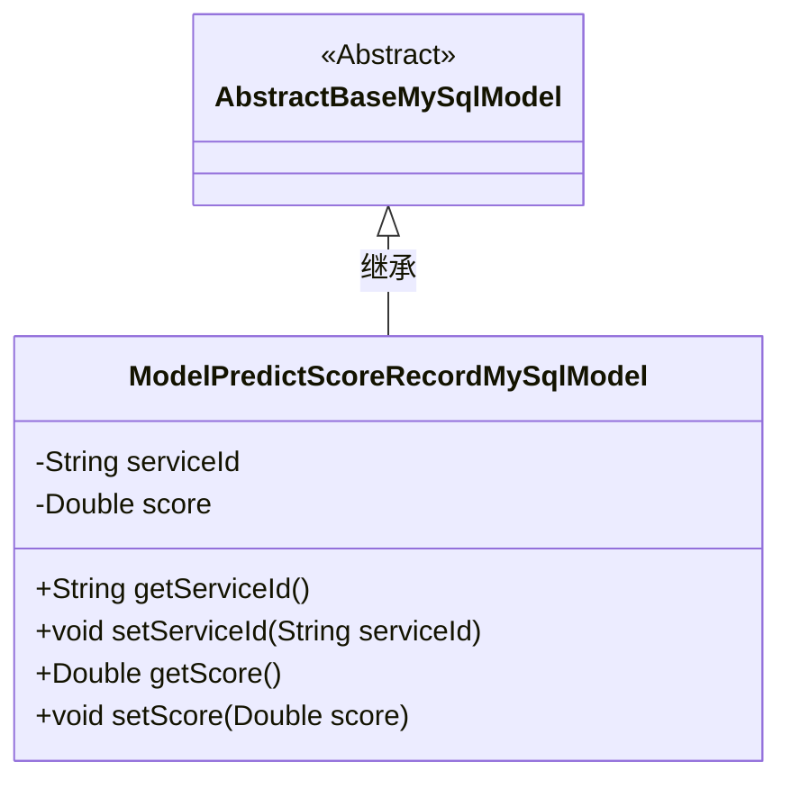
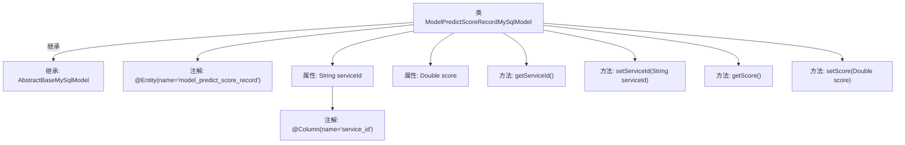

# 基础信息

|      |      |
|------|------|
| 名称 | ModelPredictScoreRecordMySqlModel |
| 编码语言 | .java |
| 代码路径 | WeFe/serving/serving-service/src/main/java/com/welab/wefe/serving/service/database/entity/ModelPredictScoreRecordMySqlModel.java |
| 包名 | com.welab.wefe.serving.service.database.entity |
| 依赖项 | ['javax.persistence.Column', 'javax.persistence.Entity'] |
| 概述说明 | 这是一个名为ModelPredictScoreRecordMySqlModel的JPA实体类，映射到数据库表model_predict_score_record，包含serviceId和score两个字段及其getter和setter方法。 |

# 说明

该内容定义了一个名为ModelPredictScoreRecordMySqlModel的Java类，用于映射数据库表model_predict_score_record。该类继承自AbstractBaseMySqlModel，包含两个属性：serviceId（字符串类型，对应数据库列service_id）和score（双精度浮点类型）。提供了这两个属性的getter和setter方法，用于访问和修改属性值。

# 类列表 Class Summary

| 名称   | 类型  | 说明 |
|-------|------|-------------|
| ModelPredictScoreRecordMySqlModel | class | 数据库实体类ModelPredictScoreRecordMySqlModel，包含serviceId和score字段及其getter/setter方法。 |

## 类 ModelPredictScoreRecordMySqlModel

|      |      |
|------|------|
| 访问范围 | @Entity(name = "model_predict_score_record");public |
| 类型 | class |
| 名称 | ModelPredictScoreRecordMySqlModel |
| 说明 | 数据库实体类ModelPredictScoreRecordMySqlModel，包含serviceId和score字段及其getter/setter方法。 |

### UML类图

类图描述：该图展示了一个继承关系，ModelPredictScoreRecordMySqlModel 继承自抽象类 AbstractBaseMySqlModel。子类包含两个私有属性 serviceId 和 score，以及对应的 getter 和 setter 方法。该类使用 JPA 注解标记为实体，并指定了表名和列名映射关系。

### 内部方法调用关系图

这段代码定义了一个名为ModelPredictScoreRecordMySqlModel的JPA实体类，继承自AbstractBaseMySqlModel。类中包含两个属性：serviceId（带有@Column注解指定数据库列名）和score，以及对应的getter和setter方法。流程图清晰地展示了类的继承关系、属性注解和方法结构，体现了该实体类作为数据库模型的核心特征，用于存储服务ID和分数预测数据。

### 字段列表 Field List

| 名称  | 类型  | 说明 |
|-------|-------|------|
| serviceId | String | 数据库字段映射：serviceId对应表列service_id。 |
| score | Double | 声明一个私有的双精度浮点型变量score。 |

### 方法列表

| 名称  | 类型  | 说明 |
|-------|-------|------|
| getServiceId | String | 获取serviceId的公共方法。 |
| setServiceId | void | 这是一个Java方法，用于设置类的serviceId属性值。方法接收一个字符串参数serviceId，并将其赋值给类的同名成员变量。 |
| getScore | Double | 方法getScore返回Double类型的score值。 |
| setScore | void | 这是一个Java方法，用于设置对象的score属性值。方法接收一个Double类型参数，并将其赋值给当前对象的score字段。 |

