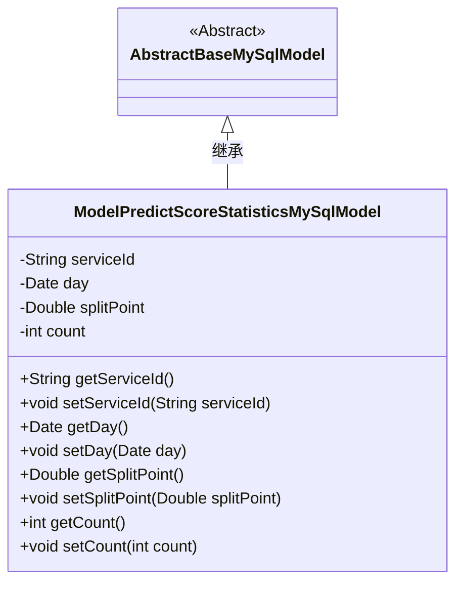
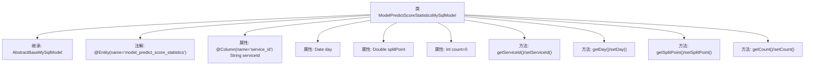

# 基础信息

|      |      |
|------|------|
| 名称 | ModelPredictScoreStatisticsMySqlModel |
| 编码语言 | .java |
| 代码路径 | WeFe/serving/serving-service/src/main/java/com/welab/wefe/serving/service/database/entity/ModelPredictScoreStatisticsMySqlModel.java |
| 包名 | com.welab.wefe.serving.service.database.entity |
| 依赖项 | ['javax.persistence.Column', 'javax.persistence.Entity', 'java.util.Date'] |
| 概述说明 | Java实体类ModelPredictScoreStatisticsMySqlModel，包含serviceId、day、splitPoint和count字段，用于存储模型预测分数统计数据。 |

# 说明

这是一个名为ModelPredictScoreStatisticsMySqlModel的Java实体类，映射到数据库表model_predict_score_statistics。它继承自AbstractBaseMySqlModel，包含四个字段：serviceId（服务ID，对应列名service_id）、day（日期）、splitPoint（分割点，双精度浮点数）和count（计数器，默认值为0）。类中为每个字段提供了标准的getter和setter方法，用于访问和修改这些属性。该实体类主要用于存储模型预测分数统计相关的数据。

# 类列表 Class Summary

| 名称   | 类型  | 说明 |
|-------|------|-------------|
| ModelPredictScoreStatisticsMySqlModel | class | 这是一个MySQL实体类，用于存储模型预测分数统计数据，包含服务ID、日期、分割点和计数字段。 |

## 类 ModelPredictScoreStatisticsMySqlModel

|      |      |
|------|------|
| 访问范围 | @Entity(name = "model_predict_score_statistics");public |
| 类型 | class |
| 名称 | ModelPredictScoreStatisticsMySqlModel |
| 说明 | 这是一个MySQL实体类，用于存储模型预测分数统计数据，包含服务ID、日期、分割点和计数字段。 |

### UML类图

该代码定义了一个名为ModelPredictScoreStatisticsMySqlModel的实体类，继承自AbstractBaseMySqlModel抽象类。该类包含四个私有字段：serviceId、day、splitPoint和count，分别表示服务ID、日期、分割点和计数。每个字段都有对应的getter和setter方法用于访问和修改。类上标注了@Entity注解，表明这是一个JPA实体类，映射到名为"model_predict_score_statistics"的数据库表。该类主要用于存储模型预测分数的统计信息，通过继承实现了基本的MySQL模型功能。

### 内部方法调用关系图

该流程图展示了ModelPredictScoreStatisticsMySqlModel类的结构，它是一个继承自AbstractBaseMySqlModel的JPA实体类，包含四个属性（serviceId、day、splitPoint、count）及其对应的getter/setter方法。类通过@Entity注解映射到数据库表model_predict_score_statistics，其中serviceId字段通过@Column注解指定列名。所有属性均为私有字段，通过公共方法提供访问和修改接口。

### 字段列表 Field List

| 名称  | 类型  | 说明 |
|-------|-------|------|
| day | Date | 声明一个私有日期类型变量day。 |
| splitPoint | Double | 私有双精度浮点型变量splitPoint。 |
| count = 0 | int | 私有整型变量count初始化为0。 |
| serviceId | String | 数据库字段映射：service_id对应私有变量serviceId。 |

### 方法列表

| 名称  | 类型  | 说明 |
|-------|-------|------|
| getSplitPoint | Double | 获取分割点数值的方法。 |
| setDay | void | 这是一个Java方法，用于设置对象的日期属性day。方法接受一个Date类型参数day，并将其赋值给当前对象的day字段。 |
| getServiceId | String | 获取serviceId的公共方法。 |
| getDay | Date | 获取日期对象的方法。 |
| setServiceId | void | 设置服务ID的方法，将输入参数赋值给类的serviceId成员变量。 |
| setSplitPoint | void | 设置分割点数值的方法，将参数splitPoint赋值给当前对象的splitPoint属性。 |
| getCount | int | 这是一个返回整型变量count值的公共方法。 |
| setCount | void | 这是一个Java方法，用于设置类成员变量count的值。方法接收一个整数参数count，并将其赋值给当前对象的count属性。 |

