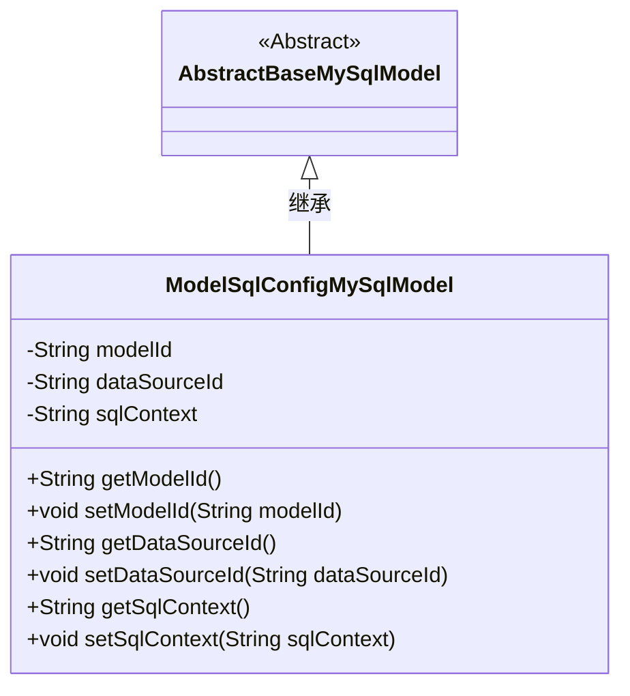
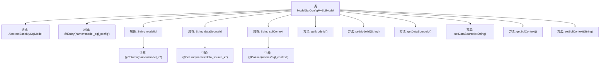

# 基础信息

|      |      |
|------|------|
| 名称 | ModelSqlConfigMySqlModel |
| 编码语言 | .java |
| 代码路径 | WeFe/serving/serving-service/src/main/java/com/welab/wefe/serving/service/database/entity/ModelSqlConfigMySqlModel.java |
| 包名 | com.welab.wefe.serving.service.database.entity |
| 依赖项 | ['javax.persistence.Column', 'javax.persistence.Entity'] |
| 概述说明 | ModelSqlConfigMySqlModel类映射model_sql_config表，包含modelId、dataSourceId和sqlContext字段及其getter/setter方法。 |

# 说明

这是一个名为ModelSqlConfigMySqlModel的Java实体类，映射到数据库表model_sql_config。它继承自AbstractBaseMySqlModel基类，包含三个字段：modelId对应表字段model_id，dataSourceId对应data_source_id，sqlContext对应sql_context。每个字段都有对应的getter和setter方法用于访问和修改属性值。该类用于存储模型SQL配置信息，包括模型ID、数据源ID和SQL内容。

# 类列表 Class Summary

| 名称   | 类型  | 说明 |
|-------|------|-------------|
| ModelSqlConfigMySqlModel | class | ModelSqlConfigMySqlModel类，包含modelId、dataSourceId和sqlContext字段，用于存储模型SQL配置信息。 |

## 类 ModelSqlConfigMySqlModel

|      |      |
|------|------|
| 访问范围 | @Entity(name = "model_sql_config");public |
| 类型 | class |
| 名称 | ModelSqlConfigMySqlModel |
| 说明 | ModelSqlConfigMySqlModel类，包含modelId、dataSourceId和sqlContext字段，用于存储模型SQL配置信息。 |

### UML类图

类图描述：该图展示了一个JPA实体类`ModelSqlConfigMySqlModel`继承自抽象基类`AbstractBaseMySqlModel`的结构。实体类包含三个私有字段（modelId、dataSourceId、sqlContext）及其对应的getter/setter方法，并通过`@Column`注解与数据库表字段映射。抽象基类作为父类提供基础功能，子类实现具体业务属性，体现了标准的JPA实体继承体系。

### 内部方法调用关系图

这段代码定义了一个名为ModelSqlConfigMySqlModel的实体类，继承自AbstractBaseMySqlModel，并使用@Entity注解标记为数据库实体。类中包含三个私有属性：modelId、dataSourceId和sqlContext，每个属性都通过@Column注解与数据库表的列名进行映射。同时，类为每个属性提供了对应的getter和setter方法，用于属性的访问和修改。这个类主要用于表示数据库中的模型SQL配置信息，通过注解实现了对象关系映射(ORM)的功能。

### 字段列表 Field List

| 名称  | 类型  | 说明 |
|-------|-------|------|
| sqlContext | String | 数据库列映射：字段sqlContext对应表列sql_context。 |
| dataSourceId | String | 数据库字段映射：dataSourceId对应列名data_source_id。 |
| modelId | String | 数据库字段映射：modelId对应表列model_id。 |

### 方法列表

| 名称  | 类型  | 说明 |
|-------|-------|------|
| getSqlContext | String | 获取SQL上下文字符串的方法。 |
| getModelId | String | 方法返回modelId字符串。 |
| setSqlContext | void | 定义了一个公共方法setSqlContext，用于设置类的sqlContext属性值。 |
| setModelId | void | 这是一个Java方法，用于设置类的modelId属性值。方法接收一个字符串参数modelId，并将其赋值给类的同名成员变量。 |
| getDataSourceId | String | 获取数据源ID的方法，直接返回成员变量dataSourceId的值。 |
| setDataSourceId | void | 设置数据源ID的方法，将输入参数赋值给类的成员变量dataSourceId。 |

