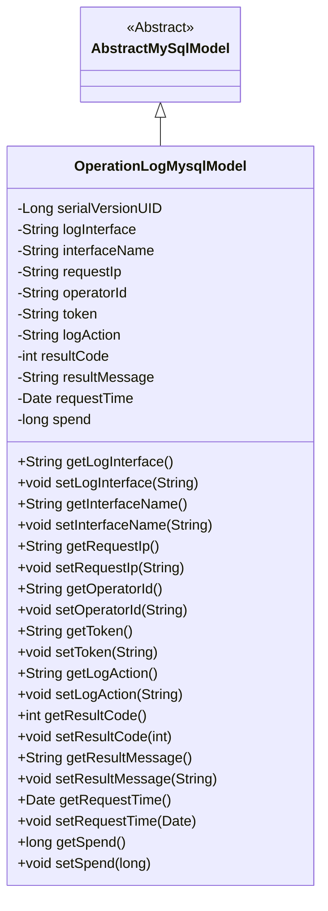

# 基础信息

|      |      |
|------|------|
| 名称 | OperationLogMysqlModel |
| 编码语言 | .java |
| 代码路径 | WeFe/serving/serving-service/src/main/java/com/welab/wefe/serving/service/database/entity/OperationLogMysqlModel.java |
| 包名 | com.welab.wefe.serving.service.database.entity |
| 依赖项 | ['java.util.Date', 'javax.persistence.Column', 'javax.persistence.Entity'] |
| 概述说明 | 操作日志实体类，包含接口、IP、操作人、行为、结果、耗时等字段，用于记录系统操作信息。 |

# 说明

该Java类定义了一个名为operator_log的数据库实体，继承自AbstractMySqlModel。它包含操作日志相关的字段：请求接口、接口名称、请求IP、操作人员编号、请求token、操作行为、请求结果编码、请求结果消息、请求时间及耗时。每个字段都有对应的getter和setter方法，部分字段通过@Column注解映射到数据库列。该类用于记录系统操作日志信息。

# 类列表 Class Summary

| 名称   | 类型  | 说明 |
|-------|------|-------------|
| OperationLogMysqlModel | class | 操作日志实体类，包含接口、IP、操作人、行为、结果、耗时等字段，用于记录系统操作信息。 |

## 类 OperationLogMysqlModel

|      |      |
|------|------|
| 访问范围 | @Entity(name = "operator_log");public |
| 类型 | class |
| 名称 | OperationLogMysqlModel |
| 说明 | 操作日志实体类，包含接口、IP、操作人、行为、结果、耗时等字段，用于记录系统操作信息。 |

### UML类图

类图描述：
OperationLogMysqlModel类继承自AbstractMySqlModel抽象类，是一个用于记录操作日志的实体类。它包含11个私有字段，分别记录接口信息、操作者信息、请求参数和结果等数据，并为每个字段提供了对应的getter和setter方法。该类通过@Entity注解标记为JPA实体，并通过@Column注解实现数据库字段映射，主要用于持久化操作日志数据到MySQL数据库。

### 内部方法调用关系图

```mermaid
graph TD
    A["类OperationLogMysqlModel"]
    B["继承: AbstractMySqlModel"]
    C["属性: String logInterface"]
    D["属性: String interfaceName"]
    E["属性: String requestIp"]
    F["属性: String operatorId"]
    G["属性: String token"]
    H["属性: String logAction"]
    I["属性: int resultCode"]
    J["属性: String resultMessage"]
    K["属性: Date requestTime"]
    L["属性: long spend"]
    M["方法: getLogInterface/setLogInterface"]
    N["方法: getInterfaceName/setInterfaceName"]
    O["方法: getRequestIp/setRequestIp"]
    P["方法: getOperatorId/setOperatorId"]
    Q["方法: getToken/setToken"]
    R["方法: getLogAction/setLogAction"]
    S["方法: getResultCode/setResultCode"]
    T["方法: getResultMessage/setResultMessage"]
    U["方法: getRequestTime/setRequestTime"]
    V["方法: getSpend/setSpend"]

    A --> B
    A --> C
    A --> D
    A --> E
    A --> F
    A --> G
    A --> H
    A --> I
    A --> J
    A --> K
    A --> L
    A --> M
    A --> N
    A --> O
    A --> P
    A --> Q
    A --> R
    A --> S
    A --> T
    A --> U
    A --> V
```

这段代码定义了一个名为OperationLogMysqlModel的实体类，继承自AbstractMySqlModel，用于记录操作日志信息。类中包含多个属性如logInterface、interfaceName、requestIp等，分别对应数据库表中的字段，每个属性都有对应的getter和setter方法。该类通过@Entity注解标记为JPA实体，@Column注解用于指定属性与数据库列的映射关系。整体结构清晰，属性覆盖了操作日志的主要信息，包括请求接口、操作人员、请求结果等关键数据。

### 字段列表 Field List

| 名称  | 类型  | 说明 |
|-------|-------|------|
| serialVersionUID = 6979249624126197334L | long | 定义了一个私有静态常量serialVersionUID，值为6979249624126197334L，用于序列化版本控制。 |
| operatorId | String | 数据库字段operator_id映射到变量operatorId。 |
| requestTime | Date | 数据库字段映射：request_time对应Date类型的requestTime。 |
| resultMessage | String | 数据库字段映射：resultMessage对应表列result_message，类型为String。 |
| requestIp | String | 数据库字段映射：requestIp对应表列request_ip，类型为字符串。 |
| logAction | String | 数据库字段映射：logAction对应表列log_action，类型为String。 |
| token | String | 声明一个私有字符串变量token。 |
| interfaceName | String | 数据库字段映射：interfaceName对应表列interface_name。 |
| logInterface | String | 数据库字段映射：log_interface对应私有字符串logInterface。 |
| resultCode | int | 数据库字段映射：resultCode对应表列result_code，类型为整型。 |
| spend | long | 私有长整型变量spend，用于存储时间或金额等数值。 |

### 方法列表

| 名称  | 类型  | 说明 |
|-------|-------|------|
| getToken | String | 获取token的公共方法，返回字符串类型token。 |
| getLogAction | String | 获取日志动作的方法，返回字符串类型变量logAction。 |
| getLogInterface | String | 获取日志接口方法，返回logInterface变量值。 |
| getResultCode | int | 这是一个Java方法，返回整型变量resultCode的值。 |
| setToken | void | 设置token字符串值的方法。 |
| setResultMessage | void | 这是一个Java方法，用于设置类的resultMessage属性值。方法接收一个字符串参数resultMessage，并将其赋值给类的同名成员变量。 |
| getResultMessage | String | 方法返回结果消息字符串。 |
| setRequestIp | void | 设置请求IP地址的方法。 |
| getRequestIp | String | 获取请求IP的方法，直接返回requestIp变量值。 |
| setLogAction | void | 定义公共方法setLogAction，用于设置成员变量logAction的值。 |
| getOperatorId | String | 这是一个Java方法，返回operatorId字符串值。 |
| setInterfaceName | void | 这是一个Java方法，用于设置接口名称，将传入的字符串参数赋值给类的成员变量interfaceName。 |
| setLogInterface | void | 定义方法setLogInterface，用于设置logInterface属性的值。 |
| setResultCode | void | 设置结果代码的方法，将输入参数赋值给类的resultCode成员变量。 |
| setOperatorId | void | 设置操作员ID的方法，将输入参数operatorId赋值给当前对象的operatorId属性。 |
| getInterfaceName | String | 获取接口名称的方法，返回变量interfaceName的值。 |
| getRequestTime | Date | 获取请求时间的方法，返回Date类型的requestTime。 |
| setRequestTime | void | 这是一个Java方法，用于设置请求时间，将传入的Date对象赋值给类的requestTime属性。 |
| getSpend | long | 方法返回spend变量的值。 |
| setSpend | void | 设置消费金额的方法，将参数值赋给类成员变量spend。 |

