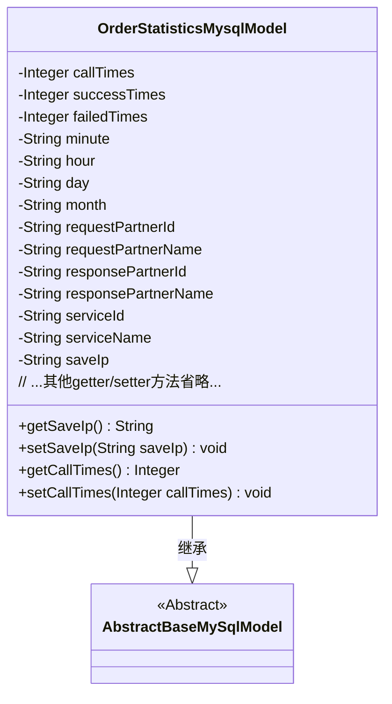
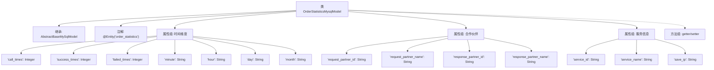

# 基础信息

|      |      |
|------|------|
| 名称 | OrderStatisticsMysqlModel |
| 编码语言 | .java |
| 代码路径 | WeFe/serving/serving-service/src/main/java/com/welab/wefe/serving/service/database/entity/OrderStatisticsMysqlModel.java |
| 包名 | com.welab.wefe.serving.service.database.entity |
| 依赖项 | ['javax.persistence.Column', 'javax.persistence.Entity'] |
| 概述说明 | 订单统计MySQL实体类，包含调用次数、成功失败次数、时间粒度、合作方信息、服务信息和IP地址等字段。 |

# 说明

这是一个名为OrderStatisticsMysqlModel的实体类，映射到数据库表order_statistics。它继承自AbstractBaseMySqlModel，包含订单统计相关的字段：调用次数、成功次数、失败次数、时间维度（分钟、小时、日、月）、请求方和响应方的ID与名称、服务ID与名称、保存IP。每个字段都有对应的getter和setter方法。

# 类列表 Class Summary

| 名称   | 类型  | 说明 |
|-------|------|-------------|
| OrderStatisticsMysqlModel | class | 订单统计MySQL实体类，包含调用次数、成功失败次数、时间粒度、合作方信息、服务信息和IP地址等字段。 |

## 类 OrderStatisticsMysqlModel

|      |      |
|------|------|
| 访问范围 | @Entity(name = "order_statistics");public |
| 类型 | class |
| 名称 | OrderStatisticsMysqlModel |
| 说明 | 订单统计MySQL实体类，包含调用次数、成功失败次数、时间粒度、合作方信息、服务信息和IP地址等字段。 |

### UML类图

这段代码展示了一个名为OrderStatisticsMysqlModel的JPA实体类，继承自AbstractBaseMySqlModel抽象类。该类用于存储订单统计信息，包含调用次数、成功/失败次数、时间维度字段（分钟/小时/天/月）、合作伙伴信息、服务信息等属性。所有字段都通过@Column注解映射到数据库表"order_statistics"的对应列，并通过getter/setter方法提供访问接口。类图清晰地展示了继承关系和完整的属性结构。

### 内部方法调用关系图

该流程图展示了OrderStatisticsMysqlModel类的完整结构，包含继承关系、JPA实体注解、三类核心属性组（时间维度指标、合作伙伴信息、服务信息）以及对应的getter/setter方法。所有数据库字段均通过@Column注解映射，属性按业务维度分组呈现，清晰反映了订单统计数据的存储结构。

### 字段列表 Field List

| 名称  | 类型  | 说明 |
|-------|-------|------|
| day | String | 数据库字段映射：day列对应String类型变量day。 |
| serviceName | String | 数据库字段映射：service_name对应String类型的serviceName。 |
| successTimes | Integer | 数据库字段success_times，类型为整数，对应列名success_times。 |
| minute | String | 数据库字段映射：minute列对应String类型变量minute。 |
| responsePartnerId | String | 数据库字段映射：response_partner_id对应私有字符串变量responsePartnerId。 |
| responsePartnerName | String | 数据库字段映射：response_partner_name对应私有字符串变量responsePartnerName。 |
| month | String | 数据库表字段映射，month对应私有字符串类型变量month。 |
| requestPartnerName | String | 数据库字段映射：requestPartnerName对应表列request_partner_name，类型为String。 |
| requestPartnerId | String | 数据库字段映射：requestPartnerId对应表列request_partner_id，类型为String。 |
| failedTimes | Integer | 数据库字段failed_times映射为整型变量failedTimes。 |
| callTimes | Integer | 数据库字段映射：call_times对应Integer类型的callTimes。 |
| hour | String | 数据库字段映射：hour列对应String类型hour变量。 |
| saveIp | String | 数据库字段映射：saveIp对应表列save_ip，类型为String。 |
| serviceId | String | 数据库字段映射：serviceId对应表列service_id。 |

### 方法列表

| 名称  | 类型  | 说明 |
|-------|-------|------|
| setMonth | void | 设置月份的方法，将输入字符串赋值给类的month变量。 |
| setMinute | void | 设置分钟属性的方法，将输入字符串赋值给类的minute成员变量。 |
| getResponsePartnerId | String | 获取响应合作方ID的方法，返回字符串类型的responsePartnerId。 |
| getRequestPartnerName | String | 获取请求合作方名称的方法，返回字符串类型的requestPartnerName。 |
| getCallTimes | Integer | 获取调用次数的整数值。 |
| setSaveIp | void | Java方法：设置saveIp属性值。参数为字符串saveIp，将其赋值给类的同名成员变量。 |
| setRequestPartnerName | void | 设置请求合作方名称的方法，将参数值赋给类成员变量requestPartnerName。 |
| setSuccessTimes | void | 这是一个Java方法，用于设置successTimes属性的值。方法接受一个Integer参数，并将其赋值给类的成员变量successTimes。 |
| getRequestPartnerId | String | 获取请求合作方ID的方法，返回requestPartnerId字符串。 |
| getHour | String | 获取小时值的公共方法，返回字符串类型的小时属性。 |
| getMonth | String | 获取月份的方法，返回字符串类型的month变量。 |
| setCallTimes | void | 这是一个Java方法，用于设置callTimes属性的值。方法接受一个Integer参数，并将其赋值给类的成员变量callTimes。 |
| getFailedTimes | Integer | 获取失败次数的整数值。 |
| getSuccessTimes | Integer | 获取成功次数的整数值。 |
| setDay | void | 这是一个Java方法，用于设置对象的day属性值。方法接收一个字符串参数day，并将其赋值给当前对象的day成员变量。 |
| setFailedTimes | void | 设置失败次数的公共方法，参数为整数类型，用于更新实例变量failedTimes的值。 |
| getSaveIp | String | 获取保存的IP地址字符串。 |
| getDay | String | 获取当前日期的字符串方法。 |
| getMinute | String | 获取分钟值的字符串方法。 |
| setHour | void | 方法setHour接收字符串参数hour，并将其赋值给当前对象的hour属性。 |
| setRequestPartnerId | void | 设置请求合作方ID的方法，将参数值赋给类的成员变量requestPartnerId。 |
| setResponsePartnerId | void | 设置响应合作方ID的方法，将输入参数赋值给类的成员变量responsePartnerId。 |
| getResponsePartnerName | String | 获取响应合作伙伴名称的方法。 |
| setResponsePartnerName | void | 设置响应合作伙伴名称的方法，将输入参数赋值给类的成员变量responsePartnerName。 |
| getServiceId | String | 获取服务ID的方法，返回字符串类型的serviceId。 |
| setServiceId | void | 设置服务ID的方法，将输入参数赋值给类的serviceId成员变量。 |
| getServiceName | String | 获取服务名称的方法，返回字符串serviceName。 |
| setServiceName | void | 这是一个Java方法，用于设置类的serviceName属性值。方法接收一个字符串参数serviceName，并将其赋值给类的同名成员变量。 |

