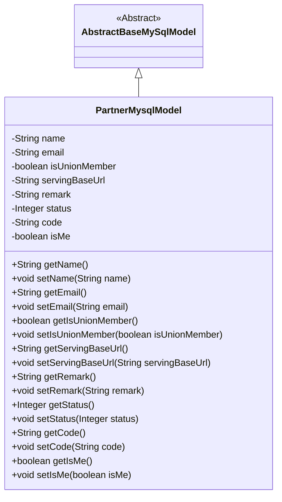

# 基础信息

|      |      |
|------|------|
| 名称 | PartnerMysqlModel |
| 编码语言 | .java |
| 代码路径 | WeFe/serving/serving-service/src/main/java/com/welab/wefe/serving/service/database/entity/PartnerMysqlModel.java |
| 包名 | com.welab.wefe.serving.service.database.entity |
| 依赖项 | ['javax.persistence.Column', 'javax.persistence.Entity', 'com.welab.wefe.serving.service.enums.ClientStatusEnum'] |
| 概述说明 | PartnerMysqlModel类，包含name、email、isUnionMember、servingBaseUrl、remark、status、code、isMe字段，用于表示合作伙伴信息。 |

# 说明

该代码定义了一个名为PartnerMysqlModel的实体类，映射到数据库表partner。类继承自AbstractBaseMySqlModel，包含name、email、isUnionMember、servingBaseUrl、remark、status、code和isMe等属性。其中isUnionMember和isMe通过@Column注解指定了数据库列名。status属性默认值为ClientStatusEnum.NORMAL.getValue()，表示正常状态。类为每个属性提供了getter和setter方法。

# 类列表 Class Summary

| 名称   | 类型  | 说明 |
|-------|------|-------------|
| PartnerMysqlModel | class | PartnerMysqlModel类定义了合作伙伴实体，包含名称、邮箱、是否联盟成员、服务URL、备注、状态、编码及是否本人等字段，并提供相应getter和setter方法。 |

## 类 PartnerMysqlModel

|      |      |
|------|------|
| 访问范围 | @Entity(name = "partner");public |
| 类型 | class |
| 名称 | PartnerMysqlModel |
| 说明 | PartnerMysqlModel类定义了合作伙伴实体，包含名称、邮箱、是否联盟成员、服务URL、备注、状态、编码及是否本人等字段，并提供相应getter和setter方法。 |

### UML类图

类图描述：PartnerMysqlModel类继承自AbstractBaseMySqlModel抽象类，是一个JPA实体类，用于表示合作伙伴信息。包含姓名、邮箱、是否联盟成员、服务基础URL、备注、状态、编码和是否当前用户等属性，以及对应的getter和setter方法。通过@Entity注解标记为持久化实体，部分字段使用@Column注解指定数据库列名。

### 内部方法调用关系图

```mermaid
graph TD
    A["类PartnerMysqlModel"]
    B["继承: AbstractBaseMySqlModel"]
    C["属性: String name"]
    D["属性: String email"]
    E["属性: boolean isUnionMember"]
    F["属性: String servingBaseUrl"]
    G["属性: String remark"]
    H["属性: Integer status"]
    I["属性: String code"]
    J["属性: boolean isMe"]
    K["方法: getName/setName"]
    L["方法: getEmail/setEmail"]
    M["方法: getIsUnionMember/setIsUnionMember"]
    N["方法: getServingBaseUrl/setServingBaseUrl"]
    O["方法: getRemark/setRemark"]
    P["方法: getStatus/setStatus"]
    Q["方法: getCode/setCode"]
    R["方法: getIsMe/setIsMe"]

    A --> B
    A --> C
    A --> D
    A --> E
    A --> F
    A --> G
    A --> H
    A --> I
    A --> J
    A --> K
    A --> L
    A --> M
    A --> N
    A --> O
    A --> P
    A --> Q
    A --> R
```

该流程图展示了PartnerMysqlModel类的完整结构，该类继承自AbstractBaseMySqlModel，包含9个核心属性和对应的getter/setter方法。特别值得注意的是布尔型属性isUnionMember和isMe的特殊命名约定，以及status属性使用ClientStatusEnum.NORMAL的默认值初始化。所有属性都通过标准JavaBean模式进行封装，体现了良好的面向对象设计原则。

### 字段列表 Field List

| 名称  | 类型  | 说明 |
|-------|-------|------|
| status = ClientStatusEnum.NORMAL.getValue() | Integer | 私有整型变量status初始化为ClientStatusEnum.NORMAL的值。 |
| servingBaseUrl | String | 数据库字段映射：servingBaseUrl对应表列serving_base_url。 |
| name | String | 私有字符串变量name |
| email | String | 声明一个私有字符串变量email。 |
| isUnionMember | boolean | 数据库字段映射：布尔类型isUnionMember对应表列is_union_member。 |
| isMe = false | boolean | 数据库字段映射：is_me对应布尔类型isMe，默认值false。 |
| code | String | 定义一个私有字符串变量code。 |
| remark | String | 私有字符串类型变量remark，用于存储备注信息。 |
| serialVersionUID = -2477812313658221499L | long | 定义了一个私有静态不可变长整型序列化版本号，值为-2477812313658221499L。 |

### 方法列表

| 名称  | 类型  | 说明 |
|-------|-------|------|
| setServingBaseUrl | void | 设置服务基础URL的方法，将输入参数赋给类变量servingBaseUrl。 |
| getIsUnionMember | boolean | 方法返回布尔值isUnionMember，表示是否为工会成员。 |
| setStatus | void | 设置状态值的方法，将输入参数status赋值给当前对象的status属性。 |
| setCode | void | 设置字符串类型的code属性值。 |
| getIsMe | boolean | 这是一个Java方法，返回布尔值isMe，用于判断当前对象是否为自身。 |
| setIsMe | void | 这是一个Java方法，用于设置布尔类型成员变量isMe的值。方法名为setIsMe，接受一个boolean参数isMe，并将其赋值给当前对象的isMe属性。 |
| setEmail | void | 这是一个Java方法，用于设置对象的email属性。方法接收一个字符串参数email，并将其赋值给当前对象的email字段。 |
| setIsUnionMember | void | 这是一个Java方法，用于设置成员变量isUnionMember的布尔值。 |
| getRemark | String | 获取备注信息的公共方法，返回字符串类型的备注内容。 |
| setName | void | 设置对象名称的方法，将参数name赋值给对象的name属性。 |
| getStatus | Integer | 获取状态值的方法，返回整数类型的status变量。 |
| getName | String | 获取名称的方法，返回字符串类型的name变量值。 |
| getServingBaseUrl | String | 获取服务基础URL的方法，返回servingBaseUrl变量值。 |
| setRemark | void | 这是一个Java方法，用于设置对象的remark属性值。方法接收一个字符串参数remark，并将其赋值给当前对象的remark成员变量。 |
| getEmail | String | 这是一个Java方法，返回字符串类型的email变量值。 |
| getCode | String | 获取code值的公共方法。 |

