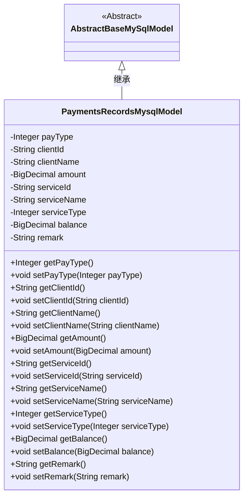

# 基础信息

|      |      |
|------|------|
| 名称 | PaymentsRecordsMysqlModel |
| 编码语言 | .java |
| 代码路径 | WeFe/serving/serving-service/src/main/java/com/welab/wefe/serving/service/database/entity/PaymentsRecordsMysqlModel.java |
| 包名 | com.welab.wefe.serving.service.database.entity |
| 依赖项 | ['javax.persistence.Column', 'javax.persistence.Entity', 'java.math.BigDecimal'] |
| 概述说明 | 支付记录实体类，包含支付类型、客户ID、客户名称、金额、服务ID、服务名称、服务类型、余额和备注字段。 |

# 说明

这是一个名为payments_records的MySQL数据库实体类，用于存储支付记录信息。类中包含支付类型（1充值或2支出）、客户ID和名称、金额、服务ID、名称和类型、余额以及备注等字段。所有字段都有对应的getter和setter方法，用于数据的存取操作。该类继承自AbstractBaseMySqlModel基类。

# 类列表 Class Summary

| 名称   | 类型  | 说明 |
|-------|------|-------------|
| PaymentsRecordsMysqlModel | class | 支付记录实体类，包含支付类型、客户信息、服务信息、金额、余额和备注等字段。 |

## 类 PaymentsRecordsMysqlModel

|      |      |
|------|------|
| 访问范围 | @Entity(name = "payments_records");public |
| 类型 | class |
| 名称 | PaymentsRecordsMysqlModel |
| 说明 | 支付记录实体类，包含支付类型、客户信息、服务信息、金额、余额和备注等字段。 |

### UML类图

这段代码定义了一个名为`PaymentsRecordsMysqlModel`的实体类，继承自`AbstractBaseMySqlModel`，用于表示支付记录。类中包含支付类型、客户ID、客户名称、金额、服务ID、服务名称、服务类型、余额和备注等属性，并提供了相应的getter和setter方法。该类使用JPA注解标记为实体，并映射到数据库表`payments_records`。

### 内部方法调用关系图

```mermaid
graph TD
    A["类PaymentsRecordsMysqlModel"]
    B["继承: AbstractBaseMySqlModel"]
    C["注解: @Entity('payments_records')"]
    D["属性: Integer payType"]
    E["属性: String clientId"]
    F["属性: String clientName"]
    G["属性: BigDecimal amount"]
    H["属性: String serviceId"]
    I["属性: String serviceName"]
    J["属性: Integer serviceType"]
    K["属性: BigDecimal balance"]
    L["属性: String remark"]
    M["方法: getRemark()/setRemark()"]
    N["方法: getPayType()/setPayType()"]
    O["方法: getClientId()/setClientId()"]
    P["方法: getClientName()/setClientName()"]
    Q["方法: getAmount()/setAmount()"]
    R["方法: getServiceId()/setServiceId()"]
    S["方法: getServiceName()/setServiceName()"]
    T["方法: getServiceType()/setServiceType()"]
    U["方法: getBalance()/setBalance()"]

    A --> B
    A --> C
    A --> D
    A --> E
    A --> F
    A --> G
    A --> H
    A --> I
    A --> J
    A --> K
    A --> L
    A --> M
    A --> N
    A --> O
    A --> P
    A --> Q
    A --> R
    A --> S
    A --> T
    A --> U
```

该流程图展示了PaymentsRecordsMysqlModel类的完整结构，包括其继承关系、实体注解、11个属性和对应的getter/setter方法。这个JPA实体类用于表示支付记录，包含支付类型、客户信息、服务信息、金额、余额等核心字段，所有属性都通过注解与数据库表字段映射。每个属性都有对应的访问方法，体现了标准的JavaBean规范。

### 字段列表 Field List

| 名称  | 类型  | 说明 |
|-------|-------|------|
| balance | BigDecimal | 私有的大数值类型余额变量。 |
| serviceType | Integer | 数据库字段映射：service_type对应Integer类型的serviceType。 |
| serviceId | String | 数据库字段映射：service_id对应String类型的serviceId。 |
| remark | String | 私有字符串类型备注字段。 |
| clientName | String | 数据库字段映射：clientName对应表列client_name。 |
| clientId | String | 数据库字段映射：client_id对应私有变量clientId。 |
| payType | Integer | 数据库字段pay_type，类型为Integer。 |
| serviceName | String | 数据库字段映射：serviceName对应表列service_name。 |
| amount | BigDecimal | 私有的大数值金额变量。 |

### 方法列表

| 名称  | 类型  | 说明 |
|-------|-------|------|
| getBalance | BigDecimal | 这是一个Java方法，返回BigDecimal类型的余额值。 |
| setPayType | void | 设置支付类型方法，参数为整型payType，赋值给当前对象同名属性。 |
| getRemark | String | 这是一个Java方法，返回字符串类型的remark属性值。 |
| getClientName | String | 这是一个Java方法，返回字符串类型的clientName成员变量值。 |
| setServiceType | void | 这是一个Java方法，用于设置serviceType属性的值，参数为Integer类型。 |
| getPayType | Integer | 这是一个Java方法，返回名为payType的整型变量值。 |
| getAmount | BigDecimal | 方法返回BigDecimal类型的金额值。 |
| setBalance | void | Java方法：设置余额，参数为BigDecimal类型，将输入值赋给类变量balance。 |
| setRemark | void | Java方法：设置备注信息，将输入字符串赋值给类的remark属性。 |
| setServiceName | void | 这是一个Java方法，用于设置类的serviceName属性值。方法接收一个字符串参数serviceName，并将其赋值给类的同名成员变量。 |
| setServiceId | void | 这是一个Java方法，用于设置类的serviceId属性值。方法接收一个字符串参数serviceId，并将其赋值给类的同名成员变量。 |
| getServiceId | String | 获取serviceId的方法，直接返回serviceId值。 |
| getServiceName | String | 该方法返回serviceName字符串值。 |
| setAmount | void | 设置金额方法，将传入的BigDecimal值赋给类的amount属性。 |
| getServiceType | Integer | 获取服务类型的方法，返回整型数值serviceType。 |
| getClientId | String | 这是一个Java方法，返回字符串类型的clientId成员变量值。 |
| setClientName | void | 设置客户端名称的方法，将输入参数赋值给成员变量clientName。 |
| setClientId | void | 设置客户端ID的方法，将传入的clientId赋值给当前对象的clientId属性。 |

