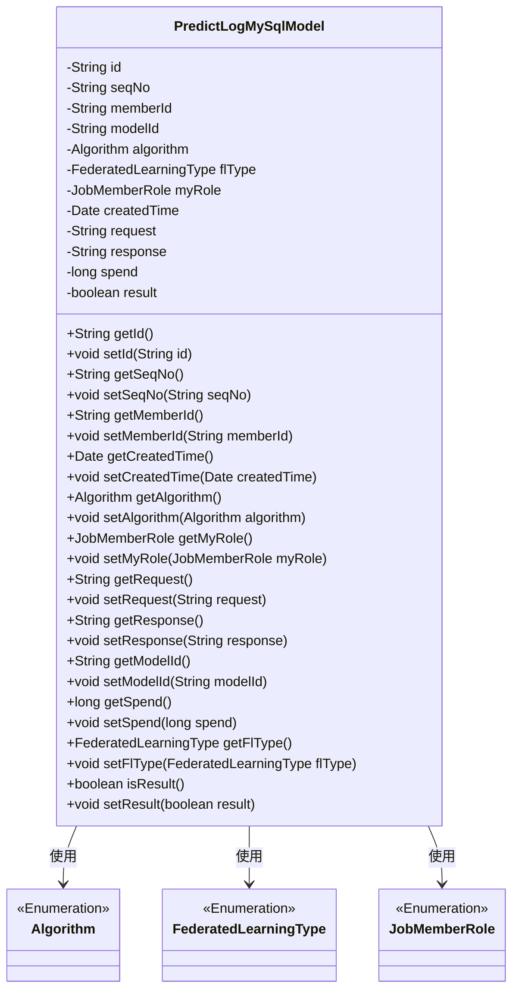

# 基础信息

|      |      |
|------|------|
| 名称 | PredictLogMySqlModel |
| 编码语言 | .java |
| 代码路径 | WeFe/serving/serving-service/src/main/java/com/welab/wefe/serving/service/database/entity/PredictLogMySqlModel.java |
| 包名 | com.welab.wefe.serving.service.database.entity |
| 依赖项 | ['com.welab.wefe.common.wefe.enums.Algorithm', 'com.welab.wefe.common.wefe.enums.FederatedLearningType', 'com.welab.wefe.common.wefe.enums.JobMemberRole', 'javax.persistence', 'java.util.Date', 'java.util.UUID'] |
| 概述说明 | PredictLogMySqlModel类定义了预测日志的MySQL实体，包含ID、序列号、成员ID、模型ID、算法、联邦学习类型、角色、创建时间、请求、响应、耗时和结果等字段。 |

# 说明

该代码定义了一个名为PredictLogMySqlModel的JPA实体类，映射到数据库表predict_log。实体包含多个字段：唯一ID（自动生成）、序列号、成员ID、模型ID、算法类型、联邦学习类型、角色、创建时间、请求数据、响应数据、耗时和结果标志。所有字段均有对应的getter和setter方法。枚举类型字段使用字符串形式存储。该实体用于记录预测日志信息，包含执行上下文和结果数据。

# 类列表 Class Summary

| 名称   | 类型  | 说明 |
|-------|------|-------------|
| PredictLogMySqlModel | class | PredictLogMySqlModel类定义了预测日志的数据库实体，包含ID、序列号、成员ID、模型ID、算法类型、联邦学习类型、角色、创建时间、请求、响应、耗时和结果等字段。 |

## 类 PredictLogMySqlModel

|      |      |
|------|------|
| 访问范围 | @Entity(name = "predict_log");public |
| 类型 | class |
| 名称 | PredictLogMySqlModel |
| 说明 | PredictLogMySqlModel类定义了预测日志的数据库实体，包含ID、序列号、成员ID、模型ID、算法类型、联邦学习类型、角色、创建时间、请求、响应、耗时和结果等字段。 |

### UML类图

这段代码定义了一个名为PredictLogMySqlModel的实体类，用于记录预测日志信息。该类包含多个私有字段，如唯一标识id、序列号seqNo、成员ID memberId、模型ID modelId等，以及对应的getter和setter方法。该类使用了三个枚举类型：Algorithm表示算法类型，FederatedLearningType表示联邦学习类型，JobMemberRole表示任务成员角色。这些枚举类型通过关联关系被PredictLogMySqlModel类使用。整体设计符合JPA实体规范，适合用于数据库持久化操作。

### 内部方法调用关系图

```mermaid
graph TD
    A["类PredictLogMySqlModel"]
    B["属性: String id"]
    C["属性: String seqNo"]
    D["属性: String memberId"]
    E["属性: String modelId"]
    F["属性: Algorithm algorithm"]
    G["属性: FederatedLearningType flType"]
    H["属性: JobMemberRole myRole"]
    I["属性: Date createdTime"]
    J["属性: String request"]
    K["属性: String response"]
    L["属性: long spend"]
    M["属性: boolean result"]
    N["方法: getId/setId"]
    O["方法: getSeqNo/setSeqNo"]
    P["方法: getMemberId/setMemberId"]
    Q["方法: getCreatedTime/setCreatedTime"]
    R["方法: getAlgorithm/setAlgorithm"]
    S["方法: getMyRole/setMyRole"]
    T["方法: getRequest/setRequest"]
    U["方法: getResponse/setResponse"]
    V["方法: getModelId/setModelId"]
    W["方法: getSpend/setSpend"]
    X["方法: getFlType/setFlType"]
    Y["方法: isResult/setResult"]

    A --> B
    A --> C
    A --> D
    A --> E
    A --> F
    A --> G
    A --> H
    A --> I
    A --> J
    A --> K
    A --> L
    A --> M
    A --> N
    A --> O
    A --> P
    A --> Q
    A --> R
    A --> S
    A --> T
    A --> U
    A --> V
    A --> W
    A --> X
    A --> Y
```

这段代码定义了一个名为PredictLogMySqlModel的JPA实体类，用于记录预测日志信息。该类包含13个属性，分别用于存储唯一标识ID、序列号、成员ID、模型ID、算法类型、联邦学习类型、角色、创建时间、请求数据、响应数据、耗时、结果标志等。每个属性都有对应的getter和setter方法，用于属性的读写操作。该实体类映射到数据库中的"predict_log"表，通过JPA注解配置了字段名、枚举类型存储方式等元数据。

### 字段列表 Field List

| 名称  | 类型  | 说明 |
|-------|-------|------|
| createdTime = new Date() | Date | 数据库字段created_time映射为Date类型，默认值为当前时间。 |
| response | String | 私有字符串变量response。 |
| request | String | 私有字符串变量request。 |
| flType | FederatedLearningType | 代码定义了一个枚举类型字段flType，使用字符串形式存储在数据库列fl_type中，关联枚举类FederatedLearningType。 |
| myRole | JobMemberRole | 使用@Enumerated注解将枚举类型JobMemberRole以字符串形式存储到数据库表的my_role列中。 |
| result | boolean | 布尔类型私有变量result |
| seqNo | String | 数据库字段映射：seq_no对应私有变量seqNo。 |
| memberId | String | 数据库字段映射：成员ID，对应表列member_id，类型为字符串。 |
| id = UUID.randomUUID().toString().replaceAll("-", "") | String | 实体ID字段，使用UUID生成并去除横杠，不可更新。 |
| algorithm | Algorithm | 枚举类型Algorithm以字符串形式存储。 |
| modelId | String | 数据库字段映射：modelId对应表列model_id。 |
| spend | long | 私有长整型变量spend，用于存储时间或金额等数值。 |

### 方法列表

| 名称  | 类型  | 说明 |
|-------|-------|------|
| setSpend | void | 设置花费数值的方法，将参数spend赋值给类成员变量spend。 |
| getRequest | String | 获取请求字符串的方法。 |
| setMemberId | void | 设置成员ID的方法，将输入参数memberId赋值给当前对象的memberId属性。 |
| getMemberId | String | 获取成员ID的方法，返回字符串类型的memberId。 |
| getResponse | String | 获取response字符串的方法。 |
| getSeqNo | String | 获取序列号方法，返回字符串类型seqNo。 |
| getFlType | FederatedLearningType | 获取联邦学习类型的方法，返回flType字段值。 |
| setId | void | 设置对象ID的方法，将参数id赋值给当前对象的id属性。 |
| getAlgorithm | Algorithm | 获取当前算法实例的方法。 |
| getCreatedTime | Date | 获取创建时间的方法，返回日期类型变量createdTime。 |
| setCreatedTime | void | 设置创建时间的方法，参数为Date类型，赋值给类的createdTime属性。 |
| setSeqNo | void | 设置序列号的方法，将输入参数赋值给类的seqNo成员变量。 |
| setModelId | void | 设置模型ID的方法，将传入的字符串赋值给类的modelId成员变量。 |
| getId | String | 方法getId返回字符串类型的id值。 |
| isResult | boolean | 该方法返回布尔值result，表示结果状态。 |
| getSpend | long | 方法getSpend返回长整型变量spend的值。 |
| setRequest | void | 设置请求字符串的方法。 |
| setAlgorithm | void | 设置算法方法，将传入的算法对象赋值给当前对象的algorithm属性。 |
| setFlType | void | 设置联邦学习类型的方法，参数为flType，赋值给当前对象的flType属性。 |
| setMyRole | void | 这是一个Java方法，用于设置当前对象的成员角色属性。方法接受一个JobMemberRole类型的参数myRole，并将其赋值给当前对象的同名属性。 |
| setResponse | void | 设置响应内容的方法，将输入字符串赋值给类的response成员变量。 |
| getMyRole | JobMemberRole | 获取当前用户的角色信息，返回JobMemberRole类型的myRole变量值。 |
| getModelId | String | 方法返回modelId字符串。 |
| setResult | void | 这是一个Java方法，用于设置布尔类型的result变量值。方法接受一个布尔参数result，并将其赋值给当前对象的result成员变量。 |

