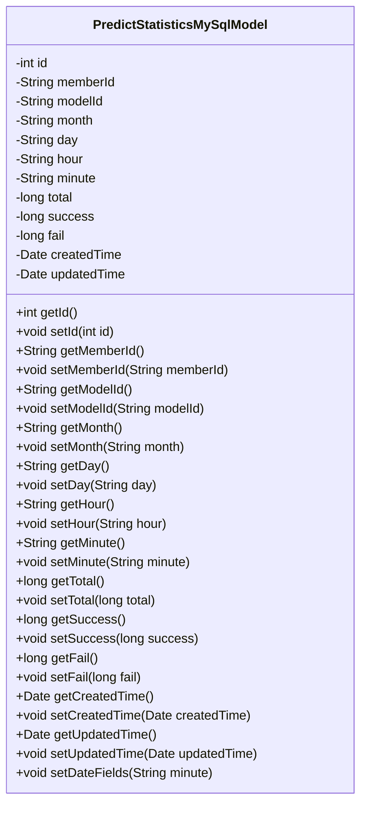
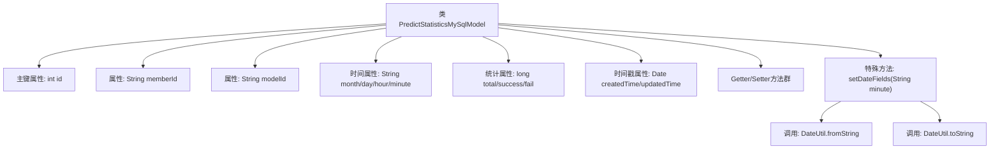

# 基础信息

|      |      |
|------|------|
| 名称 | PredictStatisticsMySqlModel |
| 编码语言 | .java |
| 代码路径 | WeFe/serving/serving-service/src/main/java/com/welab/wefe/serving/service/database/entity/PredictStatisticsMySqlModel.java |
| 包名 | com.welab.wefe.serving.service.database.entity |
| 依赖项 | ['com.welab.wefe.common.util.DateUtil', 'javax.persistence', 'java.util.Date'] |
| 概述说明 | 这是一个名为predict_statistics的MySQL实体类，包含预测统计信息，如ID、成员ID、模型ID、时间字段（月、日、时、分）、总数、成功数、失败数及创建更新时间。提供设置日期字段的方法。 |

# 说明

这是一个名为PredictStatisticsMySqlModel的JPA实体类，映射到数据库表predict_statistics。该类包含预测统计相关的字段：自增主键id、会员ID、模型ID、年月日时分时间字段、总调用次数、成功次数、失败次数、创建时间和更新时间。提供所有字段的getter和setter方法，并包含一个setDateFields方法用于根据分钟级时间戳设置年月日字段。实体使用注解配置表名、列名和主键生成策略。

# 类列表 Class Summary

| 名称   | 类型  | 说明 |
|-------|------|-------------|
| PredictStatisticsMySqlModel | class | 这是一个MySQL实体类PredictStatisticsMySqlModel，用于存储预测统计数据，包含ID、会员ID、模型ID、时间字段（月/日/时/分）、统计总量、成功/失败次数及创建/更新时间。 |

## 类 PredictStatisticsMySqlModel

|      |      |
|------|------|
| 访问范围 | @Entity(name = "predict_statistics");public |
| 类型 | class |
| 名称 | PredictStatisticsMySqlModel |
| 说明 | 这是一个MySQL实体类PredictStatisticsMySqlModel，用于存储预测统计数据，包含ID、会员ID、模型ID、时间字段（月/日/时/分）、统计总量、成功/失败次数及创建/更新时间。 |

### UML类图

该类图展示了一个名为PredictStatisticsMySqlModel的JPA实体类，用于存储预测统计数据。该类包含15个私有字段和对应的getter/setter方法，其中id字段被标记为主键且自动生成。setDateFields方法用于根据分钟级时间戳设置月、日、小时字段。所有字段都通过JPA注解与数据库表predict_statistics进行映射，包含统计总数、成功/失败次数以及创建/更新时间等核心业务数据。

### 内部方法调用关系图

该流程图展示了PredictStatisticsMySqlModel类的完整结构，这是一个JPA实体类，用于存储预测统计数据。类包含12个成员变量，其中id使用@Id标注为主键，包含基本类型和日期类型字段。核心方法是setDateFields，该方法通过DateUtil工具类将分钟级时间戳分解为月、日、小时格式。所有字段都配有标准的getter/setter方法，updatedTime字段支持数据更新时自动维护。

### 字段列表 Field List

| 名称  | 类型  | 说明 |
|-------|-------|------|
| memberId | String | 数据库字段映射：成员ID对应表列member_id，类型为字符串。 |
| createdTime = new Date() | Date | 数据库字段映射：created_time对应Date类型，默认值为当前时间。 |
| fail | long | 私有长整型变量fail，用于记录失败次数或状态。 |
| month | String | 私有字符串变量month |
| minute | String | 定义字符串类型变量minute。 |
| id | int | 实体类ID字段，使用自增策略，不可更新。 |
| total | long | 私有长整型变量total。 |
| modelId | String | 数据库字段映射：modelId对应表列model_id。 |
| hour | String | 定义私有字符串变量hour。 |
| success | long | 私有长整型变量success |
| updatedTime | Date | 数据库字段updated_time映射为Date类型的updatedTime。 |
| day | String | 声明一个私有字符串变量day。 |

### 方法列表

| 名称  | 类型  | 说明 |
|-------|-------|------|
| getTotal | long | 方法返回total变量的值。 |
| getDay | String | 获取当前日期的字符串值。 |
| getCreatedTime | Date | 获取创建时间的方法，返回Date类型变量createdTime。 |
| setMonth | void | 设置月份的方法，将输入字符串赋值给类的month属性。 |
| setCreatedTime | void | 设置创建时间的方法，参数为Date类型，赋值给成员变量createdTime。 |
| getHour | String | 获取小时值的方法，返回字符串类型的小时数据。 |
| setTotal | void | 这是一个Java方法，用于设置类成员变量total的值。方法接受一个long类型参数total，并将其赋值给当前对象的total属性。 |
| setFail | void | 设置失败计数方法，参数为长整型fail，赋值给类成员变量fail。 |
| getSuccess | long | 获取成功次数的长整型方法。 |
| setHour | void | 方法setHour接收字符串参数hour，并将其赋值给类的成员变量hour。 |
| setMemberId | void | 定义公共方法setMemberId，接收字符串参数memberId并赋值给当前对象的同名成员变量。 |
| setDay | void | 定义了一个公共方法setDay，用于设置对象的day属性值。参数为字符串类型的day。 |
| setMinute | void | 设置分钟数值的方法，将输入字符串赋值给类的minute变量。 |
| getUpdatedTime | Date | 获取更新时间的方法，返回updatedTime对象。 |
| getMemberId | String | 获取成员ID的方法，返回字符串类型的memberId。 |
| getFail | long | 获取失败计数值的方法，返回长整型变量fail。 |
| setModelId | void | 这是一个Java方法，用于设置modelId属性的值。方法接收一个字符串参数modelId，并将其赋值给当前对象的modelId属性。 |
| setId | void | 设置对象ID的方法，将参数id赋值给当前对象的id属性。 |
| getId | int | 这是一个Java方法，返回私有成员变量id的值。 |
| setSuccess | void | 设置成功计数的方法，将输入值赋给内部变量success。 |
| getMonth | String | 获取月份的方法，返回字符串类型的月份值。 |
| getModelId | String | 方法返回modelId字符串。 |
| getMinute | String | 获取分钟数值的方法，返回字符串类型的分钟值。 |
| setUpdatedTime | void | 设置更新时间的公共方法，参数为Date类型。 |
| setDateFields | void | 方法setDateFields将输入字符串minute转换为年月、年月日、年月日时分三种格式，并分别赋值给month、day、hour字段。 |

