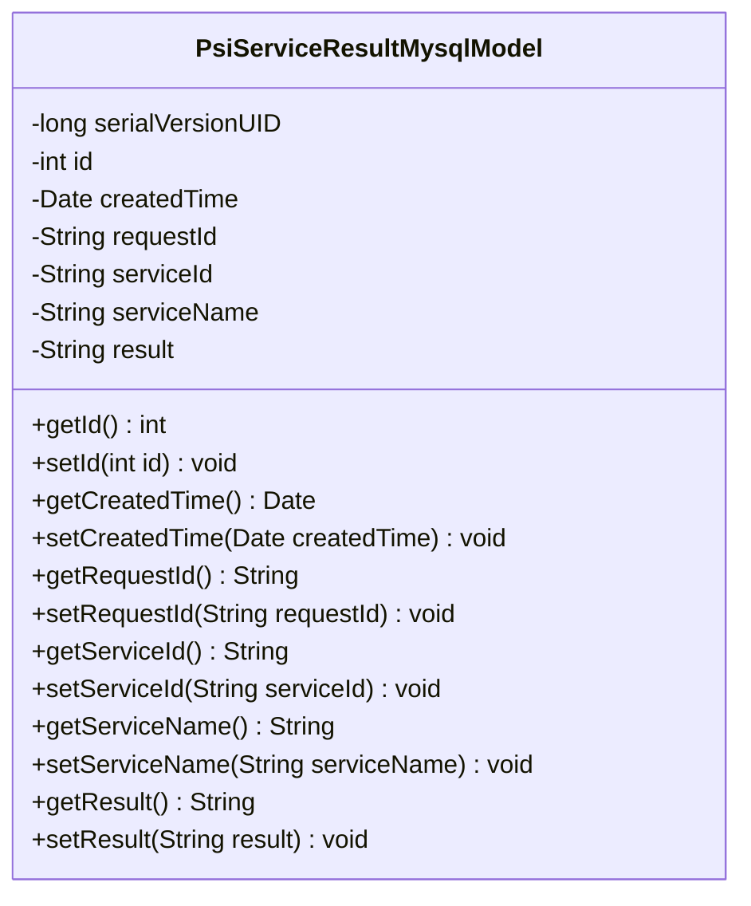

# 基础信息

|      |      |
|------|------|
| 名称 | PsiServiceResultMysqlModel |
| 编码语言 | .java |
| 代码路径 | WeFe/serving/serving-service/src/main/java/com/welab/wefe/serving/service/database/entity/PsiServiceResultMysqlModel.java |
| 包名 | com.welab.wefe.serving.service.database.entity |
| 依赖项 | ['java.io.Serializable', 'java.util.Date', 'javax.persistence.Column', 'javax.persistence.Entity', 'javax.persistence.GeneratedValue', 'javax.persistence.GenerationType', 'javax.persistence.Id'] |
| 概述说明 | PSI服务结果MySQL实体类，包含ID、创建时间、请求ID、服务ID、服务名称和结果字段，实现序列化接口。 |

# 说明

这是一个名为PsiServiceResultMysqlModel的Java实体类，映射到数据库表psi_service_result。类实现了Serializable接口，包含序列化ID。主键id为自增整数，不可更新。包含创建时间createdTime，默认值为当前时间。其他字段包括请求ID requestId、服务ID serviceId、服务名称serviceName和结果result。每个字段都有对应的getter和setter方法。类用于存储PSI服务结果数据，各字段均有数据库列映射注解。

# 类列表 Class Summary

| 名称   | 类型  | 说明 |
|-------|------|-------------|
| PsiServiceResultMysqlModel | class | PSI服务结果MySQL实体类，包含ID、创建时间、请求ID、服务ID、服务名称和结果字段，实现序列化接口。 |

## 类 PsiServiceResultMysqlModel

|      |      |
|------|------|
| 访问范围 | @Entity(name = "psi_service_result");public |
| 类型 | class |
| 名称 | PsiServiceResultMysqlModel |
| 说明 | PSI服务结果MySQL实体类，包含ID、创建时间、请求ID、服务ID、服务名称和结果字段，实现序列化接口。 |

### UML类图

这段代码定义了一个名为`PsiServiceResultMysqlModel`的实体类，用于映射数据库表`psi_service_result`。该类实现了`Serializable`接口，包含id、创建时间、请求ID、服务ID、服务名称和结果等字段，并提供了相应的getter和setter方法。这些字段通过JPA注解与数据库表的列进行映射，其中id字段是主键且自动生成。这个类主要用于存储和操作PSI（Private Set Intersection）服务的结果数据。

### 内部方法调用关系图

```mermaid
graph TD
    A["类PsiServiceResultMysqlModel"]
    B["属性: int id"]
    C["属性: Date createdTime"]
    D["属性: String requestId"]
    E["属性: String serviceId"]
    F["属性: String serviceName"]
    G["属性: String result"]
    H["方法: int getId()"]
    I["方法: void setId(int id)"]
    J["方法: Date getCreatedTime()"]
    K["方法: void setCreatedTime(Date createdTime)"]
    L["方法: String getRequestId()"]
    M["方法: void setRequestId(String requestId)"]
    N["方法: String getServiceId()"]
    O["方法: void setServiceId(String serviceId)"]
    P["方法: String getServiceName()"]
    Q["方法: void setServiceName(String serviceName)"]
    R["方法: String getResult()"]
    S["方法: void setResult(String result)"]

    A --> B
    A --> C
    A --> D
    A --> E
    A --> F
    A --> G
    A --> H
    A --> I
    A --> J
    A --> K
    A --> L
    A --> M
    A --> N
    A --> O
    A --> P
    A --> Q
    A --> R
    A --> S
```

该流程图展示了PsiServiceResultMysqlModel类的完整结构，包含6个私有属性和对应的12个getter/setter方法。这是一个典型的JPA实体类，用于映射数据库表"psi_service_result"，包含ID、创建时间、请求ID、服务ID、服务名称和结果等字段，所有属性都通过注解配置了数据库映射关系。

### 字段列表 Field List

| 名称  | 类型  | 说明 |
|-------|-------|------|
| result | String | 数据库表字段映射：result对应私有字符串变量result。 |
| requestId | String | 数据库字段映射：requestId对应表列request_id。 |
| serviceName | String | 数据库字段映射：serviceName对应表列service_name。 |
| createdTime = new Date() | Date | 数据库字段映射：created_time对应Date类型，默认值为当前时间。 |
| id | int | 实体类ID字段，自增主键，不可更新。 |
| serialVersionUID = 8408824816733245588L | long | 定义了一个私有静态常量serialVersionUID，值为8408824816733245588L，用于序列化版本控制。 |
| serviceId | String | 数据库字段映射：serviceId对应表列service_id。 |

### 方法列表

| 名称  | 类型  | 说明 |
|-------|-------|------|
| getServiceId | String | 这是一个Java方法，返回字符串类型的serviceId成员变量值。 |
| getRequestId | String | 方法getRequestId返回字符串类型的requestId值。 |
| getCreatedTime | Date | 获取创建时间的方法，返回Date类型。 |
| setCreatedTime | void | 设置对象创建时间的方法，参数为Date类型。 |
| setId | void | 这是一个Java方法，用于设置对象的ID属性。方法接收一个整数参数id，并将其赋值给当前对象的id成员变量。 |
| setRequestId | void | 设置请求ID的方法，将输入参数requestId赋值给当前对象的requestId属性。 |
| setServiceId | void | 设置服务ID的方法，将输入参数赋值给类的serviceId成员变量。 |
| getServiceName | String | 这是一个Java方法，返回字符串类型的serviceName属性值。 |
| setServiceName | void | 这是一个Java方法，用于设置类的serviceName属性值。方法接收一个字符串参数serviceName，并将其赋值给类的同名成员变量。 |
| getResult | String | 获取结果字符串的方法。 |
| setResult | void | 设置结果变量值为输入参数result的值。 |
| getId | int | 获取对象ID的方法，返回整型变量id。 |

