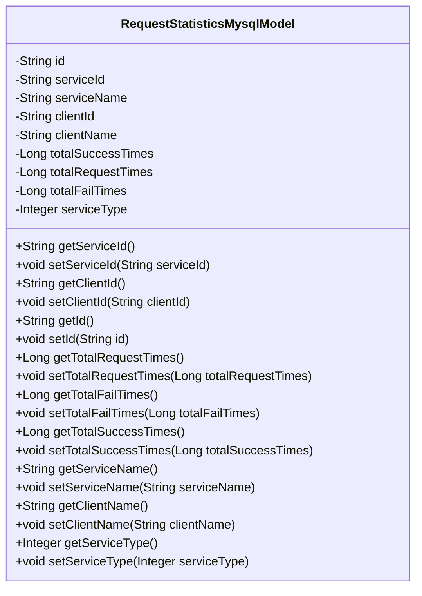

# 基础信息

|      |      |
|------|------|
| 名称 | RequestStatisticsMysqlModel |
| 编码语言 | .java |
| 代码路径 | WeFe/serving/serving-service/src/main/java/com/welab/wefe/serving/service/database/entity/RequestStatisticsMysqlModel.java |
| 包名 | com.welab.wefe.serving.service.database.entity |
| 依赖项 | ['javax.persistence.Column', 'javax.persistence.Entity', 'javax.persistence.Id', 'java.util.UUID'] |
| 概述说明 | MySQL请求统计实体类，包含ID、服务ID/名称、客户ID/名称、成功/失败/总调用次数和服务类型等字段及对应getter/setter方法。 |

# 说明

这是一个名为RequestStatisticsMysqlModel的JPA实体类，用于存储请求统计信息。包含主键id、服务ID和名称、客户ID和名称、总成功次数、总调用次数、总失败次数以及服务类型等字段。类中为每个字段提供了对应的getter和setter方法，用于访问和修改这些属性值。该实体类主要用于记录和统计服务调用的相关数据。

# 类列表 Class Summary

| 名称   | 类型  | 说明 |
|-------|------|-------------|
| RequestStatisticsMysqlModel | class | 请求统计MySQL实体类，包含ID、服务ID、名称、客户ID、名称、成功、失败、总调用次数及服务类型字段。 |

## 类 RequestStatisticsMysqlModel

|      |      |
|------|------|
| 访问范围 | @Entity;public |
| 类型 | class |
| 名称 | RequestStatisticsMysqlModel |
| 说明 | 请求统计MySQL实体类，包含ID、服务ID、名称、客户ID、名称、成功、失败、总调用次数及服务类型字段。 |

### UML类图

该类图展示了一个名为RequestStatisticsMysqlModel的实体类，用于存储请求统计信息。该类包含多个私有字段，如服务ID、客户端ID、成功次数、调用次数等，并为每个字段提供了公有的getter和setter方法。这个类主要用于持久化存储与请求相关的统计数据，可以用于分析和监控服务的调用情况。

### 内部方法调用关系图

```mermaid
graph TD
    A["类RequestStatisticsMysqlModel"]
    B["主键属性: @Id String id"]
    C["属性: String serviceId"]
    D["属性: String serviceName"]
    E["属性: String clientId"]
    F["属性: String clientName"]
    G["属性: Long totalSuccessTimes"]
    H["属性: Long totalRequestTimes"]
    I["属性: Long totalFailTimes"]
    J["属性: Integer serviceType"]
    K["Getter/Setter方法组"]
    
    A --> B
    A --> C
    A --> D
    A --> E
    A --> F
    A --> G
    A --> H
    A --> I
    A --> J
    A -.-> K
    
    K --> L["getServiceId/setServiceId"]
    K --> M["getClientId/setClientId"]
    K --> N["getId/setId"]
    K --> O["getTotalRequestTimes/setTotalRequestTimes"]
    K --> P["getTotalFailTimes/setTotalFailTimes"]
    K --> Q["getTotalSuccessTimes/setTotalSuccessTimes"]
    K --> R["getServiceName/setServiceName"]
    K --> S["getClientName/setClientName"]
    K --> T["getServiceType/setServiceType"]
```

该流程图展示了RequestStatisticsMysqlModel类的完整结构，包含9个核心属性和对应的16个访问方法。作为JPA实体类，通过@Id标注主键字段，所有属性均采用私有封装并通过Getter/Setter暴露访问接口。类设计用于存储服务调用统计数据，包含服务/客户端标识信息、调用次数统计和服务类型分类等业务字段，形成完整的数据持久化模型。

### 字段列表 Field List

| 名称  | 类型  | 说明 |
|-------|-------|------|
| id | String | 实体类中使用@Id注解标记主键字段id。 |
| clientName | String | 声明一个私有字符串变量clientName。 |
| clientId | String | 私有字符串变量clientId，用于存储客户端标识。 |
| totalSuccessTimes | Long | 私有长整型变量，记录总成功次数。 |
| serviceName | String | 私有字符串变量，存储服务名称。 |
| serviceId | String | 私有字符串变量serviceId，用于存储服务标识。 |
| serviceType | Integer | 私有整型变量，表示服务类型。 |
| totalRequestTimes | Long | 私有长整型变量，记录总请求次数。 |
| totalFailTimes | Long | 私有长整型变量，记录总失败次数。 |

### 方法列表

| 名称  | 类型  | 说明 |
|-------|-------|------|
| setClientName | void | 这是一个Java方法，用于设置客户端名称。方法接受一个字符串参数clientName，并将其赋值给类的成员变量clientName。 |
| getServiceName | String | 方法返回serviceName字符串。 |
| getId | String | 获取ID的公共方法，返回字符串类型的id。 |
| getTotalSuccessTimes | Long | 获取成功次数的总计值方法。 |
| getServiceId | String | 获取serviceId的公共方法，返回字符串类型的serviceId。 |
| setId | void | 设置对象ID的方法，将参数id赋值给对象的id属性。 |
| setClientId | void | 设置客户端ID的方法，将参数clientId赋值给类的成员变量clientId。 |
| getTotalFailTimes | Long | 获取失败次数的总计值。 |
| getTotalRequestTimes | Long | 获取请求总次数的公共方法，返回长整型数值totalRequestTimes。 |
| setTotalSuccessTimes | void | Java方法：设置成功次数变量totalSuccessTimes的值。 |
| getClientName | String | 获取客户端名称的方法，返回clientName变量值。 |
| getClientId | String | 这是一个Java方法，返回字符串类型的clientId成员变量值。 |
| getServiceType | Integer | 获取服务类型的方法，返回整型值serviceType。 |
| setServiceName | void | 设置服务名称的方法，将输入参数赋值给类的成员变量serviceName。 |
| setServiceId | void | 这是一个Java方法，用于设置类的serviceId属性值。方法接收一个字符串参数serviceId，并将其赋值给类的同名成员变量。 |
| setServiceType | void | 这是一个Java方法，用于设置类的serviceType属性，参数为Integer类型。 |
| setTotalRequestTimes | void | 设置请求总次数的Java方法，将参数赋值给类变量totalRequestTimes。 |
| setTotalFailTimes | void | 设置失败次数的公共方法，参数为长整型totalFailTimes，用于更新对象中的失败次数属性。 |

