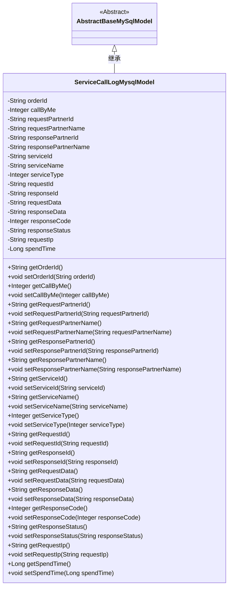

# 基础信息

|      |      |
|------|------|
| 名称 | ServiceCallLogMysqlModel |
| 编码语言 | .java |
| 代码路径 | WeFe/serving/serving-service/src/main/java/com/welab/wefe/serving/service/database/entity/ServiceCallLogMysqlModel.java |
| 包名 | com.welab.wefe.serving.service.database.entity |
| 依赖项 | ['javax.persistence.Column', 'javax.persistence.Entity'] |
| 概述说明 | MySQL服务调用日志实体类，包含订单ID、调用方、服务信息、请求响应数据、状态码、耗时等字段。 |

# 说明

该内容定义了一个名为service_call_log的MySQL数据库实体类ServiceCallLogMysqlModel，继承自AbstractBaseMySqlModel。类中包含多个字段用于记录服务调用日志信息，包括订单ID、调用方标识、请求和响应合作方ID与名称、服务ID与名称及类型、请求和响应ID与数据、响应状态码与状态、请求IP以及耗时等。每个字段都有对应的getter和setter方法，用于访问和修改这些属性。

# 类列表 Class Summary

| 名称   | 类型  | 说明 |
|-------|------|-------------|
| ServiceCallLogMysqlModel | class | 这是一个MySQL实体类，用于记录服务调用日志，包含订单ID、请求响应数据、合作伙伴信息、服务详情、响应状态和耗时等字段。 |

## 类 ServiceCallLogMysqlModel

|      |      |
|------|------|
| 访问范围 | @Entity(name = "service_call_log");public |
| 类型 | class |
| 名称 | ServiceCallLogMysqlModel |
| 说明 | 这是一个MySQL实体类，用于记录服务调用日志，包含订单ID、请求响应数据、合作伙伴信息、服务详情、响应状态和耗时等字段。 |

### UML类图

类图描述：
ServiceCallLogMysqlModel 是一个继承自 AbstractBaseMySqlModel 的实体类，用于记录服务调用的日志信息。它包含多个私有字段，如订单ID、调用方标识、请求和响应伙伴信息、服务信息、请求和响应数据、响应状态码、请求IP以及耗时等，并提供了对应的getter和setter方法。该类通过JPA注解标注为数据库实体，映射到名为"service_call_log"的表。

### 内部方法调用关系图

该流程图展示了ServiceCallLogMysqlModel类的完整结构，包括继承关系、16个私有属性及其对应的getter/setter方法。这个JPA实体类用于记录服务调用日志，包含订单ID、调用方标识、请求/响应合作伙伴信息、服务详情、请求/响应数据、状态码、IP地址和耗时等关键字段。所有属性都通过@Column注解与数据库表字段映射，形成完整的服务调用日志数据模型。

### 字段列表 Field List

| 名称  | 类型  | 说明 |
|-------|-------|------|
| requestPartnerId | String | 数据库字段映射：requestPartnerId对应表列request_partner_id，类型为String。 |
| serviceId | String | 数据库字段映射：serviceId对应表列service_id，类型为字符串。 |
| requestPartnerName | String | 数据库字段映射：requestPartnerName对应表列request_partner_name，类型为String。 |
| callByMe | Integer | 数据库字段映射，名为call_by_me，类型为Integer。 |
| responseData | String | 数据库字段映射：responseData对应表列response_data，类型为String。 |
| responseId | String | 数据库字段映射：responseId对应表列response_id。 |
| serialVersionUID = 5160393066516857125L | long | 定义了一个私有静态常量serialVersionUID，值为5160393066516857125L，用于序列化版本控制。 |
| serviceType | Integer | 数据库字段映射：service_type对应Integer类型的serviceType。 |
| requestIp | String | 数据库字段映射：requestIp对应表列request_ip，类型为字符串。 |
| requestId | String | 数据库字段映射：requestId对应表列request_id，类型为String。 |
| responsePartnerId | String | 数据库字段映射：response_partner_id对应私有字符串变量responsePartnerId。 |
| requestData | String | 数据库字段映射：requestData对应表列request_data。 |
| serviceName | String | 数据库字段映射：serviceName对应表列service_name，类型为String。 |
| orderId | String | 数据库字段映射：orderId对应表列order_id。 |
| spendTime | Long | 数据库字段映射：spend_time对应Long类型变量spendTime。 |
| responsePartnerName | String | 数据库字段映射：responsePartnerName对应表列response_partner_name，类型为String。 |
| responseCode | Integer | 数据库字段映射：responseCode对应表列response_code，类型为整数。 |
| responseStatus | String | 数据库字段映射：responseStatus对应表列response_status，类型为String。 |

### 方法列表

| 名称  | 类型  | 说明 |
|-------|-------|------|
| setRequestPartnerId | void | 设置请求合作方ID的方法，将参数值赋给类的成员变量requestPartnerId。 |
| setRequestId | void | 这是一个Java方法，用于设置请求ID。方法接收一个字符串参数requestId，并将其赋值给当前对象的requestId属性。 |
| getResponsePartnerName | String | 获取响应伙伴名称的方法，返回字符串类型的responsePartnerName。 |
| getRequestPartnerName | String | 获取请求合作方名称的方法，返回字符串类型的requestPartnerName。 |
| setResponsePartnerName | void | 设置响应伙伴名称的方法，将输入参数赋值给类的成员变量responsePartnerName。 |
| setCallByMe | void | Java方法：设置callByMe属性值。 |
| setOrderId | void | 这是一个Java方法，用于设置订单ID。方法名为setOrderId，接收一个字符串参数orderId，并将其赋值给当前对象的orderId属性。 |
| setServiceType | void | 定义了一个公共方法setServiceType，用于设置类中的serviceType整型属性值。 |
| getServiceName | String | 获取服务名称的方法，返回字符串serviceName。 |
| setServiceId | void | 设置服务ID的方法，将输入参数赋值给类的serviceId成员变量。 |
| getCallByMe | Integer | 获取callByMe的整数值。 |
| getResponseData | String | 获取响应数据的方法，返回字符串类型变量responseData。 |
| setResponseId | void | 这是一个Java方法，用于设置responseId属性的值。方法接收一个字符串参数responseId，并将其赋值给类的成员变量this.responseId。 |
| getOrderId | String | 这是一个Java方法，返回字符串类型的orderId成员变量值。 |
| setRequestData | void | 定义了一个公共方法setRequestData，用于设置类成员变量requestData的值。参数为字符串类型。 |
| getResponseId | String | 方法返回字符串类型的responseId。 |
| setServiceName | void | 设置服务名称的方法，将输入参数赋值给类的成员变量serviceName。 |
| getServiceId | String | 获取serviceId的方法，返回字符串类型的serviceId值。 |
| setResponseData | void | 设置响应数据的方法，将传入的字符串赋值给类的responseData成员变量。 |
| setRequestPartnerName | void | 这是一个Java方法，用于设置请求伙伴名称的成员变量。方法接收一个字符串参数，并将其赋值给类的requestPartnerName属性。 |
| getResponseCode | Integer | 方法返回响应码。 |
| setResponseCode | void | 设置HTTP响应状态码的方法，将传入的整数值赋给类的responseCode成员变量。 |
| getResponseStatus | String | 获取响应状态的方法，返回字符串类型的responseStatus。 |
| setResponseStatus | void | 定义了一个公共方法setResponseStatus，用于设置对象的responseStatus属性值。参数为字符串类型responseStatus。 |
| getRequestIp | String | 获取请求IP地址的方法，返回字符串类型的requestIp值。 |
| setRequestIp | void | 设置请求IP的方法，将传入的requestIp赋值给当前对象的requestIp属性。 |
| getSpendTime | Long | 方法getSpendTime返回spendTime的长整型值。 |
| setSpendTime | void | 定义方法setSpendTime，用于设置spendTime属性值，参数为Long类型。 |
| getResponsePartnerId | String | 获取响应合作方ID的方法，返回字符串类型的responsePartnerId。 |
| getRequestId | String | 获取请求ID的方法，返回字符串类型的requestId。 |
| getRequestPartnerId | String | 获取请求合作方ID的方法，返回requestPartnerId字符串。 |
| getRequestData | String | 获取请求数据的方法，返回字符串类型。 |
| setResponsePartnerId | void | 设置响应合作方ID的方法，将输入参数赋值给类的成员变量responsePartnerId。 |
| getServiceType | Integer | 获取服务类型的方法，返回整型值serviceType。 |

