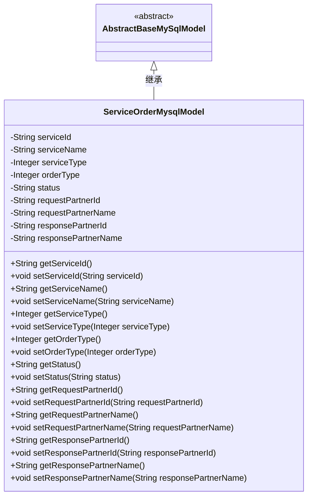
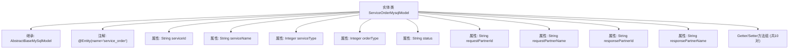

# 基础信息

|      |      |
|------|------|
| 名称 | ServiceOrderMysqlModel |
| 编码语言 | .java |
| 代码路径 | WeFe/serving/serving-service/src/main/java/com/welab/wefe/serving/service/database/entity/ServiceOrderMysqlModel.java |
| 包名 | com.welab.wefe.serving.service.database.entity |
| 依赖项 | ['javax.persistence.Column', 'javax.persistence.Entity'] |
| 概述说明 | 服务订单MySQL实体类，包含服务ID、名称、类型、订单类型、状态及请求/响应合作伙伴信息。 |

# 说明

这是一个名为ServiceOrderMysqlModel的Java实体类，映射到数据库表service_order。它继承自AbstractBaseMySqlModel，包含服务ID、名称、类型、订单类型、状态等字段，以及请求方和响应方的ID和名称信息。每个字段都有对应的getter和setter方法，并通过注解与数据库列名进行映射。

# 类列表 Class Summary

| 名称   | 类型  | 说明 |
|-------|------|-------------|
| ServiceOrderMysqlModel | class | 服务订单实体类，包含服务ID、名称、类型、订单类型、状态及请求响应方信息。 |

## 类 ServiceOrderMysqlModel

|      |      |
|------|------|
| 访问范围 | @Entity(name = "service_order");public |
| 类型 | class |
| 名称 | ServiceOrderMysqlModel |
| 说明 | 服务订单实体类，包含服务ID、名称、类型、订单类型、状态及请求响应方信息。 |

### UML类图

这段代码定义了一个名为ServiceOrderMysqlModel的实体类，用于映射数据库表service_order。该类继承自抽象基类AbstractBaseMySqlModel，包含多个私有字段及其对应的getter和setter方法，用于存储服务订单的相关信息，如服务ID、名称、类型、订单类型、状态以及请求和响应方的合作伙伴信息。通过@Entity和@Column注解实现了与数据库表的映射关系。

### 内部方法调用关系图

该流程图展示了ServiceOrderMysqlModel实体类的完整结构，包含继承关系、JPA实体注解、10个数据库映射字段及其对应的Getter/Setter方法组。作为数据库订单服务的持久化模型，该类通过@Column注解将字段映射到service_order表的对应列，同时继承了AbstractBaseMySqlModel的基础功能。所有属性均为私有字段并通过公共访问方法暴露，符合JPA实体规范。

### 字段列表 Field List

| 名称  | 类型  | 说明 |
|-------|-------|------|
| serviceId | String | 数据库字段映射：serviceId对应表列service_id。 |
| serialVersionUID = 5578364684919929903L | long | 声明一个私有静态不可变的长整型序列化版本ID，值为5578364684919929903。 |
| requestPartnerId | String | 数据库字段映射：requestPartnerId对应表列request_partner_id，类型为String。 |
| requestPartnerName | String | 数据库字段映射：request_partner_name对应私有字符串变量requestPartnerName。 |
| responsePartnerName | String | 数据库字段映射：responsePartnerName对应表列response_partner_name，类型为String。 |
| orderType | Integer | 数据库字段映射：order_type对应Integer类型的orderType。 |
| status | String | 数据库字段映射：status属性对应表中的status列。 |
| serviceType | Integer | 数据库字段service_type映射为Integer类型的serviceType。 |
| serviceName | String | 数据库字段映射：serviceName对应表列service_name。 |
| responsePartnerId | String | 数据库字段映射：response_partner_id对应私有字符串变量responsePartnerId。 |

### 方法列表

| 名称  | 类型  | 说明 |
|-------|-------|------|
| getServiceId | String | 获取serviceId的公共方法。 |
| setRequestPartnerName | void | 设置请求合作方名称的方法，将参数值赋给类成员变量requestPartnerName。 |
| getStatus | String | 获取当前状态值的方法。 |
| getResponsePartnerId | String | 获取响应合作方ID的方法，返回字符串类型的responsePartnerId。 |
| setServiceId | void | 设置服务ID的方法，将输入参数赋值给类的serviceId成员变量。 |
| getResponsePartnerName | String | 获取响应合作方名称的方法，返回字符串类型值responsePartnerName。 |
| setOrderType | void | 这是一个Java方法，用于设置订单类型属性，接收一个整型参数orderType。 |
| getServiceType | Integer | 获取服务类型的方法，返回整型值serviceType。 |
| getRequestPartnerId | String | 获取请求合作方ID的方法，返回requestPartnerId字段值。 |
| setStatus | void | 这是一个Java方法，用于设置对象的status属性值。方法接收一个字符串参数status，并将其赋值给当前对象的同名属性。 |
| getRequestPartnerName | String | 获取请求合作方名称的方法，返回字符串类型的requestPartnerName。 |
| setResponsePartnerName | void | 设置响应伙伴名称的方法，将输入参数赋值给类的成员变量responsePartnerName。 |
| getOrderType | Integer | 这是一个Java方法，返回名为orderType的整型变量。 |
| setResponsePartnerId | void | 设置响应合作方ID的方法，将输入参数赋值给类的成员变量responsePartnerId。 |
| setServiceName | void | 这是一个Java方法，用于设置类的serviceName属性值。方法接收一个字符串参数serviceName，并将其赋值给类的同名成员变量。 |
| setServiceType | void | 定义了一个公共方法setServiceType，用于设置类中的serviceType整型属性值。 |
| getServiceName | String | 获取服务名称的方法，返回字符串类型的serviceName。 |
| setRequestPartnerId | void | 设置请求合作方ID的方法，将参数值赋给类的成员变量requestPartnerId。 |

