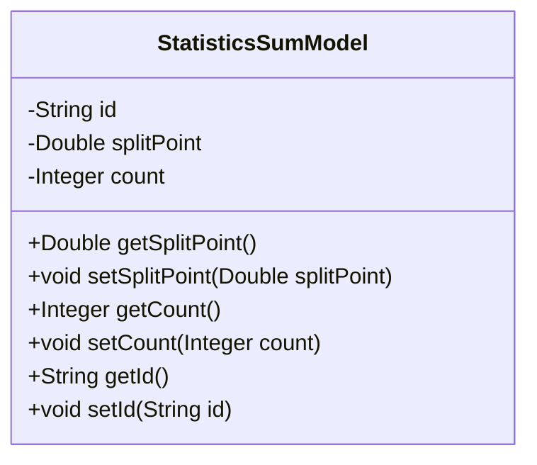
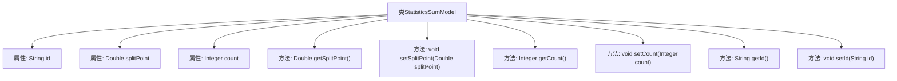

# 基础信息

|      |      |
|------|------|
| 名称 | StatisticsSumModel |
| 编码语言 | .java |
| 代码路径 | WeFe/serving/serving-service/src/main/java/com/welab/wefe/serving/service/database/entity/StatisticsSumModel.java |
| 包名 | com.welab.wefe.serving.service.database.entity |
| 依赖项 | ['javax.persistence.Entity', 'javax.persistence.Id'] |
| 概述说明 | Java实体类StatisticsSumModel，包含id、splitPoint和count字段，提供各字段的getter和setter方法。 |

# 说明

这是一个名为StatisticsSumModel的Java实体类，使用JPA注解标记为数据库实体。类包含三个私有字段：id作为主键，splitPoint为双精度浮点数类型，count为整数类型。每个字段都有对应的getter和setter方法用于访问和修改数据。该类主要用于存储统计数据，包含分割点和计数值。

# 类列表 Class Summary

| 名称   | 类型  | 说明 |
|-------|------|-------------|
| StatisticsSumModel | class | 这是一个名为StatisticsSumModel的JPA实体类，包含id、splitPoint和count三个字段，分别表示唯一标识、分割点和计数，并提供了对应的getter和setter方法。 |

## 类 StatisticsSumModel

|      |      |
|------|------|
| 访问范围 | @Entity;public |
| 类型 | class |
| 名称 | StatisticsSumModel |
| 说明 | 这是一个名为StatisticsSumModel的JPA实体类，包含id、splitPoint和count三个字段，分别表示唯一标识、分割点和计数，并提供了对应的getter和setter方法。 |

### UML类图

该代码定义了一个名为`StatisticsSumModel`的实体类，用于存储统计汇总数据。类中包含三个私有字段：`id`作为主键标识，`splitPoint`表示分割点数值，`count`记录数量统计值。通过公共的getter和setter方法提供对这些字段的访问和修改能力。这是一个典型的Java持久化实体类，遵循了JavaBean规范，适合与JPA或Hibernate等ORM框架配合使用，主要用于数据库交互场景中的数据建模。

### 内部方法调用关系图

这段代码定义了一个名为StatisticsSumModel的JPA实体类，包含三个私有属性：id、splitPoint和count。类中提供了这些属性的getter和setter方法，用于访问和修改属性值。该实体类主要用于存储统计数据的分段点值和计数信息，通过注解@Entity标记为持久化实体，@Id注解指定id为主键字段。流程图清晰地展示了类结构与各方法间的关联关系。

### 字段列表 Field List

| 名称  | 类型  | 说明 |
|-------|-------|------|
| count | Integer | 私有整型变量count |
| id | String | 实体类主键字段，类型为String。 |
| splitPoint | Double | 私有双精度浮点型变量splitPoint。 |

### 方法列表

| 名称  | 类型  | 说明 |
|-------|-------|------|
| getCount | Integer | 获取计数值的方法，返回整数类型的count变量。 |
| setCount | void | 这是一个Java方法，用于设置类中的count属性值。方法接收一个Integer参数，并将其赋值给类的count成员变量。 |
| setSplitPoint | void | 设置分割点数值的方法，将参数splitPoint赋值给当前对象的splitPoint属性。 |
| setId | void | 这是一个Java方法，用于设置对象的id属性。方法接收一个字符串参数id，并将其赋值给对象的id字段。 |
| getId | String | 方法getId返回字符串类型的id值。 |
| getSplitPoint | Double | 获取分割点数值的方法，返回Double类型splitPoint值。 |

