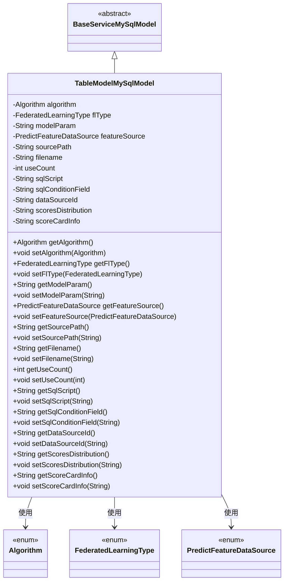

# 基础信息

|      |      |
|------|------|
| 名称 | TableModelMySqlModel |
| 编码语言 | .java |
| 代码路径 | WeFe/serving/serving-service/src/main/java/com/welab/wefe/serving/service/database/entity/TableModelMySqlModel.java |
| 包名 | com.welab.wefe.serving.service.database.entity |
| 依赖项 | ['com.welab.wefe.common.wefe.enums.Algorithm', 'com.welab.wefe.common.wefe.enums.FederatedLearningType', 'com.welab.wefe.common.wefe.enums.PredictFeatureDataSource', 'javax.persistence'] |
| 概述说明 | MySQL数据库表模型类，包含算法类型、联邦学习类型、模型参数、特征源、文件路径、使用计数、SQL脚本、数据源ID、分数分布和评分卡信息等字段。 |

# 说明

这是一个名为TableModelMySqlModel的Java实体类，映射到数据库表table_model。它继承自BaseServiceMySqlModel，包含机器学习模型和深度学习模型相关字段。主要字段包括算法类型、联邦学习类型、模型参数、特征数据源、文件路径、文件名、使用计数、SQL脚本、SQL条件字段、数据源ID、分数分布和评分卡信息。所有字段都有对应的getter和setter方法。类使用了JPA注解进行数据库映射，包括@Entity、@Table和@Column等。

# 类列表 Class Summary

| 名称   | 类型  | 说明 |
|-------|------|-------------|
| TableModelMySqlModel | class | 这是一个名为TableModelMySqlModel的Java实体类，映射到数据库表table_model。包含机器学习模型字段（算法类型、联邦学习类型、模型参数等）和深度学习模型字段（文件路径、文件名、使用计数等）。类继承自BaseServiceMySqlModel，提供各字段的getter和setter方法。 |

## 类 TableModelMySqlModel

|      |      |
|------|------|
| 访问范围 | @Entity(name = "table_model");@Table(name = "table_model");public |
| 类型 | class |
| 名称 | TableModelMySqlModel |
| 说明 | 这是一个名为TableModelMySqlModel的Java实体类，映射到数据库表table_model。包含机器学习模型字段（算法类型、联邦学习类型、模型参数等）和深度学习模型字段（文件路径、文件名、使用计数等）。类继承自BaseServiceMySqlModel，提供各字段的getter和setter方法。 |

### UML类图

这段代码定义了一个名为TableModelMySqlModel的实体类，继承自BaseServiceMySqlModel，用于表示数据库中的表模型。该类包含多个字段，如算法类型、联邦学习类型、模型参数、特征数据源等，并提供了相应的getter和setter方法。类中使用了多个枚举类型（Algorithm、FederatedLearningType、PredictFeatureDataSource）来表示特定类型的字段。该类通过JPA注解与数据库表进行映射，是一个典型的数据持久化模型类。

### 内部方法调用关系图

```mermaid
graph TD
    A["类TableModelMySqlModel"]
    B["继承: BaseServiceMySqlModel"]
    C["注解: @Entity/@Table"]
    D["字段: Algorithm algorithm"]
    E["字段: FederatedLearningType flType"]
    F["字段: String modelParam"]
    G["字段: PredictFeatureDataSource featureSource"]
    H["字段: String sourcePath"]
    I["字段: String filename"]
    J["字段: int useCount"]
    K["字段: String sqlScript"]
    L["字段: String sqlConditionField"]
    M["字段: String dataSourceId"]
    N["字段: String scoresDistribution"]
    O["字段: String scoreCardInfo"]
    P["Getter/Setter方法组"]

    A --> B
    A --> C
    A --> D
    A --> E
    A --> F
    A --> G
    A --> H
    A --> I
    A --> J
    A --> K
    A --> L
    A --> M
    A --> N
    A --> O
    A --> P
    D -.-> P
    E -.-> P
    F -.-> P
    G -.-> P
    H -.-> P
    I -.-> P
    J -.-> P
    K -.-> P
    L -.-> P
    M -.-> P
    N -.-> P
    O -.-> P
```

该流程图展示了TableModelMySqlModel类的完整结构，包含继承关系、类注解、14个字段定义及其对应的Getter/Setter方法组。作为JPA实体类，它通过@Enumerated处理枚举类型字段，使用@Column定制数据库列名，主要存储机器学习模型参数、文件路径、SQL脚本等元数据。所有字段都通过标准访问器方法暴露，符合JavaBean规范，继承自BaseServiceMySqlModel基类。

### 字段列表 Field List

| 名称  | 类型  | 说明 |
|-------|-------|------|
| featureSource = PredictFeatureDataSource.code | PredictFeatureDataSource | 枚举类型字段featureSource，数据库列名feature_source，默认值code，使用字符串存储枚举值。 |
| flType | FederatedLearningType | 使用@Enumerated注解将枚举类型FederatedLearningType以字符串形式存储到数据库表的fl_type列中。 |
| sqlConditionField | String | 数据库字段映射：sql_condition_field对应String类型变量sqlConditionField。 |
| sourcePath | String | 数据库字段映射：sourcePath对应表列source_path，存储文件路径。 |
| serialVersionUID = -1320731560182386318L | long | 声明一个私有静态不可变的长整型序列化版本ID，值为-1320731560182386318。 |
| modelParam | String | 数据库字段映射：modelParam对应表列model_param，类型为String。 |
| useCount | int | 数据库字段映射：use_count对应useCount，类型为整型，记录使用次数。 |
| scoresDistribution | String | 数据库字段映射：scoresDistribution对应表列scores_distribution，存储分数分布数据。 |
| filename | String | 声明字符串变量filename |
| sqlScript | String | 数据库字段映射：sqlScript对应表列sql_script。 |
| algorithm | Algorithm | 枚举类型字段algorithm使用字符串形式存储。 |
| dataSourceId | String | 定义私有字符串变量dataSourceId，对应数据库列名data_source_id。 |
| scoreCardInfo | String | 数据库字段映射，名为score_card_info，对应私有字符串变量scoreCardInfo。 |

### 方法列表

| 名称  | 类型  | 说明 |
|-------|-------|------|
| setSqlConditionField | void | Java方法：设置SQL条件字段属性值。 |
| getFilename | String | 方法返回文件名字符串。 |
| setSourcePath | void | 设置源路径的方法，将输入参数赋值给类的sourcePath成员变量。 |
| getScoresDistribution | String | 获取分数分布的方法，返回scoresDistribution字符串。 |
| getFeatureSource | PredictFeatureDataSource | 获取特征数据源的方法，返回PredictFeatureDataSource对象。 |
| getFlType | FederatedLearningType | 这是一个Java方法，返回名为flType的FederatedLearningType类型对象。 |
| setAlgorithm | void | 设置当前对象的算法属性为指定算法实例。 |
| setScoresDistribution | void | 设置分数分布的方法，将输入字符串赋值给类变量scoresDistribution。 |
| getAlgorithm | Algorithm | 获取当前算法实例的方法。 |
| setModelParam | void | 定义了一个公共方法setModelParam，用于设置类成员变量modelParam的值。参数为字符串类型modelParam。 |
| getModelParam | String | 获取模型参数的字符串方法。 |
| getSourcePath | String | 这是一个Java方法，返回字符串类型的sourcePath变量值。 |
| getDataSourceId | String | 获取数据源ID的方法，返回字符串类型的数据源ID。 |
| setFeatureSource | void | 设置特征数据源的方法，将输入参数赋值给类成员变量featureSource。 |
| setUseCount | void | Java方法：设置useCount变量值为输入参数。 |
| getScoreCardInfo | String | 获取分数卡信息的方法，返回字符串类型变量scoreCardInfo。 |
| setScoreCardInfo | void | 这是一个Java方法，用于设置scoreCardInfo变量的值。方法接收一个字符串参数，并将其赋值给类的成员变量scoreCardInfo。 |
| getSqlConditionField | String | 这是一个Java方法，返回字符串类型的sqlConditionField字段值。 |
| setFilename | void | 设置文件名的方法，将输入参数赋值给类的filename成员变量。 |
| setDataSourceId | void | 设置数据源ID的方法，将输入参数赋值给类成员变量dataSourceId。 |
| setSqlScript | void | Java方法：设置SQL脚本字符串。 |
| getSqlScript | String | 方法返回字符串类型的sqlScript属性值。 |
| getUseCount | int | 获取使用次数的整型方法，返回变量useCount的值。 |
| setFlType | void | 设置联邦学习类型的方法，将参数flType赋值给类成员变量flType。 |

